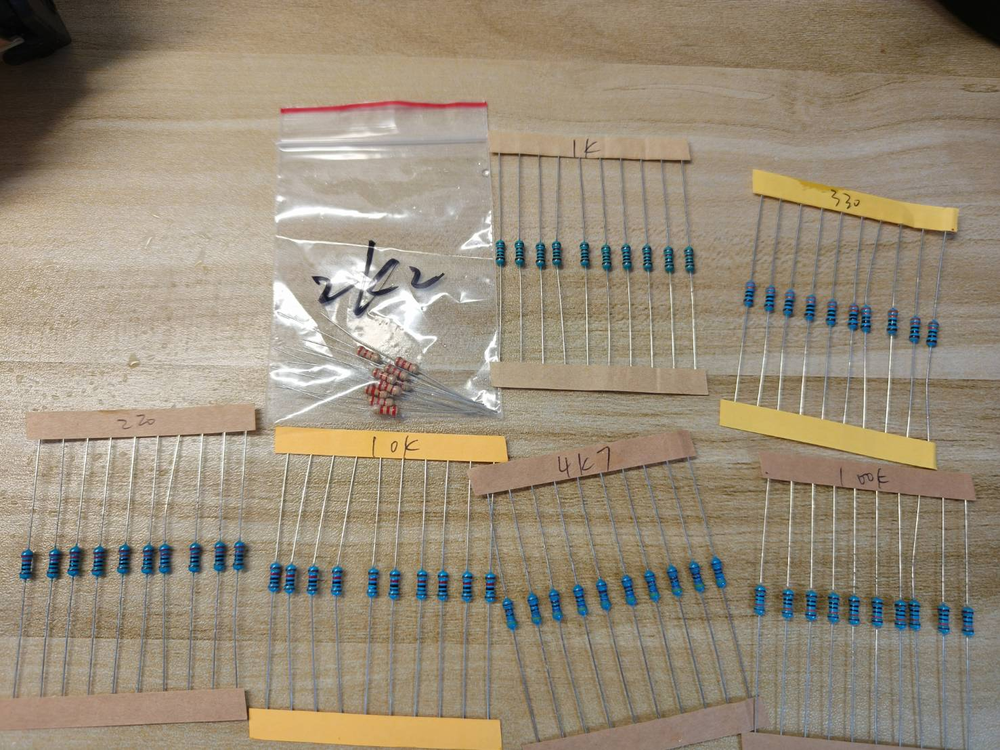
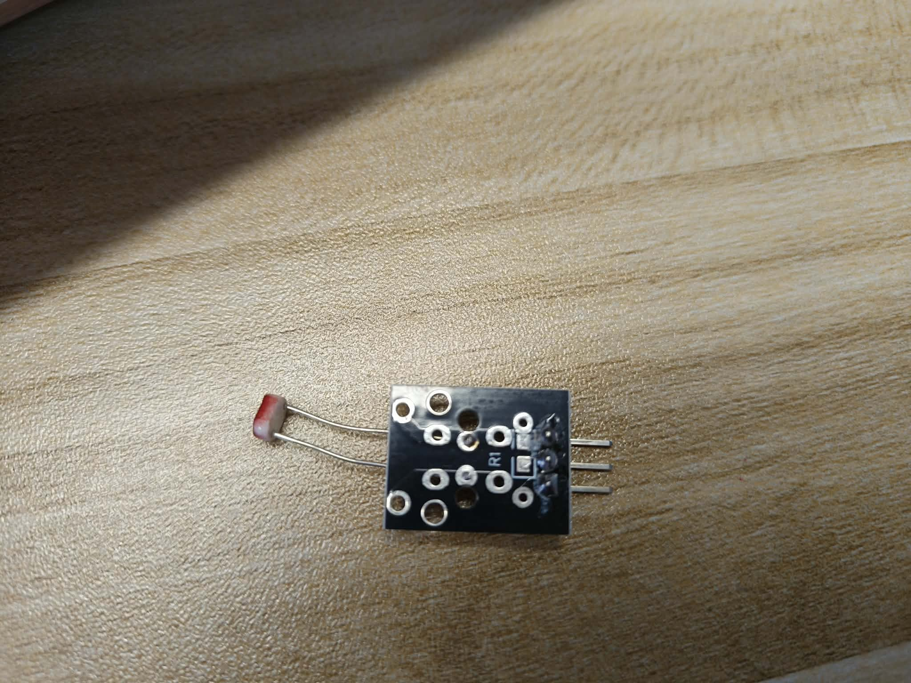
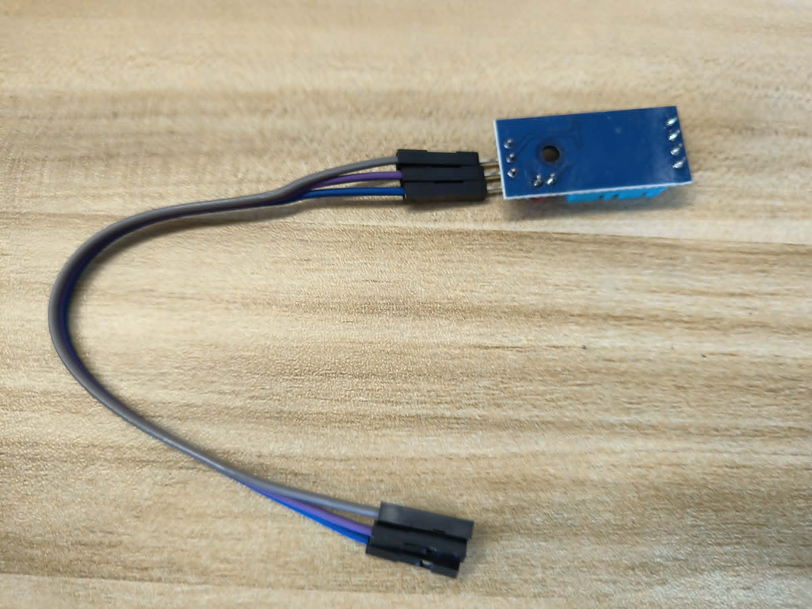
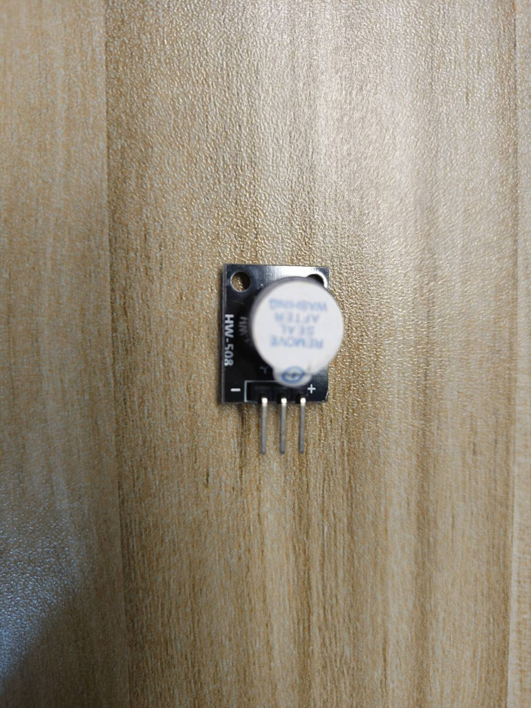
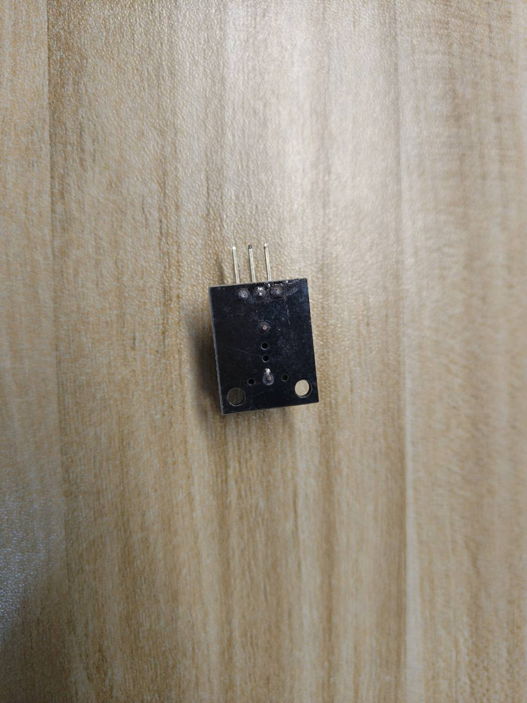
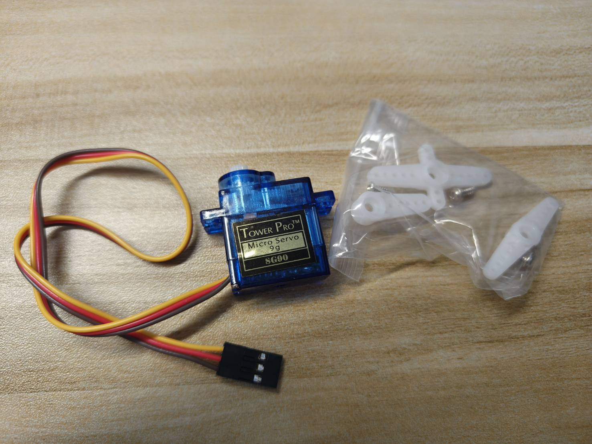
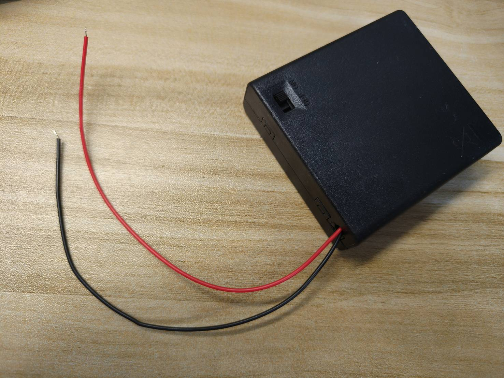

# Week 1: Course Overview, Assessment, and Project Direction

Date: September 9, 2026<br>
Course: Internet of Things

No hardware is required, connected, or powered on in Week 1, and no program will be
uploaded. This week establishes the project expectations, the eighteen-week learning
path, the assessment structure, material responsibilities, and the preparation required
before Week 2.

The objectives below describe the **end of the course**, not skills that must already
be mastered in Week 1. This week, explain one possible interaction in everyday language,
identify the roles of its parts, and use the course rules to plan your preparation.
Protocol names and electrical terms will be taught before their practical use.

[課程大綱](#course-schedule)｜[配分](#assessment)｜[中文採購清單](#purchase-table)｜[零件照片](#equipment-photos)｜[參考預算](#purchase-budget)｜[每組電表](#group-measurement-tool)｜[Week 2課前準備](#week-2-preclass-setup)

Reading path: [a first IoT example](#first-iot-example) →
[schedule](#course-schedule) → [assessment](#assessment) →
[final-project requirements](#final-project) → [materials](#materials) →
[preparation before Week 2](#before-week2).

## 1. Week 1 Overview

### 教學目標

完成本課程後，學生應能：

1. 設計全端物聯網系統（full-stack IoT system），整合實體輸入與輸出、ESP32-S3、網路通訊（network communication）、後端（backend）、資料庫（database）與行動介面（mobile interface）。
2. 依據適當的電壓（voltage）、供電（power supply）、接地（grounding）、訊號（signal）與故障安全（fail-safe）原則，安全地建立及操作嵌入式硬體（embedded hardware）。
3. 運用超文字傳輸協定（HTTP）、網頁雙向通訊協定（WebSocket）、訊息佇列遙測傳輸協定（MQTT）、結構化資料（structured data）、持久化儲存（persistent storage）與系統紀錄（system log），實作可靠的裝置與軟體之間的資料及命令流程。
4. 運用可觀察的行為、量測、紀錄、故障證據與可重現的設定說明，測試、排查、記錄並解釋物聯網專題。

### 教學內容

共同硬體練習是「紅綠燈遮光挑戰」：開始按鈕（Start）啟動倒數，光敏模組（photoresistor module）辨認遮光事件，三色發光模組（RGB LED）提示允許或禁止，有機發光顯示器（OLED）呈現時間與次數，舵機（servo）以紙指針指出有效次數，蜂鳴器（buzzer）提示失敗。這是Week 3～7共同練習，不限定期末題目。

本課程介紹完整物聯網系統（Internet of Things, IoT）的設計，將實體裝置與具有實際用途的軟體連接起來。學生會學習感測器（sensor）與按鈕（pushbutton）如何提供輸入、ESP32-S3如何解讀輸入，以及發光二極體（LED）、蜂鳴器（buzzer）、舵機（servo）或其他致動器（actuator）如何產生可觀察的實體反應。電氣安全、供電、接地（grounding）、訊號品質（signal quality）、系統狀態（system state）及錯誤復原（error recovery），都是設計過程的必要部分。

課程也涵蓋裝置與其他系統連接所需的通訊及軟體層。學生會透過無線網路（Wi-Fi）連接裝置，以超文字傳輸協定（HTTP）、網頁雙向通訊協定（WebSocket）或訊息佇列遙測傳輸協定（MQTT）交換結構化資料（structured data），開發後端服務（backend service）、將事件（event）存入資料庫（database），並利用紀錄（log）了解操作成功或失敗的原因。適合手機使用的介面會提供即時狀態、歷史資訊及受控命令（command）。

上述部分最後整合為具有明確使用者與用途的全端物聯網專題（full-stack IoT project）。完成的系統應包含有意義的實體互動、可靠的資料流（data flow）、安全行為、錯誤處理（error handling）、測試證據，以及足以讓他人理解並重建系統的文件。

<a id="first-iot-example"></a>
<a id="architecture-extension"></a>

### A First IoT Example: A Local Game and a Connected Device


*教學功能示意，不是接線圖，也不是已完成實機驗證的成品。*

The common hardware exercise is a traffic-light shade challenge. Press Start, then cover
and uncover the light sensor while the indicator is green. Each new stable cover adds one;
a new cover during red subtracts one, down to zero. Holding it covered does not keep scoring.
The OLED shows time and effective count; a short paper pointer on a servo indicates 0–6.
Reach six and press Finish before the deadline. Reaching six alone does not stop time,
and a later red penalty can reduce it again. Failure produces a brief buzzer sound.
A device fault or manual abort is recorded separately from player failure.

Week 3 teaches classification, Week 4 dual sensors and one-shot events, Week 5 RGB and
OLED timing, Week 6 the servo pointer and external power, and Week 7 the complete rules.
DHT11 has a meaningful Week 4 task but is not forced into the game. This preview is not
a tested device, and game scores are not course grades. No hardware is operated now.
A final project can use another topic. The desk-indicator example below explains how
networked software can extend a local physical interaction.

Consider a proposed desk indicator: a person presses a button to request help, a light
changes color, and a phone shows which desk requested help. Later, an authorized user
can acknowledge the request from the phone. This is a **design example**, not a tested
device or a complete final-project submission. No wiring or programming is needed now.

The button, development board, and light are **hardware**: physical parts that can be
touched. **Software** is the set of instructions that decides what those parts do and
what the phone displays. The ESP32-S3 is the **controller** in this example: its program
reads the button and decides how to control the light. An **input** supplies information
to that program; an **output** is a response it controls. Here the input is a button
press and the output is a visible light. In another project, a **sensor** could provide
an input by detecting an environmental condition, such as changing light. An
**actuator** produces a physical response, such as a servo moving an arm.

The local interaction can be described without any network:

```text
Person presses the button
  → ESP32-S3 program reads the press and changes the desk state to "help requested"
  → Program commands the indicator light to change color
  → Person checks whether the light actually changed
```

That local interaction alone is not the complete connected system required in this
course. **IoT (Internet of Things)** connects physical devices with networked software
so that events can be shared and devices can be monitored or controlled. The course
can use a local network; this does not require a paid cloud service or an Internet-wide
public website. For the example, the additional parts have distinct jobs:

| Part | Meaning in this example | What a person could check |
|---|---|---|
| Network | Carries messages between the ESP32-S3 and the backend | Did the help-request message arrive? |
| Backend | A program running on a computer that receives events, checks commands, and prepares responses | Was a request accepted or rejected, and why? |
| Database | Organized, persistent storage for events and results | Can an earlier request still be retrieved after the backend restarts? |
| Log | A record of what a program did or encountered, used to trace a problem | Was an event received, or did an operation fail? |
| Mobile interface, or frontend | The page the user sees and operates on a phone | Does it show a request, an old reading, or a connection problem? |

Now follow two different messages. An **event** reports something that happened;
a **command** asks the device to do something. Neither word means electrical current.

```text
Event: "Desk A requested help"
  ESP32-S3 → network → backend
                         ├─ saves the event in the database
                         └─ sends an update to the phone interface

Command: "Acknowledge Desk A's request"
  Phone interface → backend checks permission → network → ESP32-S3 checks its state
    → device accepts and attempts the light change, or rejects the command
    → device result returns to the backend → recorded result and phone update
```

The arrows describe **information flow**, not a wiring diagram. The database stores
information; it does not power the light. WebSocket, introduced later, provides the
backend-to-browser update channel; HTTP and MQTT are communication methods studied
later for exchanging messages. Their syntax is not a Week 1 requirement.

A phone message saying “sent” proves only that sending was attempted at that stage.
It does not prove that the device received the command or that the light changed.
The backend waits for a device result; if none arrives within a defined waiting period,
it records a **timeout**. A timeout means “no result received in time,” not “the light
definitely stayed off.” A device report and a person's observation of the light are
also different kinds of evidence. Later laboratories teach how to compare them.

Before using this example to develop your own idea, point out its input, controller,
output, stored event, and phone action. Explain what would remain unknown if the
network were disconnected. If a part has no clear job in your idea, return to the user
need before adding more hardware. The [final-project requirements](#final-project)
below still apply.

## 2. Course Information

| Item | Information |
|---|---|
| Class | Four-Year Bachelor's Program in Information Management, Year 2, Class B |
| Instructor | Wen-Yi Lee |
| Class Time | Wednesdays, Periods 5-7, 13:30-16:15 |
| Weekly Hours | 3 hours |
| Prerequisite Knowledge | Basic programming experience in any language; no prior electronics or robotics experience is required |
| Primary Development Board | ESP32-S3 N16R8, pre-soldered downward-facing 44-pin headers; exact PCB must match the approved wiring profile |
| Material Language | The course outline retains English explanations; procurement, preparation and practical instructions use Traditional Chinese with necessary English terms |
| Textbooks and Services | No required textbook purchase and no required paid cloud service |

Administrative fields such as credits, course code, required or elective status, and
the official language of instruction are subject to the final university registration
system announcement.

The board name in the purchase list does not replace inspection of the delivered PCB
and module. A matching memory label alone does not establish identical pin positions
or power connections.

<a id="course-schedule"></a>

## 3. Eighteen-Week Course Schedule

| Week | Date | Core Content | Main Outcome |
|---:|---|---|---|
| 1 | 09-09 | Course orientation, assessment, materials, and challenge preview | Explain the common exercise and self-selected final project; no hardware operation |
| 2 | 09-16 | ESP32-S3, safe wiring, buttons, and debounce | Existing Week 2: upload, Serial, continuity, GPIO events and debounce evidence |
| 3 | 09-23 | Electrical measurement, ADC, and indoor/shade classification | Retain measurements and resistor-divider work; add local calibration and Serial labels |
| 4 | 09-30 | Resistor ranges, DHT11, dual sensors, and buzzer events | Independent sampling, per-sensor quality, one-shot events, fault injection and recovery |
| 5 | 10-07 | RGB, OLED countdown, and time control | Align visible states and elapsed-time countdown; no servo power |
| 6 | 10-14 | SG90 paper pointer, 0–6 scale, external power, and safety | Map count to verified safe positions; test power, mounting, stop and recovery |
| 7 | 10-21 | Traffic-light shade challenge integration | Integrate scoring, countdown, Finish, pointer and failure sound; test boundaries and abort |
| 8 | 10-28 | Project Report 1: topic and technical feasibility | One 12–15 minute report per group: hardware segment, data flow, risk and questions |
| 9 | 11-04 | Instructor abroad: optional reading | No required attendance, new submissions or assessment |
| 10 | 11-11 | Individual Written Exam 1: Weeks 2–7 hardware and safety | Individual examination only; no new instruction or laboratory work |
| 11 | 11-18 | Wi-Fi, HTTP, JSON, WebSocket and backend | Trace device events and mobile commands/results with low-power outputs |
| 12 | 11-25 | MQTT, database and structured logs | Topics, presence, commands/acks, persistence and minimal history queries |
| 13 | 12-02 | Project Report 2: progress, feedback and revision | Implementation evidence, problems and a revision plan; further improvement remains possible |
| 14 | 12-09 | Mobile frontend, responsive web/PWA and permissions | Live/history/control/offline/error and permission flows |
| 15 | 12-16 | Automation, safety, fault recovery and reconstruction | One automation, three fault tests and clean-environment reconstruction |
| 16 | 12-23 | Individual Written Exam 2: networks and integration | Assess Weeks 11, 12, 14 and 15; no new instruction or project-progress submission |
| 17 | 12-30 | Project Report 3: final demonstration and individual questions | All groups present this week; one grade per group, with individual questions |
| 18 | 01-06 | University final examination week: reserved | No regular materials, new content or assessment |

<a id="assessment"></a>
<a id="assessment-details"></a>

## 4. Assessment

| Assessment | Weight | Primary Evidence |
|---|---:|---|
| Coursework | 15% | Weekly laboratory work, questions and answers, Lab Notebook, documentation, safety, collaboration, and verified AI use |
| Project Report 1 (Week 8) | 15% | Topic, hardware segment, software purpose, architecture, materials, risks, and acceptance criteria |
| Individual Written Exam 1 (Week 10) | 15% | Hardware wiring, GPIO and GND, electrical measurement, ADC, common ground, sensing, actuation, power, state machines, and safety |
| Project Report 2 (Week 13) | 15% | Current implementation evidence, progress status, identified problems, risk analysis, and a revision plan |
| Individual Written Exam 2 (Week 16) | 15% | Wi-Fi, HTTP, JSON, WebSocket, MQTT, integrated data flow, and log-based troubleshooting |
| Project Report 3 (Week 17) | 25% | Complete physical interaction, frontend and backend, data, reliability, testing, documentation, and individual understanding |
| Total | 100% |  |

Hardware cost, mechanical complexity, and project speed do not directly earn additional
credit. A project built from basic materials can meet the highest expectations when it
provides reliable interaction, a complete data flow, a clear mobile workflow, and
sufficient testing evidence.

The three project reports are checkpoints in one developing project: feasibility in
Week 8, implementation progress and revision in Week 13, and the final demonstration
in Week 17. Each group receives only one Project Report 3 grade. The two written
exams are individual work; a group demonstration does not replace either exam.

<a id="final-project"></a>

## 5. Minimum Final Project Requirements

These are semester-end requirements. In Week 1, use them to understand the direction
of the course; do not attempt to build all layers or buy optional parts immediately.
The final project must include all of the following:

- A physical artifact that operates safely and addresses a clearly described use case.
- An ESP32-S3 or another controller approved by the instructor.
- At least one physical input and one physical output; an exception must be approved
  during Week 8.
- Wi-Fi and device communication through HTTP or MQTT.
- A student-developed backend that can be restarted from documented instructions.
- A database, historical queries, and structured logs.
- A mobile-friendly interface showing real-time data, history, controls or settings,
  and error or offline states.
- Real-time updates through WebSocket; every control action must leave a command,
  result or acknowledgement, or timeout record.
- At least one automated response, state machine, or schedule.
- At least three tests, including one involving disconnection, invalid input, an
  abnormal sensor value, or a stopped service.
- Source code, a wiring diagram, a data-flow diagram, data formats, a bill of materials,
  reconstruction instructions, AI-use and verification records, and known limitations.

A ready-made dashboard or IoT platform may be used as a supporting tool, but it cannot
replace the student-developed device program, backend, database, or mobile interface.

<a id="materials"></a>

<a id="purchase-table"></a>

<a id="一學生材料採購總表"></a>

## 6. 材料準備

適用學期：115學年度第1學期<br>
公布週次：Week 1（2026-09-09）<br>
準備方式：下表依首次使用週次排序，可一次購齊或分批準備，自行安排到貨時間，
於首次使用前備妥。USB資料線與組內電表從Week 2開始使用。

本表是全班共同實驗的正式材料清單。每人必備零件都在Week 2～7有共同操作，
不是為可能選做的專題預先購買。每位學生準備並保管自己的一套材料；
萬用電表依下方分組規則共用。

### 每人必備零件

「必備」表示上課時每人要有符合規格的零件，不是指定購買某個商品名稱叫「電子基本包」的套件。
已有合格用品可以繼續使用，只補缺少的品項；下表的數量不是要求重新買一套。

| 品項 | 必須符合的規格 | 每人數量 | 每人參考金額 | 首次使用與Week 2～7共同任務 |
|---|---|---:|---:|---|
| ESP32-S3開發板（development board） | YD-ESP32-S3 Type-A V1.5、N16R8、已焊向下44腳排針；不同電路板（PCB）版型先確認相容性，不可直接互套DevKitC-1接線圖 | 1片 | NT$390 | Week 2編譯、上傳、序列監控與按鈕輸入；Week 3～7讀取感測器、控制輸出與整合遊戲 |
| 麵包板（breadboard） | 400孔免焊麵包板，約8.5×5.5 cm | 1片 | NT$22 | Week 2五孔連通、跨槽隔離與按鈕；Week 3測點、分壓；Week 4～7依接線表重用 |
| 杜邦線（jumper wire） | 20 cm，公對公／公對母／母對母，各一排40條 | 各1排 | NT$75 | Week 2公對公延伸測點、公對母連接排針與麵包板；Week 4母對母連DHT11資料腳；後續各週重用 |
| 四腳輕觸按鈕（pushbutton） | 6×6 mm、常開瞬時型 | 2顆 | NT$4 | Week 2按鈕輸入與去抖；Week 6一顆作停止鍵；Week 7兩顆分別作開始（Start）與結束（Finish），同按為中止 |
| 指定阻值電阻（resistor） | 220 Ω、330 Ω、1 kΩ與10 kΩ；保留原阻值標示 | 4種，各至少1顆 | NT$60（以整包估算） | Week 3用1 kΩ／10 kΩ分壓與交換位置；Week 4用220 Ω／330 Ω辨認、量測與比較量程 |
| 光敏電阻模組（photoresistor module） | KY-018 | 1個 | NT$10 | Week 3訊號電壓、ADC與遮光分類；Week 4遮光事件；Week 5燈光干擾；Week 7遊戲輸入 |
| 溫濕度模組（temperature and humidity module） | YS-31 DHT11三針模組，排針已焊；不買未附模組板的裸感測器 | 1個 | NT$25 | Week 4溫濕度讀取、取樣、失敗與恢復，再與光敏及蜂鳴器整合 |
| 蜂鳴器模組（buzzer） | KY-012有源型類別；HW-508實物的腳位、供電及驅動電流仍待確認。已有者先保留；新購須取得規格，不能僅憑KY編號認定可直接GPIO | 1個 | NT$14 | Week 4新遮光事件的一次短聲與自動關聲；Week 7限時失敗提示 |
| 三色發光模組（RGB LED） | KY-016／HW-479類，單顆RGB LED、四針、板上有各色限流電阻；不是WS2812B燈條。使用前確認共同端及控制準位 | 1個 | NT$9 | Week 5各色輸出與狀態燈；Week 7綠燈允許遮光、紅燈禁止遮光的規則提示 |
| 有機發光顯示器（OLED） | 0.96吋、SSD1306控制器、128×64像素、四針I²C介面；模組須支援3.3 V供電與3.3 V邏輯，排針已焊 | 1個 | NT$65（歷史單價） | Week 5畫面、倒數與次數；Week 6指針同步顯示；Week 7倒數、次數、規則與結果 |
| 小型舵機（servo） | SG90位置型，附舵盤與螺絲；不是360度連續旋轉型。允許電壓、脈寬與安全角度須驗證，不要求轉滿180度 | 1個 | NT$35 | Week 6受限角度、指針定位與安全停止；Week 7指示有效次數 |
| 電池盒（battery holder） | 四顆AA串聯、帶開關、帶導線；搭配下方自備電池與牢固絕緣的連接材料 | 1個 | NT$15 | Week 6舵機外部供電、極性與共地檢查；Week 7重用同一供電方案 |

電阻可以沿用現有零件、單買或合買分裝，只要每人取得上述四種阻值各至少一顆。
NT$60是歷史「常用電阻包」的整包價格，不是四顆電阻的報價；合買分裝時按實際支出分攤。
包內其他阻值不列Week 2～7共同必備，也不要求為了備齊整包而另外購買。

OLED可依上表規格選購，不需等到Week 5才買。「四針」只說明接腳數量，
不保證每家模組腳序相同；收到後依實物標示確認電源、接地、時脈（SCL）與資料（SDA）。
通訊位址（I²C address）在Week 5檢查，不能只憑外觀認定為某個位址。
目前程式使用SSD1306 128×64的[U8g2設定](https://github.com/olikraus/u8g2/wiki/u8g2setupcpp)，
不要把外觀相似的SH1106或SPI版本當成相同商品。

蜂鳴器是目前仍須確認電氣規格的品項：`HW-508`照片不能證明中間腳的用途，
也不能證明可由GPIO直接驅動。不要因此重買已有模組；新購前先取得商品的供電、
腳位及驅動資料交由教師核對。清單列出用途與數量，不等於每種模組已通過上電測試。

三種杜邦線都會有共同操作，不要求一次用完每排40條；每次只分出當週接線所需線材，
其餘分類保存供後續重建與故障替換。所有接線仍依當週已驗證的完整步驟，不能只看本表
就先通電。期末作品不必使用所有模組，不因加裝更多零件增加分數。

<!-- hardware-gallery:start -->
<a id="equipment-photos"></a>

### 採購零件外觀

依採購表辨認零件；下列是外觀，不是新增採購數量或接線答案。USB 資料線、筆電、電池、充電器與連接材料依自備用品說明準備。

照片下方標示拍攝角度與來源。先辨認零件，再依本週器材表與接線步驟操作；照片本身不是接線指令，也不表示已完成電氣驗證。

[ESP32-S3 開發板](#equipment-esp32s3) · [400 孔麵包板](#equipment-breadboard400) · [杜邦線](#equipment-jumperwire) · [四腳輕觸按鈕](#equipment-pushbutton) · [萬用電表](#equipment-a830l) · [固定電阻](#equipment-resistor) · [KY-018 光敏電阻模組](#equipment-ky018) · [DHT11 溫濕度模組](#equipment-dht11) · [HW-508 蜂鳴器模組](#equipment-buzzer_hw508) · [HW-479 三色發光二極體模組](#equipment-rgb_hw479) · [有機發光二極體顯示模組](#equipment-oled) · [SG90 舵機](#equipment-sg90) · [四槽 AA 帶開關電池盒](#equipment-batteryholder4aa)

<a id="equipment-esp32s3"></a>

#### ESP32-S3 開發板（Development Board）

照片中的板卡為 YD-ESP32-S3 Type-A V1.5，搭載 N16R8 模組。正反面白底圖是既有後製展示圖；小字與腳位須核對本人實物及本週接線資料。

| 實物後製展示圖：正面：模組、按鈕與 USB 接頭 | 實物後製展示圖：背面：板身與排針 |
| --- | --- |
|  |  |

其他留存角度：[麵包板對孔紀錄；不是建議的實驗安裝方式，右側接線空間不足](../docs/images/hardware/actual/ESP32S3_3.jpg)。

<a id="equipment-breadboard400"></a>

#### 400 孔麵包板（Breadboard）

辨認中央溝槽、a～j 字母與列號。外觀照片不表示所有孔都相通，連通關係依本週圖解與斷電量測確認。

| 實物照片：俯視：中央溝槽、五孔組與側邊電源軌 |
| --- |
|  |

<a id="equipment-jumperwire"></a>

#### 杜邦線（Jumper Wire）

露出金屬針的是公頭（Male），有插孔的是母頭（Female）；線色不會自行決定電壓或功能。所需接頭種類依當週器材表，不是每週都用完三種。商品參考卡上的數量與金額是歷史資料，不是學生應買數量或目前售價。

| 實物照片：成排導線與接頭全貌 | 蝦皮商品參考：公對公：兩端皆為金屬針 |
| --- | --- |
|  |  |

| 蝦皮商品參考：公對母：金屬針與插孔各一端 | 蝦皮商品參考：母對母：兩端皆為插孔 |
| --- | --- |
|  |  |

<a id="equipment-pushbutton"></a>

#### 四腳輕觸按鈕（Tactile Pushbutton）

上方黑色部分是按壓位置，四支金屬腳用來連接電路。照片不能單獨證明哪一對腳常通；先斷電，依 Week 2 的方法辨認。

| 實物照片：俯視：按鍵與金屬上蓋 | 實物照片：側面：四支接腳 |
| --- | --- |
|  |  |

其他留存角度：[歷史接線紀錄：同一組常通接點的量測，不是按下才導通的接法答案](../docs/images/hardware/actual/Pushbutton_3.jpg)。

<a id="equipment-a830l"></a>

#### 萬用電表（Digital Multimeter）

此照片為 A830L 示範表。學生的表可能不同；旋鈕刻度、插孔及畫面單位以自己的電表為準，不能只照照片轉到相同方向。

| 實物照片：正面：顯示器、旋鈕與表筆插孔 |
| --- |
|  |

<a id="equipment-resistor"></a>

#### 固定電阻（Resistor）

共同材料只取 220 Ω、330 Ω、1 kΩ、10 kΩ；合照中的其他阻值不是新增必買項。手寫標示與色環是辨識線索，標示值不等於逐顆實測值。

| 實物照片：不同阻值與手寫分類標示 |
| --- |
|  |

<a id="equipment-ky018"></a>

#### KY-018 光敏電阻模組（Photoresistor Module）

圓形感光元件、板上固定電阻與三支排針構成模組。S 是訊號標示；元件區的 A、S1、R1 不能直接當成中間排針名稱。接線沿用已確認的 Week 3 紀錄。

| 實物照片：正面近照：感光元件、S 與 − 絲印 | 實物照片：另一元件面角度 |
| --- | --- |
|  |  |

| 實物照片：焊接面 |
| --- |
|  |

<a id="equipment-dht11"></a>

#### DHT11 溫濕度模組（Temperature and Humidity Module）

訂單名稱為 YS-31。藍色有孔外殼包住感測器；照片中的連接線不等於已核准線序。三腳名稱、供電與訊號準位確認前不上電。

| 實物照片：感測器面與連接線 | 實物照片：焊接面與排針連接 |
| --- | --- |
|  |  |

<a id="equipment-buzzer_hw508"></a>

#### HW-508 蜂鳴器模組（Buzzer Module）

訂單稱 KY-012；照片可見 HW-508、三針與兩側 −／+。中間腳功能、有源或無源型式、供電及驅動能力未由照片確認，不直接套用其他蜂鳴器接法。

| 實物照片：元件面：圓形蜂鳴器與三支排針 | 實物照片：焊接面 |
| --- | --- |
|  |  |

其他留存角度：[較早的元件面照片，文字不清](../docs/images/hardware/actual/Buzzer_HW508_3.jpg)。

<a id="equipment-rgb_hw479"></a>

#### HW-479 三色發光二極體模組（RGB LED Module）

訂單稱 KY-016；實物 PCB 標示 HW-479，前方可見 B、G、R、− 與板上電阻。共同端、阻值及控制電流仍須核對，不能用八顆燈條取代這個模組。

| 實物照片：正面：單顆 LED 與 B／G／R／− 標示 | 實物照片：焊接面 |
| --- | --- |
|  |  |

其他留存角度：[較早的元件面照片](../docs/images/hardware/actual/RGB_HW479_3.jpg)；[失焦補充照；不供腳位或焊點判讀](../docs/images/hardware/actual/RGB_HW479_4.jpg)。

<a id="equipment-oled"></a>

#### 有機發光二極體顯示模組（OLED Display）

已有蝦皮 OLED 商品照片：訂單圖 2 倒數第三列，選購項目寫 4 針、0.96 吋。商品照片不等於收到後的實物近照，不能單憑縮圖確認控制器、解析度或實物腳序。學生選購規格以 Week 1 採購表為準。

| 蝦皮商品參考：OLED 在倒數第三列；其他商品與數量不是學生採購要求 |
| --- |
|  |

<a id="equipment-sg90"></a>

#### SG90 舵機（Servo Motor）

三線插頭、舵機本體與白色舵盤一起辨認。照片中的品牌與型號標籤不證明真偽、安全行程或供電能力；不得由 GPIO 或 3V3 供應馬達電力。

| 實物照片：拆袋全貌：標籤、三線插頭與附件 | 實物照片：包裝內的標籤、插頭與舵盤 |
| --- | --- |
|  |  |

| 實物照片：另一包裝角度 |
| --- |
|  |

<a id="equipment-batteryholder4aa"></a>

#### 四槽 AA 帶開關電池盒（Battery Holder）

照片未展示盒內配置；使用時須確認為四槽串聯。Week 6、7 的方案是四顆標稱 1.2 V 鎳氫電池，電池與可靠且絕緣的連接材料自行準備。紅黑線的極性與負載電壓仍要量測。

| 實物照片：外殼、ON／OFF 開關與紅黑裸線 | 實物照片：另一盒蓋與導線角度 |
| --- | --- |
|  |  |

<!-- hardware-gallery:end -->

<a id="purchase-budget"></a>

### 參考預算：零件、電表與其他用品分開算

**上表每人零件參考小計：NT$724，已包含一個OLED，電表另計。**

計算：390＋22＋75＋4＋60＋10＋25＋14＋9＋65＋35＋15＝724。
三種杜邦線是NT$25×3＝75；兩顆按鈕是NT$2×2＝4，上表已乘過數量，不要再乘一次。

這些金額沿用[2026年採購紀錄](../docs/hardware/purchased_inventory.md)，只供預算估算，
不是目前賣場報價；符合上表規格的實際商品價格可能不同。
不另加七段顯示器或OLED專用支架。

**NT$724不是全部上課成本。** 尚未包含筆電與充電器、USB資料線、收納容器、
AA鎳氫充電電池、相容充電器的使用成本、連接材料、電表與運費；已有合格用品不必重買。
這些用品沒有統一報價，不能當成0元。實際支出為「需補買零件的實際金額
＋電表分攤＋其他需補買用品＋運費」，不是每人固定付NT$724。

<a id="group-measurement-tool"></a>

### 每組必備的量測工具

本課每組1～3人，每組自行準備一台數位萬用電表。1人組可以向其他組共用，
但兩組必須分別完成量測、記錄與結果判讀，不能共用同一份證據。

| 品項 | 最低要求 | 每組數量 | 單價參考 | 首次使用 | 後續使用 |
|---|---|---:|---:|---:|---|
| 數位萬用電表（digital multimeter） | 具通斷蜂鳴、電阻、低壓直流電壓、`COM`與`VΩ`或`VΩmA`插孔；表筆完整 | 1台 | A830L既有成交參考NT$159 | Week 2 | Week 3～7接線、供電與故障排查 |

電表不計入上述NT$724零件小計。以每組新買一台NT$159電表、平均分攤為例：

| 組別人數 | 每人電表分攤 | 每人零件＋電表參考小計 |
|---|---:|---:|
| 1人 | NT$159 | NT$883 |
| 2人 | NT$79.50 | NT$803.50 |
| 3人 | NT$53 | NT$777 |

例如三人組：159÷3＝53，每人724＋53＝777，仍未包含其他需補買用品與運費。
若使用既有合格電表，或1人組與其他組共用，依實際新增支出計算，不套用新購範例。
實際價格依品牌、功能及賣場為準。購買前應確認具有通斷蜂鳴，
不能只看到外形相似就下單。

### 學生也須自備

| 品項 | 最低要求 | 每人數量 | 首次使用 | Week 2～7用途 |
|---|---|---:|---:|---|
| 筆電（laptop）與充電器 | 可安裝Arduino IDE 2並連接USB裝置 | 1套 | Week 1 | Week 2～7編譯、上傳、序列監控與保存紀錄 |
| USB資料線（USB data cable） | 接頭符合開發板且可傳輸資料；只有充電功能不合格 | 1條 | Week 2 | Week 2～7開發板USB供電、上傳與序列通訊 |
| 收納盒或密封袋（storage container） | 有姓名或學號標籤 | 1個 | Week 2 | 每次實作斷電後分類、清點與保存零件 |
| AA鎳氫充電電池（NiMH rechargeable battery） | 每顆標稱1.2 V，四顆同類型、同規格且充電狀態相近；不混用1.5 V鹼性或其他種類 | 4顆 | Week 6 | Week 6～7四顆串聯標稱4.8 V，作舵機外部電源；實際電壓仍須檢查 |
| 鎳氫電池充電器（NiMH battery charger） | 可充上述AA鎳氫電池；可共用，不要求每人新買一台 | 可使用相容充電器 | Week 6前準備電池時 | 補充電池電量；電池盒和ESP32不會替電池充電 |
| 電源連接材料（power connector and wiring） | 可牢固固定電池盒導線、接通舵機供電並將接點絕緣；既有合適接頭／線材可沿用 | 依連接方案準備 | Week 6 | Week 6～7避免裸線鬆脫、短路；不限定購買「2P端子轉12P排針板」 |

紙／布、指針、刻度及固定用材料自行處理，不列入上方電子零件採購與估價。

連接材料可自行準備，但「隨意固定」不代表合格：裸線靠碰觸、鬆散纏繞或只靠膠帶
壓住接點都不能代替牢固的電氣連接。絕緣與固定是兩個都要達成的條件，
並非買某一塊轉接板就自動安全。斜口鉗與剝線鉗不列每人必買，依實際連接方法準備工具。

供電分工是「筆電USB供ESP32，電池盒供SG90，兩者共地（common ground）」。
不能把SG90接到GPIO或3V3取電，也不能把本課YD板未橋接的`5Vin`當成USB的5 V輸出。
四顆1.2 V的4.8 V是標稱值，不是已量到的值；充電後與舵機動作時可能不同，
Week 6接舵機前仍須確認電壓、極性、接點與安全停止。這個方案不要求預先購買降壓模組。
外部供電與共地的理由可參考[Arduino舵機供電說明](https://support.arduino.cc/hc/en-us/articles/360017053760-Troubleshoot-servo-motors)。

<a id="before-week2"></a>

<a id="week-2-preclass-setup"></a>

## 7. Week 2課前準備（Week 1課後完成）

這一節在Week 1課後完成，不在課堂接板或上傳程式。Arduino IDE是撰寫、編譯及
上傳程式的電腦軟體；ESP32 board package則讓IDE知道如何為ESP32系列建立程式。
安裝IDE與安裝board package是兩件事，看到IDE視窗不代表ESP32支援已安裝。

逐畫面的安裝與檢查步驟集中在
[Week 2第四節：軟體與板卡辨識](../Week_02_ESP32_Hardware_Basics/week2_main.ipynb#w2-install)。
此處列準備順序與須保存的證據；操作時依該節完整步驟完成。遇到不懂的名詞，
回到對應說明，不靠猜測更改設定。課前先完成安裝部分，實物板卡設定、接線與
Upload留到Week 2依序操作。

### 1. 安裝Arduino IDE 2

依Week 2第四節提供的[Arduino官方來源](https://docs.arduino.cc/software/ide/)
完成安裝，再開啟一次IDE。保留成功開啟的畫面及實際安裝版本。

### 2. 安裝Espressif ESP32 board package

依Week 2第四節及其中連結的
[Espressif官方安裝說明](https://docs.espressif.com/projects/arduino-esp32/en/latest/installing.html)
完成Boards Manager安裝，確認Espressif的`esp32`項目顯示已安裝並記下版本。
安裝後重新啟動Arduino IDE。Board、flash與PSRAM設定由教師在Week 2
依實物板卡統一公布，不自行猜測。

### 3. 取得課程資料

第一次取得課程資料且尚未使用Git時，可先在
[課程GitHub首頁](https://github.com/KennethWYLee/IoT)選擇`Code → Download ZIP`。
畫面位置可對照[GitHub官方下載說明](https://docs.github.com/en/repositories/working-with-files/using-files/downloading-source-code-archives)。
下載後解壓縮到一個容易找到的新資料夾，不直接覆蓋自己已修改過的舊資料夾。
解壓縮後確認能找到：

```text
IOT_Introduction/Week_02_ESP32_Hardware_Basics/week2_main.ipynb
IOT_Introduction/docs/course_materials/starter_code_snippets.md
```

`.ipynb`是包含說明與程式格的notebook文件；在GitHub可以閱讀，不需要在Week 1
安裝Python或Jupyter才能開始課程。下載的ZIP是一份當下的檔案快照，不會自動
取得之後的更新。已有Git工作目錄的學生可沿用原有同步方式，但同步前先檢查
尚未保存的修改；不確定時保留舊資料並提出問題，不用覆蓋或刪除來解決。

### 4. 準備上課用品與證據

- [ ] 筆電、充電器及一條可傳輸資料的USB線。
- [ ] Arduino IDE 2可開啟的截圖。
- [ ] Boards Manager顯示Espressif `esp32`已安裝的截圖。
- [ ] 課程資料已下載或同步的截圖。
- [ ] 已盤點Week 2需用的開發板、麵包板、按鈕與杜邦線。
- [ ] 已確認本組萬用電表的準備者；1人組若共用，已確認共用對象。

安裝失敗時，回報作業系統版本、卡住的步驟、完整錯誤訊息或截圖，
以及已經嘗試過的處理方式。

These preparations are completed after class, before Week 2.
Hardware operation and Upload begin in Week 2; powered voltage measurements follow in Week 3.
