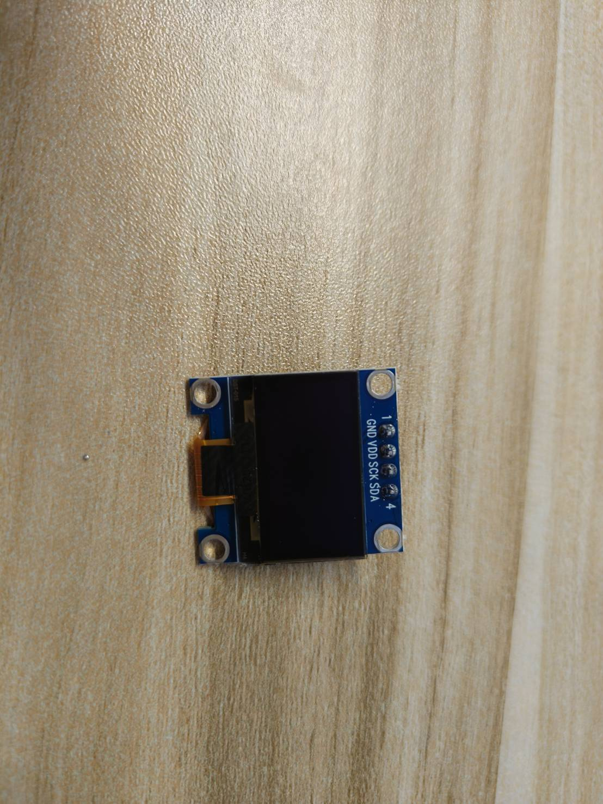
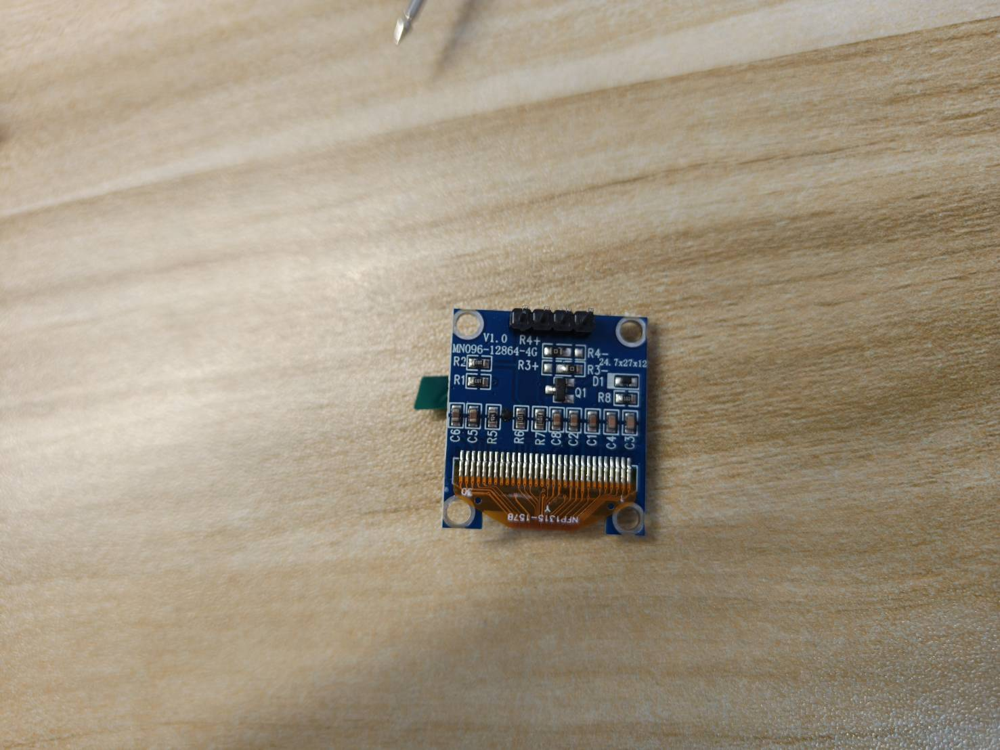
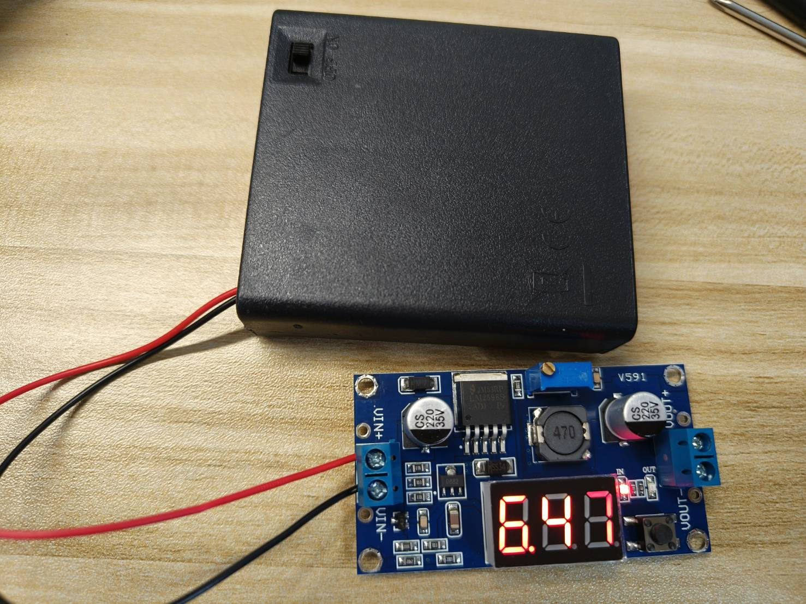
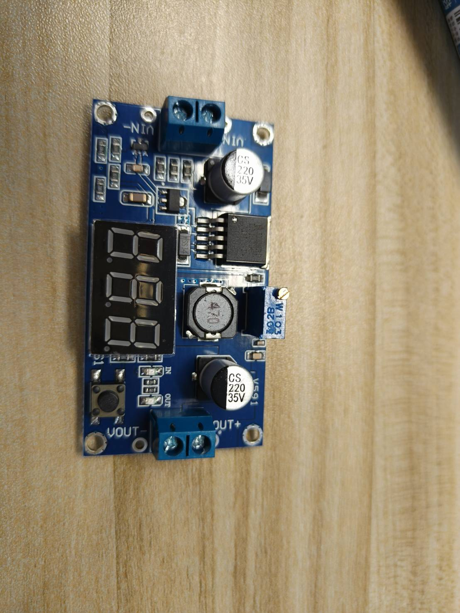
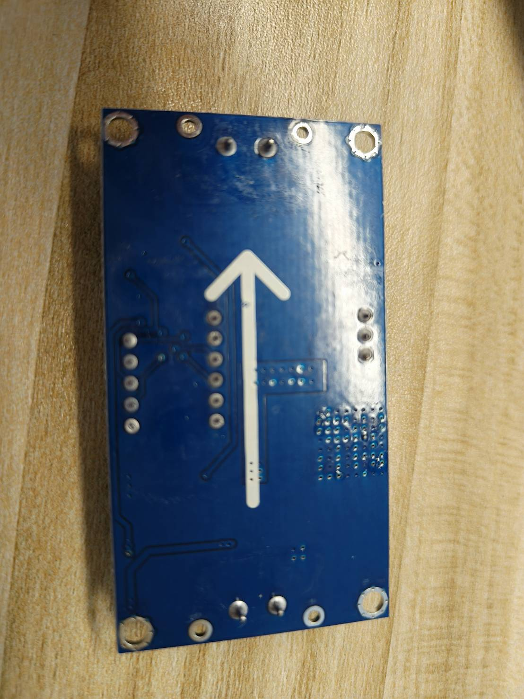
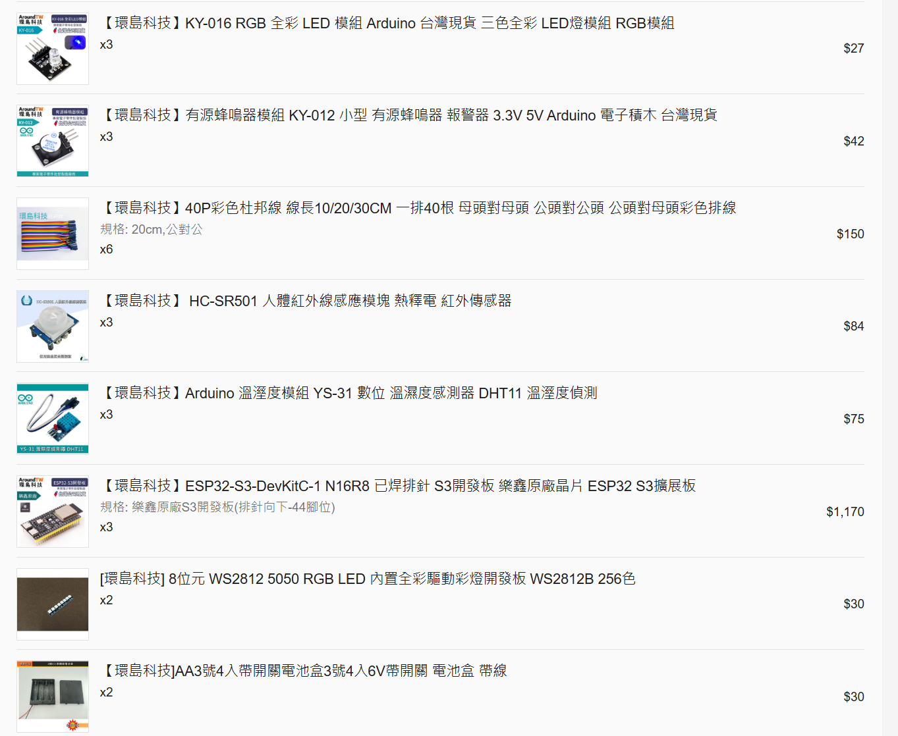
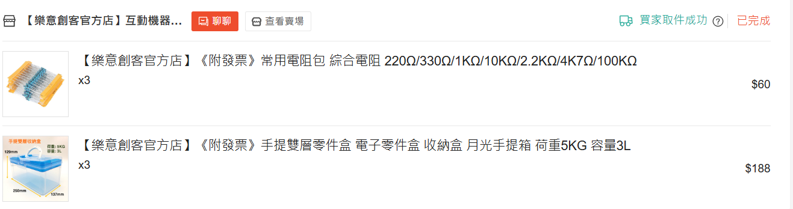

# Week 1: Course Overview, Assessment, and Project Direction

Date: September 9, 2026<br>
Course: Internet of Things

Week 1 introduces the course, assessment, project direction and materials.
No hardware is connected or powered on, and no program is uploaded.
The objectives below are semester-end abilities; practical concepts will be taught step by step.

[課程大綱](#course-schedule)｜[配分](#assessment)｜[中文採購清單](#purchase-table)｜[零件照片](#equipment-photos)｜[參考預算](#purchase-budget)｜[每組電表](#group-measurement-tool)｜[Week 2課前準備](#week-2-preclass-setup)｜[蝦皮購買圖片](#shopee-purchase-images)

## 1. Week 1 Overview

### 教學目標

完成本課程後，學生應能：

1. 整合 ESP32-S3、實體輸入與輸出、網路、後端（Backend）、資料庫（Database）及手機介面，建立全端物聯網系統（Full-stack IoT System）。
2. 依供電、接地與訊號規格安全接線，並在故障時停止設備。
3. 使用 HTTP、WebSocket 與 MQTT 等通訊方式傳送資料與命令，保存及查詢紀錄。
4. 以量測、測試與紀錄解釋系統行為，排查問題並提供可重建的文件。

### 教學內容

課程從按鈕、感測器與 ESP32-S3 開始，學習安全接線、量測及程式控制，再整合成「紅綠燈遮光挑戰」：按鈕開始倒數，光敏模組辨認遮光，RGB 提示燈色，OLED 顯示時間，舵機指出次數，蜂鳴器提示失敗。

接著將裝置連上網路，建立後端、資料庫與手機介面，學習資料紀錄、遠端控制及故障處理。期末完成具有明確用途、測試證據與重建文件的作品；題目不限定為共同遊戲。

<a id="first-iot-example"></a>
<a id="architecture-extension"></a>

### A First IoT Example: A Local Game and a Connected Device


*教學功能示意，不是接線圖，也不是已完成實機驗證的成品。*

In the local game, covering and uncovering the sensor during green adds one;
doing so during red subtracts one. Reach six and press Finish before time runs out.
Week 7 explains the complete rules. The following example shows what a network adds.

Consider a desk indicator: press a button to request help, a light changes color,
and a phone shows which desk needs assistance. A user can acknowledge the request
from the phone. This is a design example, not a tested device.

按鈕、開發板與燈是硬體（Hardware），程式是控制它們行為的軟體（Software）。
按鈕提供輸入（Input），ESP32-S3 處理後，以燈光作為輸出（Output）。

The local interaction can be described without any network:

```text
Person presses the button
  → ESP32-S3 program reads the press and changes the desk state to "help requested"
  → Program commands the indicator light to change color
  → Person checks whether the light actually changed
```

物聯網（Internet of Things, IoT）把實體互動連上網路；下列部分讓手機能顯示及回應求助訊息：

| Part | Meaning in this example | What a person could check |
|---|---|---|
| Network | Carries messages between the ESP32-S3 and the backend | Did the help-request message arrive? |
| Backend | A program running on a computer that receives events, checks commands, and prepares responses | Was a request accepted or rejected, and why? |
| Database | Organized, persistent storage for events and results | Can an earlier request still be retrieved after the backend restarts? |
| Log | A record of what a program did or encountered, used to trace a problem | Was an event received, or did an operation fail? |
| Mobile interface, or frontend | The page the user sees and operates on a phone | Does it show a request, an old reading, or a connection problem? |

```text
Button press → ESP32-S3 → network → backend → save record and update phone
Phone response → backend → network → ESP32-S3 → change light
```

These arrows show information flow, not electrical wiring. A sent message does not
prove that the light changed; later labs compare messages, records and actual behavior.
Identify this example's input, output and phone action before proposing your own topic.

## 2. Course Information

| Item | Information |
|---|---|
| Class | Four-Year Bachelor's Program in Information Management, Year 2, Class B |
| Instructor | Wen-Yi Lee |
| Class Time | Wednesdays, Periods 5-7, 13:30-16:15 |
| Weekly Hours | 3 hours |
| Prerequisite Knowledge | Basic programming experience in any language; no prior electronics or robotics experience is required |
| Primary Development Board | ESP32-S3 N16R8, pre-soldered downward-facing 44-pin headers; exact PCB must match the approved wiring profile |
| Material Language | The course outline retains English explanations; procurement, preparation and practical instructions use Traditional Chinese with necessary English terms |
| Textbooks and Services | No required textbook purchase and no required paid cloud service |

Administrative fields such as credits, course code, required or elective status, and
the official language of instruction are subject to the final university registration
system announcement.

<a id="course-schedule"></a>

## 3. Eighteen-Week Course Schedule

| Week | Date | Core Content | Main Outcome |
|---:|---|---|---|
| 1 | 09-09 | Course orientation, assessment, materials, and challenge preview | Explain the common exercise and self-selected final project; no hardware operation |
| 2 | 09-16 | ESP32-S3, safe wiring, buttons, and debounce | Existing Week 2: upload, Serial, continuity, GPIO events and debounce evidence |
| 3 | 09-23 | Electrical measurement, ADC, and indoor/shade classification | Retain measurements and resistor-divider work; add local calibration and Serial labels |
| 4 | 09-30 | Resistor ranges, DHT11, dual sensors, and buzzer events | Independent sampling, per-sensor quality, one-shot events, fault injection and recovery |
| 5 | 10-07 | RGB, OLED countdown, and time control | Align visible states and elapsed-time countdown; no servo power |
| 6 | 10-14 | SG90 paper pointer, 0–6 scale, external power, and safety | Map count to verified safe positions; test power, mounting, stop and recovery |
| 7 | 10-21 | Traffic-light shade challenge integration | Integrate scoring, countdown, Finish, pointer and failure sound; test boundaries and abort |
| 8 | 10-28 | Project Report 1: topic and technical feasibility | One 12–15 minute report per group: hardware segment, data flow, risk and questions |
| 9 | 11-04 | Instructor abroad: optional reading | No required attendance, new submissions or assessment |
| 10 | 11-11 | Individual Written Exam 1: Weeks 2–7 hardware and safety | Individual examination only; no new instruction or laboratory work |
| 11 | 11-18 | Wi-Fi, HTTP, JSON, WebSocket and backend | Trace device events and mobile commands/results with low-power outputs |
| 12 | 11-25 | MQTT, database and structured logs | Topics, presence, commands/acks, persistence and minimal history queries |
| 13 | 12-02 | Project Report 2: progress, feedback and revision | Implementation evidence, problems and a revision plan; further improvement remains possible |
| 14 | 12-09 | Mobile frontend, responsive web/PWA and permissions | Live/history/control/offline/error and permission flows |
| 15 | 12-16 | Automation, safety, fault recovery and reconstruction | One automation, three fault tests and clean-environment reconstruction |
| 16 | 12-23 | Individual Written Exam 2: networks and integration | Assess Weeks 11, 12, 14 and 15; no new instruction or project-progress submission |
| 17 | 12-30 | Project Report 3: final demonstration and individual questions | All groups present this week; one grade per group, with individual questions |
| 18 | 01-06 | University final examination week: reserved | No regular materials, new content or assessment |

<a id="assessment"></a>
<a id="assessment-details"></a>

## 4. Assessment

| Assessment | Weight | Primary Evidence |
|---|---:|---|
| Coursework | 15% | Weekly laboratory work, questions and answers, Lab Notebook, documentation, safety, collaboration, and verified AI use |
| Project Report 1 (Week 8) | 15% | Topic, hardware segment, software purpose, architecture, materials, risks, and acceptance criteria |
| Individual Written Exam 1 (Week 10) | 15% | Hardware wiring, GPIO and GND, electrical measurement, ADC, common ground, sensing, actuation, power, state machines, and safety |
| Project Report 2 (Week 13) | 15% | Current implementation evidence, progress status, identified problems, risk analysis, and a revision plan |
| Individual Written Exam 2 (Week 16) | 15% | Wi-Fi, HTTP, JSON, WebSocket, MQTT, integrated data flow, and log-based troubleshooting |
| Project Report 3 (Week 17) | 25% | Complete physical interaction, frontend and backend, data, reliability, testing, documentation, and individual understanding |
| Total | 100% |  |

The three reports develop one project: feasibility, progress and revision, then the final
demonstration. Each group receives one final-report grade; written exams are individual.
Hardware price, mechanical complexity and speed do not earn extra credit.

<a id="final-project"></a>

## 5. Minimum Final Project Requirements

These are semester-end requirements. In Week 1, use them to understand the direction
of the course; do not attempt to build all layers or buy optional parts immediately.
The final project must include all of the following:

- A physical artifact that operates safely and addresses a clearly described use case.
- An ESP32-S3 or another controller approved by the instructor.
- At least one physical input and one physical output; an exception must be approved
  during Week 8.
- Wi-Fi and device communication through HTTP or MQTT.
- A student-developed backend that can be restarted from documented instructions.
- A database, historical queries, and structured logs.
- A mobile-friendly interface showing real-time data, history, controls or settings,
  and error or offline states.
- Real-time updates through WebSocket; every control action must leave a command,
  result or acknowledgement, or timeout record.
- At least one automated response, state machine, or schedule.
- At least three tests, including one involving disconnection, invalid input, an
  abnormal sensor value, or a stopped service.
- Source code, a wiring diagram, a data-flow diagram, data formats, a bill of materials,
  reconstruction instructions, AI-use and verification records, and known limitations.

A ready-made dashboard or IoT platform may be used as a supporting tool, but it cannot
replace the student-developed device program, backend, database, or mobile interface.

<a id="materials"></a>

<a id="purchase-table"></a>

<a id="一學生材料採購總表"></a>

## 6. 材料準備

適用學期：115學年度第1學期<br>
公布週次：Week 1（2026-09-09）<br>
準備方式：下表依首次使用週次排序，可一次購齊或分批準備，自行安排到貨時間，
於首次使用前備妥。USB資料線與組內電表從Week 2開始使用。

每組1～3人，共同準備並保管一套基本零件、舵機供電組與萬用電表。各成員輪流操作，並各自保存學習紀錄。

### 每組必備零件

已有符合規格的零件可沿用，只補缺項，不限定購買整套材料包。

| 品項 | 必須符合的規格 | 每組數量 | 每組參考金額 | 首次使用與Week 2～7共同任務 |
|---|---|---:|---:|---|
| ESP32-S3開發板（development board） | YD-ESP32-S3 Type-A V1.5、N16R8、已焊向下44腳排針；不同板型先確認相容性 | 1片 | NT$390 | Week 2～7：上傳程式、讀取輸入與控制輸出 |
| 麵包板（breadboard） | 400孔免焊麵包板，約8.5×5.5 cm | 1片 | NT$22 | Week 2～7：免焊接線與量測 |
| 杜邦線（jumper wire） | 20 cm，公對公／公對母／母對母，各一排40條 | 各1排 | NT$75 | Week 2～7：連接板卡、零件與測點；母對母從Week 4使用 |
| 四腳輕觸按鈕（pushbutton） | 6×6 mm、常開瞬時型 | 2顆 | NT$4 | Week 2、6～7：按鈕輸入、停止與遊戲控制 |
| 指定阻值電阻（resistor） | 220 Ω、330 Ω、1 kΩ與10 kΩ；保留原阻值標示 | 4種，各至少1顆 | NT$60（以整包估算） | Week 3～4：1 kΩ／10 kΩ分壓；220 Ω／330 Ω量測 |
| 光敏電阻模組（photoresistor module） | KY-018 | 1個 | NT$10 | Week 3～5、7：光線量測、遮光分類與遊戲輸入 |
| 溫濕度模組（temperature and humidity module） | YS-31 DHT11三針模組，排針已焊；不買裸感測器 | 1個 | NT$25 | Week 4：溫濕度取樣、錯誤處理與雙感測器整合 |
| 蜂鳴器模組（buzzer） | KY-012有源型（Active Buzzer），三針、附模組板 | 1個 | NT$14 | Week 4、7：遮光事件與遊戲失敗的短聲提示 |
| 三色發光模組（RGB LED） | KY-016／HW-479類，單顆RGB、四針、附限流電阻；不是WS2812B燈條 | 1個 | NT$9 | Week 5、7：狀態燈與遊戲紅綠燈 |
| 有機發光顯示器（OLED） | 0.96吋、SSD1306控制器、128×64像素、四針I²C介面；模組須支援3.3 V供電與3.3 V邏輯，排針已焊 | 1個 | NT$65（歷史單價） | Week 5～7：顯示倒數、次數與結果 |
| 小型舵機（servo） | SG90位置型，附舵盤與螺絲；不是360度連續旋轉型 | 1個 | NT$35 | Week 6～7：用指針指出有效次數 |

電阻可單買或跨組合買分裝，每組備齊四種阻值各至少一顆。NT$60是整包歷史價格，
不是四顆的報價；不要求購買包內其他阻值。

OLED依上表規格選購，不以外觀相似的SH1106或SPI版本替代；腳位與通訊檢查在Week 5進行。

蜂鳴器新購前，請提供商品供電與腳位資料供教師確認；不要直接接到GPIO。已有模組可先保留。
教師已有的HW-508及使用SSD1315設定顯示的OLED，不因此要求重買：Week 4提供受限波形選項，
Week 5～7提供OLED驅動選項。這些只適用核對後的實物，並非所有同名模組都已通過驗證。

三種杜邦線依實驗需要取用，其餘保存。採購表不是接線表，上電須依當週操作步驟。

### 舵機供電組：每組一套，可共同購買

Week 6首次使用，Week 7沿用。組內輪流操作，一次只供一顆SG90，
換接前關閉電池盒並拔除USB；每位學生仍須完成操作與紀錄。

| 品項 | 選購規格 | 每組數量 | 參考金額 |
|---|---|---:|---:|
| 電池盒（Battery Holder） | 四顆AA串聯、帶開關及導線 | 1個 | NT$15 |
| 可調降壓模組（Buck Converter） | LM2596S類、已組裝、具輸入／輸出螺絲端子與可切換IN／OUT的電壓顯示；不是裸晶片 | 1片 | NT$45（歷史單價，實際規格與售價須核對） |
| AA電池（AA Battery） | 每顆標稱1.5 V，四顆同類型、同規格及新舊狀態；不混用1.2 V電池 | 4顆 | 自備，另計 |
| 電源連接材料（Power Connector and Wiring） | 能牢固連接電池盒、降壓模組與舵機，接點絕緣；合適既有線材可沿用 | 1套 | 自備，另計 |

電池先接降壓模組輸入，舵機由調整後的輸出供電，不把電池盒直接接舵機。
降壓模組的啟動電流、壓降與發熱仍須在Week 6核對；商品標示的電流不是整套供電已通過的證明。

<!-- hardware-gallery:start -->
<a id="equipment-photos"></a>

### 採購零件外觀

對照照片辨認零件，所需規格與數量以採購表為準。

照片標示來源與角度，只供外觀辨識，不是接線圖或已驗證證明；商品圖的價格與數量不代表學生需求。Week 1不接線，實作時依當週核准步驟操作。

[ESP32-S3 開發板](#equipment-esp32s3) · [400 孔麵包板](#equipment-breadboard400) · [杜邦線](#equipment-jumperwire) · [四腳輕觸按鈕](#equipment-pushbutton) · [萬用電表](#equipment-a830l) · [固定電阻](#equipment-resistor) · [KY-018 光敏電阻模組](#equipment-ky018) · [DHT11 溫濕度模組](#equipment-dht11) · [HW-508 蜂鳴器模組](#equipment-buzzer_hw508) · [HW-479 三色發光二極體模組](#equipment-rgb_hw479) · [有機發光二極體顯示模組](#equipment-oled) · [SG90 舵機](#equipment-sg90) · [四槽 AA 帶開關電池盒](#equipment-batteryholder4aa) · [帶數字顯示的降壓模組](#equipment-buckconverter)

<a id="equipment-esp32s3"></a>

#### ESP32-S3 開發板（Development Board）

主控制板，負責執行程式及連接零件。照片為YD-ESP32-S3 Type-A V1.5；不可直接套用不同板型的接線圖。

| 實物後製展示圖：正面：模組、按鈕與 USB 接頭 | 實物後製展示圖：背面：板身與排針 |
| --- | --- |
|  |  |

其他留存角度：[麵包板對孔紀錄；不是建議的實驗安裝方式，右側接線空間不足](../docs/images/hardware/actual/ESP32S3_3.jpg)。

<a id="equipment-breadboard400"></a>

#### 400 孔麵包板（Breadboard）

免焊連接零件；以中央溝槽、字母與列號辨認插孔位置。

| 實物照片：俯視：中央溝槽、五孔組與側邊電源軌 |
| --- |
|  |

<a id="equipment-jumperwire"></a>

#### 杜邦線（Jumper Wire）

用來連接零件。金屬針是公頭（Male），插孔是母頭（Female）；三種接頭都要準備。

| 實物照片：成排導線與接頭全貌 | 蝦皮商品參考：公對公：兩端皆為金屬針 |
| --- | --- |
|  |  |

| 蝦皮商品參考：公對母：金屬針與插孔各一端 | 蝦皮商品參考：母對母：兩端皆為插孔 |
| --- | --- |
|  |  |

<a id="equipment-pushbutton"></a>

#### 四腳輕觸按鈕（Tactile Pushbutton）

黑色頂部是按壓位置，四支金屬腳用來接線；用於輸入、停止及遊戲控制。

| 實物照片：俯視：按鍵與金屬上蓋 | 實物照片：側面：四支接腳 |
| --- | --- |
|  |  |

其他留存角度：[歷史接線紀錄：同一組常通接點的量測，不是按下才導通的接法答案](../docs/images/hardware/actual/Pushbutton_3.jpg)。

<a id="equipment-a830l"></a>

#### 萬用電表（Digital Multimeter）

量測電阻與電壓、檢查通斷。照片是A830L示範表，操作以自己的電表刻度與插孔為準。

| 實物照片：正面：顯示器、旋鈕與表筆插孔 |
| --- |
|  |

<a id="equipment-resistor"></a>

#### 固定電阻（Resistor）

限制電流或組成分壓電路；以色環與原包裝辨認阻值，本課需要的四種阻值見採購表。

| 實物照片：不同阻值與手寫分類標示 |
| --- |
|  |

<a id="equipment-ky018"></a>

#### KY-018 光敏電阻模組（Photoresistor Module）

頂端圓片感受光線變化，用於遮光辨識。

| 實物照片：正面近照：感光元件、S 與 − 絲印 | 實物照片：另一元件面角度 |
| --- | --- |
|  |  |

| 實物照片：焊接面 |
| --- |
|  |

<a id="equipment-dht11"></a>

#### DHT11 溫濕度模組（Temperature and Humidity Module）

藍色有孔外殼內是溫濕度感測器；照片為YS-31三針模組。

| 實物照片：感測器面與連接線 | 實物照片：焊接面與排針連接 |
| --- | --- |
|  |  |

<a id="equipment-buzzer_hw508"></a>

#### HW-508 蜂鳴器模組（Buzzer Module）

圓形發聲元件，用於短聲提示。商品名KY-012，照片板號HW-508；腳位與驅動規格仍待核對，不直接接GPIO。

| 實物照片：元件面：圓形蜂鳴器與三支排針 | 實物照片：焊接面 |
| --- | --- |
|  |  |

其他留存角度：[較早的元件面照片，文字不清](../docs/images/hardware/actual/Buzzer_HW508_3.jpg)。

<a id="equipment-rgb_hw479"></a>

#### HW-479 三色發光二極體模組（RGB LED Module）

單顆LED呈現紅、綠、藍色，用於狀態提示；四針模組，不是八顆燈條。

| 實物照片：正面：單顆 LED 與 B／G／R／− 標示 | 實物照片：焊接面 |
| --- | --- |
|  |  |

其他留存角度：[較早的元件面照片](../docs/images/hardware/actual/RGB_HW479_3.jpg)；[失焦補充照；不供腳位或焊點判讀](../docs/images/hardware/actual/RGB_HW479_4.jpg)。

<a id="equipment-oled"></a>

#### 有機發光二極體顯示模組（OLED Display）

顯示倒數、次數與結果。下列有到貨正背照片與歷史商品圖；選購規格見採購表，實物照片不代替規格。

| 實物照片：正面：螢幕與四個功能標示 | 實物照片：背面：板號與垂直於電路板的排針 |
| --- | --- |
|  |  |

| 蝦皮商品參考：OLED 在倒數第三列；其他商品與數量不是學生採購要求 |
| --- |
|  |

<a id="equipment-sg90"></a>

#### SG90 舵機（Servo Motor）

帶三線接頭的小型舵機，附白色舵盤，用來帶動指針；不可由GPIO或3V3供電。

| 實物照片：拆袋全貌：標籤、三線插頭與附件 | 實物照片：包裝內的標籤、插頭與舵盤 |
| --- | --- |
|  |  |

| 實物照片：另一包裝角度 |
| --- |
|  |

<a id="equipment-batteryholder4aa"></a>

#### 四槽 AA 帶開關電池盒（Battery Holder）

四槽AA串聯電池盒，帶開關與導線；四顆1.5 V電池經降壓模組供舵機，可按組共用。

| 實物照片：外殼、ON／OFF 開關與紅黑裸線 | 實物照片：另一盒蓋與導線角度 |
| --- | --- |
|  |  |

<a id="equipment-buckconverter"></a>

#### 帶數字顯示的降壓模組（Buck Converter）

將電池電壓調低後供舵機；辨認VIN輸入與VOUT輸出。Week 6～7使用，可按組共用，先量測再接負載。

| 實物照片：電池接 VIN、輸出未接負載；IN 指示燈亮、顯示 6.47 | 實物照片：元件面、螺絲端子與數字顯示 |
| --- | --- |
|  |  |

| 實物照片：焊接面 |
| --- |
|  |

<!-- hardware-gallery:end -->

<a id="purchase-budget"></a>

### 參考預算：零件、電表與其他用品分開算

**每組基本零件NT$709＋供電組已計價部分NT$60＋電表NT$159＝每組參考小計NT$928。**

全組共用一套，不按人數重複購買。供電組已計價部分為電池盒15＋降壓模組45＝60，不含電池與連接材料。

表中金額已包含各項數量，沿用[2026年採購紀錄](../docs/hardware/purchased_inventory.md)，不是目前報價。
NT$928未含筆電與充電器、USB資料線、收納、AA電池、連接材料及運費；
這些項目依實際需補買的用品計算，不能當成0元。

<a id="group-measurement-tool"></a>

### 每組必備的量測工具

本課每組1～3人，每組自行準備一台數位萬用電表。1人組可以向其他組共用，
但兩組必須分別完成量測、記錄與結果判讀，不能共用同一份證據。

| 品項 | 最低要求 | 每組數量 | 單價參考 | 首次使用 | 後續使用 |
|---|---|---:|---:|---:|---|
| 數位萬用電表（digital multimeter） | 具通斷蜂鳴、電阻、低壓直流電壓、`COM`與`VΩ`或`VΩmA`插孔；表筆完整 | 1台 | A830L既有成交參考NT$159 | Week 2 | Week 3～7接線、供電與故障排查 |

以每組新買上述一套零件、供電組及電表，平均分攤為例：

| 組別人數 | 每組參考小計 | 每人平均分攤 |
|---|---:|---:|
| 1人 | NT$928 | NT$928 |
| 2人 | NT$928 | NT$464 |
| 3人 | NT$928 | 約NT$309.33 |

例如三人組：928÷3≈309.33；電池、連接材料及其他用品與運費另計，實際分帳尾差由組內協調。
沿用或跨組共用合格電表者，依實際新增支出計算。

### 其他自備用品

| 品項 | 最低要求 | 準備數量 | 首次使用 | Week 2～7用途 |
|---|---|---:|---:|---|
| 筆電（laptop）與充電器 | 可安裝Arduino IDE 2並連接USB裝置 | 每人1套 | Week 1 | Week 2～7編譯、上傳、序列監控與保存個人紀錄 |
| USB資料線（USB data cable） | 接頭符合開發板且可傳輸資料；只有充電功能不合格 | 每組1條 | Week 2 | Week 2～7開發板USB供電、上傳與序列通訊 |
| 收納盒或密封袋（storage container） | 標示組別與保管人 | 每組1個 | Week 2 | 每次實作斷電後分類、清點與保存零件 |

紙／布、指針、刻度及固定用材料自行處理，不列入上方電子零件採購與估價。

電源接點須牢固且絕緣，不可用裸線碰觸、鬆散纏繞或只靠膠帶壓住接點；工具依連接方法準備。

電池與連接材料已列在上方供電組，不重複購買；一般一次性電池不得充電，本方案不要求鎳氫充電器。

供電分工是「筆電USB供ESP32，電池盒經降壓模組供SG90，兩者共地（common ground）」。
不能把SG90接到GPIO或3V3取電，也不能把本課YD板未橋接的`5Vin`當成USB的5 V輸出。
Week 6先辨認IN／OUT並量測、調整輸出，再確認舵機負載電壓、接線與安全停止。空載調整完成不代表可以直接帶負載。

<a id="before-week2"></a>

<a id="week-2-preclass-setup"></a>

## 7. Week 2課前準備（Week 1課後完成）

Week 1課後先安裝Arduino IDE（撰寫與上傳程式的軟體）及ESP32板卡套件（Board Package，讓IDE支援ESP32）；兩者須分別安裝。
操作畫面見[Week 2第四節](../Week_02_ESP32_Hardware_Basics/week2_main.ipynb#w2-install)。
課前只完成安裝與資料準備，接板、接線與上傳留到Week 2。

### 1. 安裝Arduino IDE 2

依Week 2第四節提供的[Arduino官方來源](https://docs.arduino.cc/software/ide/)
完成安裝，再開啟一次IDE。保留成功開啟的畫面及實際安裝版本。

### 2. 安裝Espressif ESP32 board package

依Week 2第四節及其中連結的
[Espressif官方安裝說明](https://docs.espressif.com/projects/arduino-esp32/en/latest/installing.html)
完成Boards Manager安裝，確認Espressif的`esp32`項目顯示已安裝並記下版本。
安裝後重新啟動Arduino IDE。Board、flash與PSRAM設定由教師在Week 2
依實物板卡統一公布，不自行猜測。

### 3. 取得課程資料

第一次取得課程資料且尚未使用Git時，可先在
[課程GitHub首頁](https://github.com/KennethWYLee/IoT)選擇`Code → Download ZIP`。
畫面位置可對照[GitHub官方下載說明](https://docs.github.com/en/repositories/working-with-files/using-files/downloading-source-code-archives)。
下載後解壓縮到一個容易找到的新資料夾，不直接覆蓋自己已修改過的舊資料夾。
解壓縮後確認能找到：

```text
IOT_Introduction/Week_02_ESP32_Hardware_Basics/week2_main.ipynb
IOT_Introduction/docs/course_materials/starter_code_snippets.md
```

`.ipynb`是包含說明與程式格的notebook文件；在GitHub可以閱讀，不需要在Week 1
安裝Python或Jupyter才能開始課程。下載的ZIP是一份當下的檔案快照，不會自動
取得之後的更新。已有Git工作目錄的學生可沿用原有同步方式，但同步前先檢查
尚未保存的修改；不確定時保留舊資料並提出問題，不用覆蓋或刪除來解決。

### 4. 準備上課用品與證據

- [ ] 筆電、充電器及一條可傳輸資料的USB線。
- [ ] Arduino IDE 2可開啟的截圖。
- [ ] Boards Manager顯示Espressif `esp32`已安裝的截圖。
- [ ] 課程資料已下載或同步的截圖。
- [ ] 已盤點Week 2需用的開發板、麵包板、按鈕與杜邦線。
- [ ] 已確認本組萬用電表的準備者；1人組若共用，已確認共用對象。

安裝失敗時，回報作業系統版本、卡住的步驟、完整錯誤訊息或截圖，
以及已經嘗試過的處理方式。

<a id="shopee-purchase-images"></a>

## 8. 老師的蝦皮購買圖片（歷史參考）

以下是老師提供的環島科技、樂意創客購物截圖。規格與數量以[中文採購清單](#purchase-table)為準，
不要照抄截圖中的整筆訂單；額外車輛器材供老師自製無人車等個人用途。
價格是歷史紀錄，不是目前報價；商品圖片不是接線圖。

[圖 1：電表、按鈕與公對母線](#shopee-order-1)｜[圖 2：OLED 與母對母線](#shopee-order-2)｜[圖 3：ESP32 與感測模組](#shopee-order-3)｜[圖 4：光敏、SG90 與麵包板](#shopee-order-4)｜[圖 5：電阻包](#shopee-order-5)

圖片中的小字可點開原圖放大查看。

<a id="shopee-order-1"></a>

### 圖 1：環島科技——電表、按鈕與公對母杜邦線

重點：A830L 電表、四腳按鈕與公對母杜邦線。最上方是支架，不含 OLED 螢幕；按鈕列為購物車紀錄。


<a id="shopee-order-2"></a>

### 圖 2：環島科技——OLED 顯示器與母對母杜邦線

倒數第三列是「4 針、0.96 吋」OLED 螢幕，不是支架；同圖另有母對母杜邦線。


<a id="shopee-order-3"></a>

### 圖 3：環島科技——ESP32、感測與發光模組

重點：ESP32-S3、DHT11、單顆 RGB、蜂鳴器、公對公杜邦線與四槽 AA 電池盒；八顆燈條不是本課 RGB 模組。



<a id="shopee-order-4"></a>

### 圖 4：環島科技——光敏模組、SG90 與麵包板

重點：KY-018、SG90 與 400 孔麵包板；上方電池盒是與圖 3 重疊的同一列。


<a id="shopee-order-5"></a>

### 圖 5：樂意創客——常用電阻包與收納盒

電阻包包含本課需要的四種阻值，可依採購表單買或分裝；收納盒不限定圖中款式。


