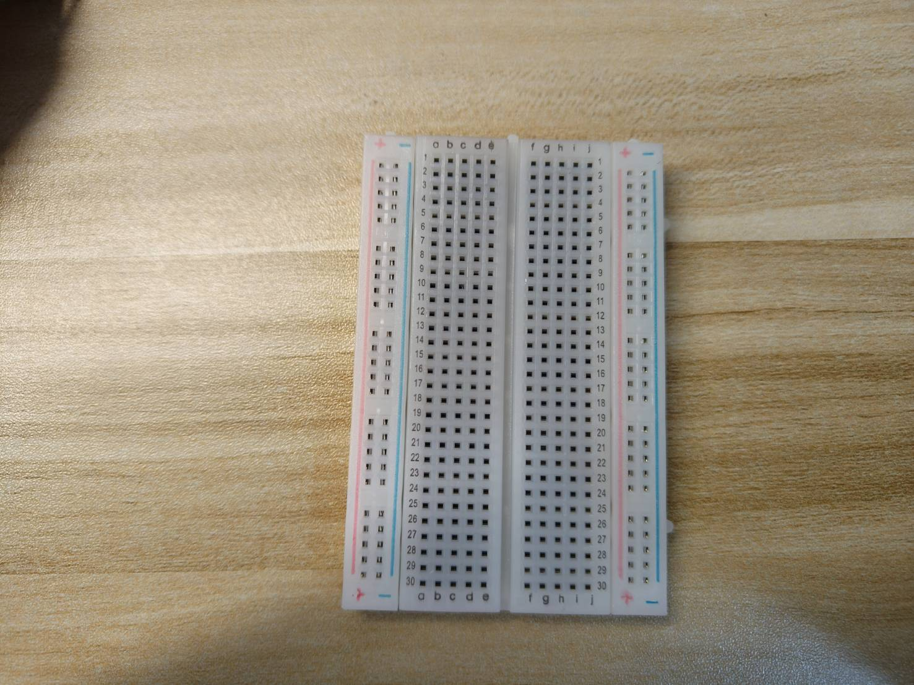
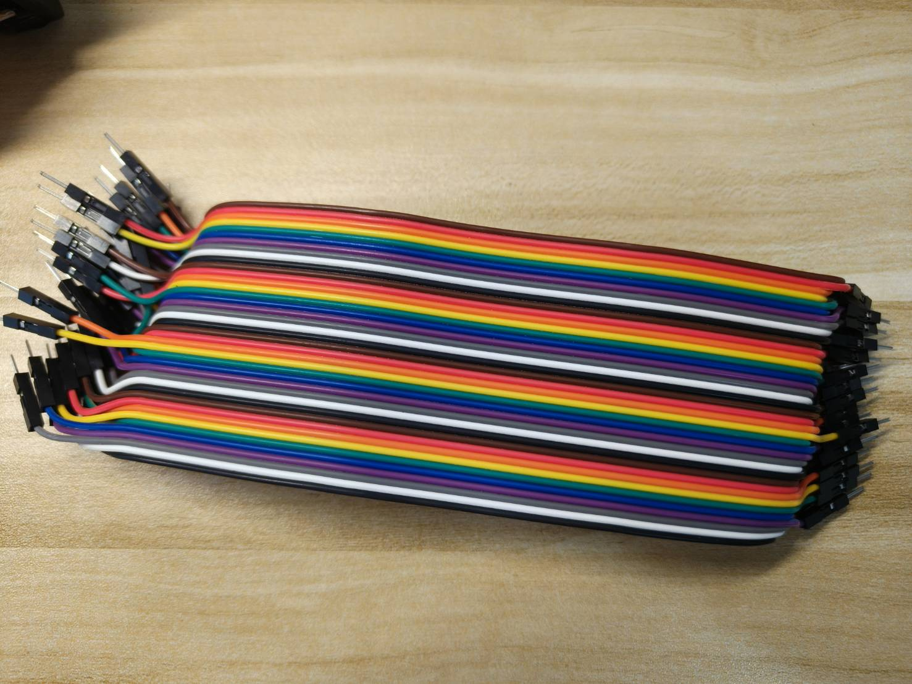
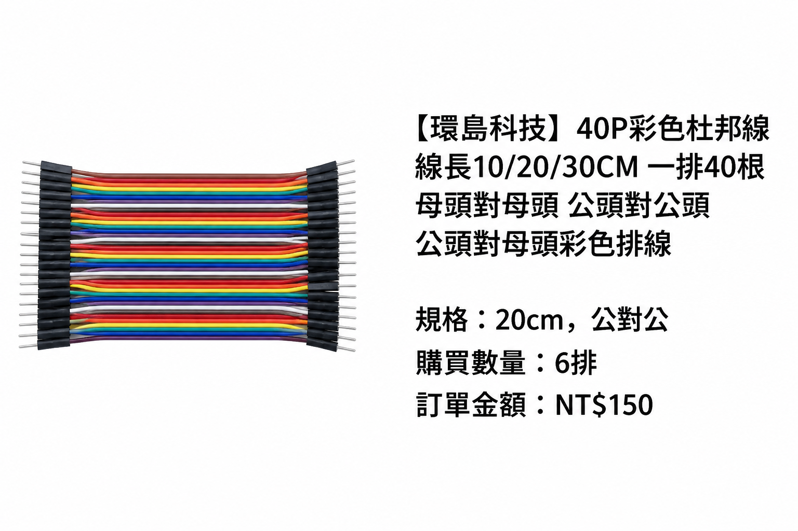
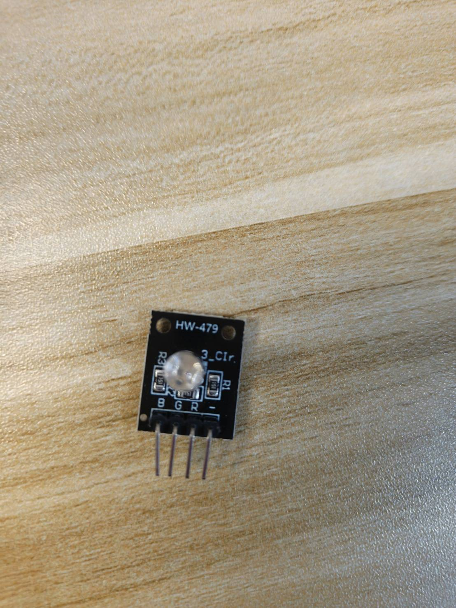

# Week 11：Wi-Fi、HTTP、JSON、WebSocket、Backend與手機雙向控制

日期：2026-11-18

本章把前七週完成的實體按鈕與RGB輸出接到第一個完整網路系統。按下ESP32的
START或STOP後，事件會送到筆電Backend、寫入SQLite，並由WebSocket即時更新
手機畫面；手機送出的`start`、`stop`或`reset`命令則由ESP32接收、判斷、執行，
最後回報結果。實體STOP仍在ESP32本機直接處理，不依賴網路才能生效。

本週採低功率網路示範：只沿用Week 7的按鈕與Week 5的RGB，不遠端控制整套遊戲。第二顆按鈕在本週改作持續有效的STOP，不是遊戲的Finish送出。韌體使用idle／active／error狀態；它們不是將Week 7所有遊戲結果直接改名。共同事件欄位保留device_id、event_type、state、value、unit、valid、reason與uptime_ms；遊戲專屬欄位若日後上傳，必須另外明訂schema映射。

## 一、Unit Overview

### 教學目標

完成本單元後，學生應能：

1. 追蹤物聯網（IoT）的事件（event）與命令（command），說明它們如何經過ESP32、超文字傳輸協定應用程式介面（HTTP API）、後端（backend）、資料庫（database）、網頁雙向通訊連線（WebSocket）與手機瀏覽器（mobile browser）。
2. 將ESP32連接到可信任的無線網路（Wi-Fi），並區分裝置位址（device address）、伺服器位址（server address）、通訊埠（port）、路徑（path）與HTTP狀態碼（HTTP status code）。
3. 建立及驗證JSON格式事件（JSON event），包含裝置識別（device identity）、事件類型（event type）、狀態（state）、有效性（validity）、原因（reason）與裝置運行時間（device uptime）。
4. 啟動課程後端並獨立驗證，再連接手機與ESP32，且不將網路機密資料（network secret）提交到Git版本控制系統（Git）。
5. 追蹤遠端命令從已提出（`requested`）、已接受（`accepted`）到最終結果（terminal result）的過程，同時保留不依賴網路的實體停止功能（physical stop）。
6. 分別測試硬體、無線網路、HTTP、後端、資料庫與瀏覽器各層，縮小故障範圍。

### 教學內容

本單元介紹全端物聯網系統（full-stack IoT system）的網路資料路徑。學生會運用無線網路（Wi-Fi）、超文字傳輸協定（HTTP）與JSON資料交換格式（JSON），將先前已驗證的實體輸入及輸出連接至本機後端（local backend）。後端負責驗證及儲存裝置事件（device event）、提供命令介面（command interface），並透過網頁雙向通訊協定（WebSocket）同步手機瀏覽器，不需持續重新整理整頁。實作重點包括可觀察的訊息流（message flow）、穩定的裝置識別（device identity）、命令回覆確認（command acknowledgement）、本機安全行為、認證資料（credential）保護與分層故障排查（layer-by-layer troubleshooting），而不只把網路操作當成一次連線成功或失敗。

### 可觀察的完整資料流

```text
START／STOP按鈕
      ↓
ESP32事件 → HTTP POST → FastAPI Backend → SQLite
                                      ↓
手機畫面 ← WebSocket即時推送 ←─────────┘

手機命令 → HTTP POST → Backend → ESP32定期HTTP查詢
                                      ↓
手機畫面 ← WebSocket ← 結果POST ← ESP32判斷與安全輸出
```

本週的**Backend（後端）**是在筆電上執行、負責接收資料、驗證請求、保存資料與
管理命令的程式。手機不是直接控制ESP32；所有事件與命令都經過Backend，才能留下
可追蹤紀錄。

<!-- hardware-gallery:start -->
<a id="equipment-photos"></a>

### 本週器材外觀

以兩顆 START／STOP 按鈕送出事件，RGB 呈現命令結果；另備筆電、USB 資料線、同一區域網路及手機。無須把 Week 7 全套輸出接回。

照片下方標示拍攝角度與來源。先辨認零件，再依本週器材表與接線步驟操作；照片本身不是接線指令，也不表示已完成電氣驗證。

[ESP32-S3 開發板](#equipment-esp32s3) · [400 孔麵包板](#equipment-breadboard400) · [杜邦線](#equipment-jumperwire) · [四腳輕觸按鈕](#equipment-pushbutton) · [HW-479 三色發光二極體模組](#equipment-rgb_hw479)

<a id="equipment-esp32s3"></a>

#### ESP32-S3 開發板（Development Board）

照片中的板卡為 YD-ESP32-S3 Type-A V1.5，搭載 N16R8 模組。正反面白底圖是既有後製展示圖；小字與腳位須核對本人實物及本週接線資料。

| 實物後製展示圖：正面：模組、按鈕與 USB 接頭 | 實物後製展示圖：背面：板身與排針 |
| --- | --- |
|  |  |

其他留存角度：[麵包板對孔紀錄；不是建議的實驗安裝方式，右側接線空間不足](../docs/images/hardware/actual/ESP32S3_3.jpg)。

<a id="equipment-breadboard400"></a>

#### 400 孔麵包板（Breadboard）

辨認中央溝槽、a～j 字母與列號。外觀照片不表示所有孔都相通，連通關係依本週圖解與斷電量測確認。

| 實物照片：俯視：中央溝槽、五孔組與側邊電源軌 |
| --- |
|  |

<a id="equipment-jumperwire"></a>

#### 杜邦線（Jumper Wire）

露出金屬針的是公頭（Male），有插孔的是母頭（Female）；線色不會自行決定電壓或功能。所需接頭種類依當週器材表，不是每週都用完三種。商品參考卡上的數量與金額是歷史資料，不是學生應買數量或目前售價。

| 實物照片：成排導線與接頭全貌 | 蝦皮商品參考：公對公：兩端皆為金屬針 |
| --- | --- |
|  |  |

| 蝦皮商品參考：公對母：金屬針與插孔各一端 | 蝦皮商品參考：母對母：兩端皆為插孔 |
| --- | --- |
|  |  |

<a id="equipment-pushbutton"></a>

#### 四腳輕觸按鈕（Tactile Pushbutton）

上方黑色部分是按壓位置，四支金屬腳用來連接電路。照片不能單獨證明哪一對腳常通；先斷電，依 Week 2 的方法辨認。

| 實物照片：俯視：按鍵與金屬上蓋 | 實物照片：側面：四支接腳 |
| --- | --- |
|  |  |

其他留存角度：[歷史接線紀錄：同一組常通接點的量測，不是按下才導通的接法答案](../docs/images/hardware/actual/Pushbutton_3.jpg)。

<a id="equipment-rgb_hw479"></a>

#### HW-479 三色發光二極體模組（RGB LED Module）

訂單稱 KY-016；實物 PCB 標示 HW-479，前方可見 B、G、R、− 與板上電阻。共同端、阻值及控制電流仍須核對，不能用八顆燈條取代這個模組。

| 實物照片：正面：單顆 LED 與 B／G／R／− 標示 | 實物照片：焊接面 |
| --- | --- |
|  |  |

其他留存角度：[較早的元件面照片](../docs/images/hardware/actual/RGB_HW479_3.jpg)；[失焦補充照；不供腳位或焊點判讀](../docs/images/hardware/actual/RGB_HW479_4.jpg)。

<!-- hardware-gallery:end -->

## 二、器材、軟體與開始狀態

每組沿用下列已購硬體，組員輪流操作；個人筆電與學習紀錄各自準備：

- ESP32-S3開發板（依核准的確切板卡）、USB資料線、400孔麵包板及杜邦線。
- 兩顆四腳按鈕，分別作為START與實體STOP。
- KY-016 RGB LED模組，作為可安全觀察的實體輸出。
- 筆電、手機，以及兩者都能加入的可信任區域網路。

本週不接SG90、蜂鳴器與4AA電池盒。先以USB及低功率RGB完成網路控制，可把網路
錯誤與致動器供電問題分開。第5週實機profile尚未完成者可以先用`DRY_RUN=true`
完成Backend與網路路徑，但不能把它記錄成實體硬體測試通過。

上課開始前須符合：

1. 已有Week 7按鈕與Week 5 RGB的指定profile及實機紀錄；本週另確認第二顆按鈕改作STOP的功能。
2. Arduino IDE能對本人的ESP32-S3完成Upload及Serial Monitor觀察。
3. 已依[Python與Git課前準備](#support-課前安裝python與git)
   確認Git與Python命令可顯示版本；版本記錄於
   [Week 11支援資料](#support-一課前環境與器材確認)。
4. 本機repository已同步，且`IOT_Introduction/examples/course_backend`存在。

## 三、安全與網路責任

1. 接線、換線與通斷量測前先拔USB；本週不在帶電狀態移動杜邦線。
2. GPIO只作訊號，不直接供應高電流負載。發熱、異味、重複重開機或異常聲音時
   立即拔除USB。
3. 實體STOP必須由ESP32本機直接讀取。Backend停止、Wi-Fi中斷或手機離線時，
   按下STOP仍須使RGB進入安全狀態。
4. 僅使用教師允許的可信任LAN（Local Area Network，區域網路）。不要設定路由器
   port forwarding，也不要把本週服務公開到Internet。
5. Wi-Fi密碼與operator key不得寫入`.ino`、Markdown、截圖或Git。教材中的值都是
   placeholder（待替換範例），不可當成真實密碼。
6. 手機顯示「命令已送出」只代表Backend收到請求，不代表硬體已動作；必須看到
   相同`command_id`的最終`done`、`error`、`timeout`或`rejected`。

本週範例使用同步HTTP request，單次timeout上限為1.2至1.5秒；request進行期間，`loop()`
無法重新讀取按鈕。因此「本機STOP」代表不需要Backend回應才能改變本機RGB，不代表它是
機械或高功率負載可用的緊急停止。若專題有舵機、馬達或其他危險動作，必須另設不受網路
request阻塞的停止與斷電路徑，並實測最壞停止時間。

## 四、先辨認網路地址，不先接ESP32

### 4.1 IP、port與URL

**IP address（IP位址）**用來辨認LAN中的一台裝置。筆電可能顯示多個位址；本週要找
與手機、ESP32位於同一個Wi-Fi網路的IPv4，例如`192.168.x.x`或`10.x.x.x`。

**port（連接埠）**用來辨認同一台電腦上的特定服務。本週Backend使用`8000`。
以下URL（Uniform Resource Locator，資源位址）可拆成：

```text
http://192.168.1.23:8000/api/events
│      │              │    └─ path：Backend中的資源路徑
│      │              └────── port：8000
│      └───────────────────── host：筆電IP
└──────────────────────────── protocol：HTTP
```

`127.0.0.1`與`localhost`都代表「目前這台電腦自己」。手機上的`127.0.0.1`
代表手機，不是筆電，因此手機與ESP32都必須使用筆電的LAN IPv4。

### 4.2 取得筆電LAN IPv4

1. 筆電先連入本週使用的Wi-Fi。
2. 開啟PowerShell，輸入：

```powershell
ipconfig
```

3. 找到目前正在使用的Wireless LAN adapter；不要抄未連線adapter、Bluetooth、
   VPN或Virtual Machine介面。
4. 記錄`IPv4 Address`，再填入支援資料的網路身分表。
5. 若無法判斷，暫時關閉VPN後重新執行`ipconfig`，但不要任意停用學校管理的安全軟體。

完成條件：能指出「Backend主機IP」與「ESP32取得的IP」是兩個不同位址，並能說明
手機為何不能使用`127.0.0.1`連筆電。

## 五、啟動並單獨驗證Backend

### 5.1 建立隔離的Python環境

1. 開啟repository資料夾。
2. 進入`IOT_Introduction/examples/course_backend`。
3. 在資料夾空白處按右鍵選擇**Open in Terminal**；若選單不同，也可先開PowerShell
   再以`cd`進入該資料夾。
4. 逐行執行：

```powershell
python -m venv .venv
.\.venv\Scripts\Activate.ps1
python -m pip install -r requirements.txt
```

**virtual environment（虛擬環境）**是專屬於此範例的Python套件空間，資料夾名稱為
`.venv`。它避免本課套件和其他專案互相影響；`.venv`不提交Git。

正常結果：命令列前方可能出現`(.venv)`，安裝最後沒有紅色`ERROR`。若PowerShell
阻擋啟用，不要更改整台電腦的安全原則；改執行：

```powershell
.\.venv\Scripts\python.exe -m pip install -r requirements.txt
```

### 5.2 設定operator key並啟動服務

**operator key（操作權限金鑰）**是Backend用來判斷某個瀏覽器是否能建立控制命令的
臨時字串。本週只把它設定在目前PowerShell process（程序）的環境變數，不寫入檔案。
本週手機LAN網址使用HTTP，傳輸本身沒有TLS加密，因此這個臨時key不能當作正式系統的
帳號安全。只在教師核准的隔離課堂網路與低功率輸出中使用，下課停止Backend後立即作廢；
不得沿用到公開網路或真實設備。

```powershell
$env:IOT_OPERATOR_KEY="replace-with-your-temporary-classroom-key"
python -m uvicorn app:app --host 0.0.0.0 --port 8000
```

若未啟用`.venv`，第二行改為：

```powershell
.\.venv\Scripts\python.exe -m uvicorn app:app --host 0.0.0.0 --port 8000
```

正常結果包含`Uvicorn running on http://0.0.0.0:8000`。`0.0.0.0`表示服務接受
本機各網路介面的連線，它不是手機要輸入的目的位址。

Windows Firewall若詢問是否允許Python接收連線，只勾選本週可信任的private network；
不勾public network。完成本週後以`Ctrl+C`停止Backend。

### 5.3 先用筆電製造一筆host test事件

另開一個PowerShell視窗，在不連ESP32的狀態執行：

```powershell
$eventBody = @{
  device_id = "host-test"
  event_type = "button_pressed"
  value = 1
  unit = "pressed"
  state = "active"
  valid = $true
  reason = "host_test"
  uptime_ms = 1234
} | ConvertTo-Json

Invoke-RestMethod -Method Post -Uri http://127.0.0.1:8000/api/events `
  -ContentType application/json -Body $eventBody
```

**HTTP request（HTTP請求）**是client送給server的動作。本例使用`POST`，表示送出
一筆新事件。**HTTP response（HTTP回應）**是server處理後傳回的狀態與資料。
正常應看到事件`id`與`recorded_at`，Backend終端機也應出現JSON格式log。

開啟`http://127.0.0.1:8000`，確認Events表中出現`host-test`。這一步只證明：

- Python程式可啟動；
- HTTP API可接收正確資料；
- SQLite可保存事件；
- 筆電瀏覽器可讀取資料。

它不證明ESP32、手機或Wi-Fi路徑。若失敗，先依
[Week 11分層故障表](#support-四分層故障排查表)修正，不能先改ESP32程式。

## 六、理解JSON事件與命令狀態

**JSON（JavaScript Object Notation）**以欄位名稱和值表示結構化資料。它不是任意句子；
欄位拼字、型別與括號都必須符合介面約定。一筆裝置事件如下：

```json
{
  "device_id": "team03-device01",
  "event_type": "start_pressed",
  "value": 1,
  "unit": "pressed",
  "state": "active",
  "valid": true,
  "reason": "physical_input",
  "uptime_ms": 18420
}
```

- `device_id`：穩定辨認一片裝置，不使用人名或學號。
- `event_type`：發生什麼事件，使用一致的小寫名稱。
- `value`與`unit`：數值及意義；按鈕的`1 pressed`不同於感測器的原始值。
- `state`：事件發生後的裝置狀態。
- `valid`與`reason`：資料是否可信，以及判斷原因。
- `uptime_ms`：ESP32從本次開機後經過的毫秒數，不是假裝成網路校時日期。

手機命令依序經過：

```text
requested → accepted → done
                     ↘ error／timeout／rejected
```

`accepted`只代表ESP32收到命令；`done`才代表命令已完成。本週Backend為每筆命令產生
唯一的`command_id`，之後的回報必須使用同一個ID。

## 七、建立ESP32網路程式

### 7.1 建立不提交Git的`secrets.h`

在Arduino sketch中新增分頁，命名為`secrets.h`，填入實際Wi-Fi與筆電IP：

```cpp
#pragma once

const char WIFI_SSID[] = "replace-with-wifi-name";
const char WIFI_PASSWORD[] = "replace-with-wifi-password";
const char API_BASE_URL[] = "http://192.168.1.23:8000";
```

最後一行只能換成筆電的LAN IPv4，不加結尾`/`。先確認sketch所在資料夾不在Git追蹤
範圍；若要保存程式到repository，只提交`secrets.example.h`，不要提交`secrets.h`。

### 7.2 貼上完整主程式

以下程式預設`DRY_RUN=true`及所有GPIO為`-1`，因此不會驅動硬體。先完成編譯與網路
測試，再依已核准的按鈕與RGB實測profile逐項填值；不得從其他同學或網路照片猜GPIO。

```cpp
#include <Arduino.h>
#include <ArduinoJson.h>
#include <HTTPClient.h>
#include <WiFi.h>
#include "secrets.h"

const char DEVICE_ID[] = "replace-with-team-device-id";

// 只可抄入本人Week 7已驗證的profile。
const bool DRY_RUN = true;
const int PIN_START = -1;
const int PIN_STOP = -1;
const int PIN_RGB_R = -1;
const int PIN_RGB_G = -1;
const int PIN_RGB_B = -1;
const int RGB_ON_LEVEL = -1;  // 經實測後填HIGH或LOW

enum class DeviceState { IDLE, ACTIVE, ERROR_STATE };
DeviceState state = DeviceState::IDLE;

bool startLastRaw = false;
bool stopLastRaw = false;
bool startStablePressed = false;
bool stopStablePressed = false;
unsigned long startChangedAt = 0;
unsigned long stopChangedAt = 0;
unsigned long lastPollAt = 0;
unsigned long lastWifiAttemptAt = 0;

struct ProcessedCommand {
  String id;
  String result;
  String message;
};
const int PROCESSED_COMMAND_CAPACITY = 8;
ProcessedCommand processedCommands[PROCESSED_COMMAND_CAPACITY];
int nextProcessedCommand = 0;

const unsigned long DEBOUNCE_MS = 35;
const unsigned long COMMAND_POLL_MS = 750;
const unsigned long WIFI_RETRY_MS = 10000;

const char *stateName() {
  switch (state) {
    case DeviceState::IDLE: return "idle";
    case DeviceState::ACTIVE: return "active";
    case DeviceState::ERROR_STATE: return "error";
  }
  return "unknown";
}

bool identifierReady(const char *value) {
  size_t length = strlen(value);
  if (length == 0 || length > 80 || String(value).startsWith("replace-")) return false;
  for (size_t index = 0; index < length; index++) {
    char character = value[index];
    bool allowed = isAlphaNumeric(character) || character == '.' ||
                   character == '_' || character == '-';
    if (!allowed) return false;
  }
  return isAlphaNumeric(value[0]);
}

bool allPinsUnique(const int *pins, size_t count) {
  for (size_t left = 0; left < count; left++)
    for (size_t right = left + 1; right < count; right++)
      if (pins[left] == pins[right]) return false;
  return true;
}

bool profileReady() {
  const int pins[] = {PIN_START, PIN_STOP, PIN_RGB_R, PIN_RGB_G, PIN_RGB_B};
  bool pinsReady = PIN_START >= 0 && PIN_STOP >= 0 &&
                   PIN_RGB_R >= 0 && PIN_RGB_G >= 0 && PIN_RGB_B >= 0;
  bool levelReady = RGB_ON_LEVEL == HIGH || RGB_ON_LEVEL == LOW;
  return pinsReady && allPinsUnique(pins, 5) && levelReady;
}

int rgbOffLevel() {
  return RGB_ON_LEVEL == HIGH ? LOW : HIGH;
}

void setRgb(bool red, bool green, bool blue) {
  if (DRY_RUN || !profileReady()) return;
  digitalWrite(PIN_RGB_R, red ? RGB_ON_LEVEL : rgbOffLevel());
  digitalWrite(PIN_RGB_G, green ? RGB_ON_LEVEL : rgbOffLevel());
  digitalWrite(PIN_RGB_B, blue ? RGB_ON_LEVEL : rgbOffLevel());
}

void applySafeOutput() {
  if (state == DeviceState::IDLE) setRgb(false, false, true);
  if (state == DeviceState::ACTIVE) setRgb(false, true, false);
  if (state == DeviceState::ERROR_STATE) setRgb(true, false, false);
}

void enterState(DeviceState next, const char *reason) {
  state = next;
  applySafeOutput();
  Serial.printf("state=%s reason=%s\n", stateName(), reason);
}

bool wifiReady() {
  return WiFi.status() == WL_CONNECTED;
}

void requestWifiConnection() {
  if (wifiReady()) return;
  unsigned long now = millis();
  if (now - lastWifiAttemptAt < WIFI_RETRY_MS && lastWifiAttemptAt != 0) return;
  lastWifiAttemptAt = now;
  Serial.printf("wifi=connecting ssid=%s\n", WIFI_SSID);
  WiFi.disconnect();
  WiFi.begin(WIFI_SSID, WIFI_PASSWORD);
}

int postJson(const String &path, const String &body) {
  if (!wifiReady()) return -1000;
  WiFiClient networkClient;
  HTTPClient http;
  String url = String(API_BASE_URL) + path;
  if (!http.begin(networkClient, url)) return -1001;
  http.setTimeout(1500);
  http.addHeader("Content-Type", "application/json");
  int statusCode = http.POST(body);
  String response = http.getString();
  Serial.printf("http=POST path=%s status=%d response=%s\n",
                path.c_str(), statusCode, response.c_str());
  http.end();
  return statusCode;
}

bool postEvent(const char *eventType, int value, const char *unit,
               bool valid, const char *reason) {
  JsonDocument document;
  document["device_id"] = DEVICE_ID;
  document["event_type"] = eventType;
  document["value"] = value;
  document["unit"] = unit;
  document["state"] = stateName();
  document["valid"] = valid;
  document["reason"] = reason;
  document["uptime_ms"] = millis();
  String body;
  serializeJson(document, body);
  int code = postJson("/api/events", body);
  return code == 201;
}

bool postCommandResult(const String &commandId, const char *result,
                       const char *message) {
  JsonDocument document;
  document["result"] = result;
  document["message"] = message;
  String body;
  serializeJson(document, body);
  String path = "/api/commands/" + commandId + "/result";
  int code = postJson(path, body);
  return code == 200;
}

bool pressedEvent(int pin, bool &lastRawPressed, bool &stablePressed,
                  unsigned long &changedAt) {
  bool rawPressed = digitalRead(pin) == LOW;  // INPUT_PULLUP：按下時為LOW
  unsigned long now = millis();
  if (rawPressed != lastRawPressed) {
    lastRawPressed = rawPressed;
    changedAt = now;
  }
  if (now - changedAt >= DEBOUNCE_MS && rawPressed != stablePressed) {
    stablePressed = rawPressed;
    return stablePressed;
  }
  return false;
}

int findProcessedCommand(const String &commandId) {
  for (int index = 0; index < PROCESSED_COMMAND_CAPACITY; index++) {
    if (processedCommands[index].id == commandId) return index;
  }
  return -1;
}

void rememberTerminalResult(const String &commandId, const char *result,
                            const char *message) {
  processedCommands[nextProcessedCommand] = {commandId, result, message};
  nextProcessedCommand = (nextProcessedCommand + 1) % PROCESSED_COMMAND_CAPACITY;
}

void finishCommand(const String &commandId, const char *result,
                   const char *message) {
  rememberTerminalResult(commandId, result, message);
  postCommandResult(commandId, result, message);
}

void executeCommand(const String &commandId, const String &command) {
  int previousIndex = findProcessedCommand(commandId);
  if (previousIndex >= 0) {
    postCommandResult(commandId,
                      processedCommands[previousIndex].result.c_str(),
                      processedCommands[previousIndex].message.c_str());
    return;
  }
  postCommandResult(commandId, "accepted", "received by device");

  if (command == "stop") {
    enterState(DeviceState::ERROR_STATE, "remote_stop");
    postEvent("remote_stop", 1, "command", true, "command_executed");
    finishCommand(commandId, "done", "safe output applied");
    return;
  }

  if (command == "start") {
    if (state == DeviceState::ERROR_STATE) {
      finishCommand(commandId, "rejected", "reset required after error");
      return;
    }
    enterState(DeviceState::ACTIVE, "remote_start");
    postEvent("remote_start", 1, "command", true, "command_executed");
    finishCommand(commandId, "done", "active output applied");
    return;
  }

  if (command == "reset") {
    if (!DRY_RUN && stopStablePressed) {
      finishCommand(commandId, "rejected", "release physical stop before reset");
      return;
    }
    enterState(DeviceState::IDLE, "remote_reset");
    postEvent("remote_reset", 1, "command", true, "command_executed");
    finishCommand(commandId, "done", "idle output applied");
    return;
  }

  finishCommand(commandId, "rejected", "unknown command");
}

void pollCommand() {
  if (!wifiReady()) return;
  unsigned long now = millis();
  if (now - lastPollAt < COMMAND_POLL_MS) return;
  lastPollAt = now;

  WiFiClient networkClient;
  HTTPClient http;
  String path = "/api/devices/" + String(DEVICE_ID) + "/commands/next";
  String url = String(API_BASE_URL) + path;
  if (!http.begin(networkClient, url)) return;
  http.setTimeout(1200);
  int statusCode = http.GET();

  if (statusCode == 204) {
    http.end();
    return;
  }
  if (statusCode != 200) {
    Serial.printf("http=GET path=%s status=%d\n", path.c_str(), statusCode);
    http.end();
    return;
  }

  String response = http.getString();
  http.end();
  JsonDocument document;
  DeserializationError error = deserializeJson(document, response);
  if (error) {
    Serial.printf("command=parse_error detail=%s\n", error.c_str());
    return;
  }
  String commandId = document["command_id"] | "";
  String command = document["command"] | "";
  if (commandId.length() == 0 || command.length() == 0) {
    Serial.println("command=invalid reason=missing_field");
    return;
  }
  executeCommand(commandId, command);
}

void readPhysicalInputs() {
  if (DRY_RUN || !profileReady()) return;
  bool stopPressedEvent =
    pressedEvent(PIN_STOP, stopLastRaw, stopStablePressed, stopChangedAt);
  bool startPressedEvent =
    pressedEvent(PIN_START, startLastRaw, startStablePressed, startChangedAt);
  // STOP是持續條件；按住時即使收到remote reset，也必須維持ERROR。
  if (stopStablePressed) {
    if (stopPressedEvent || state != DeviceState::ERROR_STATE) {
      enterState(DeviceState::ERROR_STATE, "physical_stop");
      postEvent("stop_pressed", 1, "pressed", true, "physical_input");
    }
    return;
  }
  if (startPressedEvent) {
    if (state == DeviceState::ERROR_STATE) {
      postEvent("start_rejected", 1, "pressed", false, "reset_required");
    } else {
      enterState(DeviceState::ACTIVE, "physical_start");
      postEvent("start_pressed", 1, "pressed", true, "physical_input");
    }
  }
}

void readSerialTestCommand() {
  if (!Serial.available()) return;
  String command = Serial.readStringUntil('\n');
  command.trim();
  if (command == "test-event") {
    postEvent("serial_test", 1, "test", true, "manual_host_path_test");
  } else if (command == "status") {
    Serial.printf("device=%s state=%s wifi=%s ip=%s mode=%s\n",
                  DEVICE_ID, stateName(), wifiReady() ? "connected" : "offline",
                  WiFi.localIP().toString().c_str(), DRY_RUN ? "dry_run" : "hardware");
  } else {
    Serial.printf("serial=unknown value=%s\n", command.c_str());
  }
}

void setup() {
  Serial.begin(115200);
  Serial.setTimeout(50);
  delay(500);

  if (!identifierReady(DEVICE_ID)) {
    Serial.println("fatal=device_id_missing_or_invalid");
    return;
  }
  if (!DRY_RUN && !profileReady()) {
    Serial.println("fatal=hardware_profile_incomplete");
    return;
  }
  if (!DRY_RUN) {
    pinMode(PIN_START, INPUT_PULLUP);
    pinMode(PIN_STOP, INPUT_PULLUP);
    pinMode(PIN_RGB_R, OUTPUT);
    pinMode(PIN_RGB_G, OUTPUT);
    pinMode(PIN_RGB_B, OUTPUT);
    applySafeOutput();
  }

  WiFi.mode(WIFI_STA);
  requestWifiConnection();
  Serial.printf("week=11 device=%s mode=%s state=%s\n",
                DEVICE_ID, DRY_RUN ? "dry_run" : "hardware", stateName());
}

void loop() {
  readPhysicalInputs();       // 每次loop先讀本機輸入；Backend成功不是STOP前置條件
  requestWifiConnection();
  pollCommand();
  readSerialTestCommand();

  static wl_status_t previousStatus = WL_NO_SHIELD;
  wl_status_t currentStatus = WiFi.status();
  if (currentStatus != previousStatus) {
    previousStatus = currentStatus;
    Serial.printf("wifi_status=%d ip=%s\n", currentStatus,
                  WiFi.localIP().toString().c_str());
  }
  delay(5);
}
```

### 7.3 編譯、Upload與第一個網路事件

1. 在Arduino IDE確認Week 2使用過的相同Board、Port與USB mode設定。
2. 保持`DRY_RUN=true`，確認`DEVICE_ID`不含姓名、學號、空格或斜線。
3. 按**Verify**。編譯成功只證明語法、library及board package可以建立binary。
4. 按**Upload**，開啟**Tools → Serial Monitor**，baud rate選`115200`。
5. 正常先看到`mode=dry_run`，連線後`ip=`不再是`0.0.0.0`。
6. 在Serial Monitor輸入`status`，確認`wifi=connected`且API位址屬同一LAN。
7. 輸入`test-event`。正常應看到HTTP status`201`；手機或筆電Events表新增
   `serial_test`。

常見HTTP status code（狀態碼）：

- `201`：Backend建立了新事件。
- `200`：查詢或結果更新成功。
- `204`：目前沒有等待中的命令；這是正常狀態，不是錯誤。
- `403`：建立命令時缺少正確operator key。
- `409`：命令已經是terminal status，逾時後到達的結果不得覆寫原紀錄。
- `422`：JSON欄位或型別不符合Backend規格。
- 負數：ESP32端未取得HTTP回應，先查Wi-Fi、IP與Backend是否執行。

完成條件：保留Serial的`201`與瀏覽器中同一筆`serial_test`。此時仍記作
`host test + target upload + network dry run`，不能記作實體輸入測試。

## 八、由手機驗證WebSocket

**WebSocket**是瀏覽器與Backend維持的一條雙向連線。HTTP查詢通常是一次request配
一次response；WebSocket連上後，Backend可在事件發生時主動推送更新，不需不停刷新頁面。

1. 手機與筆電連到同一個可信任Wi-Fi；先暫停手機行動數據，避免手機繞到其他網路。
2. 手機瀏覽器輸入`http://<筆電LAN IPv4>:8000`。
3. 頁面頂端應由`connecting`變成`connected`。
4. ESP32 Serial Monitor再輸入`test-event`。
5. 不重新整理手機頁面，確認Events立即新增資料。
6. 關閉Backend，觀察頁面變成disconnected或offline；重新啟動後等待自動重連。

這個步驟驗證的是`ESP32 → HTTP → Backend → WebSocket → 手機`。FastAPI的WebSocket
介面原理可參考[FastAPI官方WebSocket文件](https://fastapi.tiangolo.com/advanced/websockets/)。

## 九、啟用實體START、STOP與RGB

只有Week 7按鈕／Week 5 RGB profile與本週接線檢查完成時才進行：

1. 拔除USB。
2. 依本週接線表及已核准profile重建START、STOP、KY-016 RGB與共地；不接SG90、蜂鳴器、
   電池盒或其他負載。
3. 從ESP32沿線檢查到模組，再從模組反向檢查回ESP32。確認沒有5V進入GPIO。
4. 把程式的四組GPIO、`RGB_ON_LEVEL`改成自己的實測profile，再把
   `DRY_RUN=false`。
5. Verify成功後才Upload。接回USB時手指不要壓住任何按鈕。
6. 開機正常為IDLE，RGB顯示profile定義的藍色；若顏色相反，立即拔USB並回查
   ON level，不要以交換隨機GPIO掩蓋問題。
7. 按START一次：Serial應顯示`state=active`、RGB變綠、HTTP status為`201`，
   手機收到`start_pressed`。
8. 按STOP一次：不論Backend是否可連，下一次本機輸入處理後RGB必須變紅並進入ERROR；
   量測按下到變色的最長時間。網路可用時手機另收到`stop_pressed`。

若STOP只在Backend開啟時才有效，表示安全邏輯放錯位置，本階段不算完成。

## 十、手機命令與command_id追蹤

1. Backend啟動時使用的operator key填入手機頁面；key只留在目前頁面的記憶體，
   不要截圖或貼到通訊軟體。
2. Device ID填成程式中的`DEVICE_ID`，逐字相同。
3. 裝置先保持IDLE，按手機`start`。
4. 在Commands區找到新產生的`command_id`，記錄它。
5. ESP32下一次poll取得命令後先回`accepted`，執行安全輸出後再回`done`。
6. 確認RGB變綠，手機上同一個`command_id`最後為`done`。
7. 按手機`stop`，確認RGB變紅、狀態為ERROR、結果為`done`。
8. 在ERROR狀態再送`start`，裝置應回`rejected`及`reset required after error`，
   RGB不得變綠。
9. 送`reset`回IDLE後，才可再次`start`。

這段流程至少留下三筆不同結果：成功`done`、安全拒絕`rejected`、以及下一節故障
測試中的未完成或連線錯誤。完整命令紀錄表放在
[Week 11支援資料](#support-三命令追蹤與資料流紀錄)。

程式會在RAM保存最近8個`command_id`及其terminal result。相同ID仍在快取時，
只重送原結果，不再執行實體動作；但ESP32重新開機後RAM紀錄會消失，因此這不是跨重啟的
exactly-once保證；同一次開機中舊ID被第9筆等新紀錄擠出後也不再受保護。具有機械或高功率輸出的專題還要讓命令本身可安全重做，或將已完成ID
保存到耐久儲存，並以實體停止與最大動作時間限制最壞結果。

## 十一、四項故障注入

每次只改一個變因；每次開始前先記錄目前可正常工作的baseline。

### 故障A：錯誤Device ID

手機Device ID故意改成不存在的`unknown-device`並送`start`。Backend會建立命令，
但本人的ESP32不會取得。記錄該命令停在哪個狀態，再把Device ID改回正確值。

### 故障B：錯誤筆電IP

先拔USB，將`API_BASE_URL`最後一段改成LAN中不存在的位址，Upload後輸入
`test-event`。應看不到`201`。完成觀察後立刻還原正確IP再Upload，不在帶電狀態改線。

### 故障C：Backend停止

保持ESP32通電，在筆電Backend視窗按`Ctrl+C`。按實體STOP：RGB仍須由本機進入紅色；
記錄實測反應時間。事件無法送達是網路層故障，不得阻止本機安全輸出。重新啟動
Backend後，先按住STOP並送reset；命令必須rejected且RGB保持紅色。放開STOP、確認
故障條件已排除後再送新的reset，裝置才可回IDLE。

### 故障D：錯誤命令

用Backend的`/docs`頁或PowerShell建立一筆`blink-forever`命令。ESP32應回
`rejected`與`unknown command`，不能因未知輸入進入ACTIVE。

完成每項故障後都要恢復baseline並重新驗證一筆正常事件。症狀、第一個安全檢查與
復原方式記錄於支援資料，不使用「網路壞了」作為結論。

## 十二、練習

### 練習1：事件欄位的可觀察差異

將`serial_test`的`reason`改成另一個明確值，先預測手機哪一欄會改變，再Verify、
Upload與執行。不得同時改`event_type`、`state`與`unit`。

完成條件：提供修改前後兩筆JSON，能指出唯一改變的欄位及Backend仍接受的原因。

### 練習2：命令拒絕規則

保留ERROR狀態下拒絕`start`的規則，再新增一個明確且安全的拒絕條件，例如
`DEVICE_ID`未替換時拒絕所有遠端命令。先寫出狀態與預期結果，再修改程式。

完成條件：一筆命令以同一`command_id`呈現`accepted → rejected`，且RGB沒有進入綠色。

### 練習3：WebSocket與重新整理比較

用手機同時開兩個頁籤。讓頁籤A保持前景、頁籤B重新整理，送出一筆實體事件，比較：

- WebSocket即時到達的事件；
- 重新整理後由`GET /api/events`讀回的歷史事件。

完成條件：能用自己的實驗紀錄說明「即時推送」與「歷史查詢」不是同一件事。

## 十三、實驗紀錄與完成條件

繳交內容：

1. 網路身分表，遮蔽Wi-Fi密碼與operator key。
2. Backend host test的PowerShell結果與Events畫面。
3. Arduino Verify結果、Upload結果及Serial中ESP32 IP；三者分開標示。
4. START、STOP、RGB接線照片及Week 7按鈕／Week 5 RGB profile來源。
5. 實體START事件與WebSocket手機畫面。
6. 同一`command_id`從`requested`、`accepted`到`done`的證據。
7. 一次`rejected`與四項故障注入紀錄。
8. 說明實體STOP在Backend停止時仍有效的證據。

本週完成檢核：

- [ ] 筆電host test通過，事件寫入SQLite並顯示於網頁。
- [ ] ESP32使用唯一且不含個資的`DEVICE_ID`連入正確LAN。
- [ ] 真實START或STOP事件以HTTP status`201`進入Backend。
- [ ] 手機不刷新頁面即可透過WebSocket看到事件。
- [ ] 手機命令能以相同`command_id`追蹤至最終結果。
- [ ] ERROR狀態拒絕不安全的`start`，未知命令不執行。
- [ ] Backend或Wi-Fi失效時，實體STOP仍能在本機進入安全輸出。
- [ ] repository、截圖與實驗紀錄中沒有真實密碼或operator key。
- [ ] 已分別標示host test、compile、upload、network test與physical target test；
      未做的層次不得標示通過。

結束前先把RGB恢復IDLE，再於Backend終端機按`Ctrl+C`。拔除USB後拆線，ESP32、
按鈕、RGB與杜邦線分別收好。完整故障表、紀錄表與延伸挑戰見
[Week 11支援資料](#practice-and-reference)。

<a id="practice-and-reference"></a>

## 準備、紀錄表與延伸參考

<a id="support-課前安裝python與git"></a>

### 課前安裝Python與Git

在Windows開始功能表搜尋Python與Git；在PowerShell分別執行`python --version`與`git --version`。若找不到，依[Python Windows官方文件](https://docs.python.org/3/using/windows.html)與[Git官方下載](https://git-scm.com/downloads)安裝，重新開啟PowerShell再測。記錄實際版本與路徑；不要在原本正常的環境同時升級多個套件。無安裝權限時先回報教師，不繞過學校安全設定。

執行`git status`確認自己的修改，再依主教材進入`IOT_Introduction/examples/course_backend`建立虛擬環境。虛擬環境（virtual environment）是本專案專用的Python套件位置，不是另一台電腦。命令出現版本號表示可啟動，不代表Backend或硬體測試完成。

<a id="support-一課前環境與器材確認"></a>

### 一、課前環境與器材確認

<a id="support-軟體與檔案"></a>

#### 軟體與檔案

| 項目 | 檢查方法 | 實際結果 | 可開始條件 |
|---|---|---|---|
| 本機repository | `git status`、`git pull --ff-only` |  | 無未處理衝突；可看到Week 11與Backend |
| Python | PowerShell執行`python --version` |  | 可啟動且版本已記錄 |
| Git | PowerShell執行`git --version` |  | 可執行Git命令 |
| Arduino IDE | 開啟IDE並讀取About／版本畫面 |  | Week 7相同環境可用 |
| esp32 board package | Boards Manager讀取已安裝版本 |  | Week 7相同版本可用 |
| ArduinoJson | Library Manager搜尋已安裝版本 |  | Verify時可找到`ArduinoJson.h` |
| Backend檔案 | 開啟`IOT_Introduction/examples/course_backend` |  | `app.py`、`requirements.txt`、`static`存在 |

版本不是越新越好；本週先記錄實際版本，不在同一次除錯中同時升級Python、board
package與library。

<a id="support-學生自備器材"></a>

#### 學生自備器材

| 品項 | 數量 | 本週用途 | 上電前確認 |
|---|---:|---|---|
| ESP32-S3開發板（依核准的確切板卡） | 1 | Wi-Fi裝置與GPIO控制 | 型號、USB端口、排針無彎折 |
| USB資料線 | 1 | Upload及USB供電 | Week 7已驗證可傳資料 |
| 400孔麵包板 | 1 | START、STOP與RGB接線 | 電源軌方向已辨認 |
| 四腳按鈕 | 2 | START與本機STOP | Week 7按鈕腳位方向已辨認 |
| KY-016 RGB模組 | 1 | IDLE／ACTIVE／ERROR輸出 | Week 5 ON level已記錄 |
| 杜邦線 | 依profile | 訊號、3V3與GND | 無鬆脫、破皮、焦痕 |
| 筆電與手機 | 各1 | Backend與mobile browser | 能加入同一可信任LAN |

本週不使用4AA電池盒、SG90與蜂鳴器；避免把網路故障和外部供電故障混在一起。

<a id="support-二網路身分與秘密檢查表"></a>

### 二、網路身分與秘密檢查表

<a id="support-網路身分表"></a>

#### 網路身分表

| 欄位 | 實際值 | 如何取得 | 是否可出現在公開截圖 |
|---|---|---|---|
| Backend筆電LAN IPv4 |  | `ipconfig`目前Wi-Fi adapter | 可局部遮蔽 |
| Backend port | `8000` | 啟動命令 | 可以 |
| ESP32 IPv4 |  | Serial Monitor | 可局部遮蔽 |
| 手機目前Wi-Fi名稱 |  | 手機Wi-Fi設定 | 視環境遮蔽 |
| `DEVICE_ID` |  | 程式常數 | 可以，但不得含個資 |
| API base URL |  | `secrets.h` | 公開前遮蔽IP |
| operator key | 不抄入本表 | PowerShell暫存值 | 不可以 |
| Wi-Fi密碼 | 不抄入本表 | 網路管理者提供 | 不可以 |

<a id="support-提交前秘密掃描"></a>

#### 提交前秘密掃描

在repository根目錄執行下列檢查前，先把搜尋字串替換成**自己密碼的一小段獨特片段**；
不要把完整密碼貼入終端截圖：

```powershell
git status --short
git diff --cached --name-only
rg -n "replace-with-wifi|replace-with-your-temporary" .
```

另外人工確認：

- `secrets.h`沒有被`git status`列出。
- 螢幕錄影沒有拍到PowerShell中的operator key。
- 手機頁面截圖裁掉key輸入欄。
- `DEVICE_ID`不含姓名、學號、電子郵件或手機號碼。

<a id="support-三命令追蹤與資料流紀錄"></a>

### 三、命令追蹤與資料流紀錄

<a id="support-事件資料流表"></a>

#### 事件資料流表

| 檢查點 | 應觀察欄位 | 實際證據 | 結論 |
|---|---|---|---|
| ESP32產生事件 | event type、state、uptime | Serial行號／截圖 |  |
| HTTP request | method、path、body | Serial `POST`紀錄 |  |
| HTTP response | status code | `201`或錯誤碼 |  |
| Backend驗證 | action、device、valid | Backend structured log |  |
| SQLite保存 | id、recorded_at | Events歷史查詢 |  |
| WebSocket推送 | connection、event | 手機未刷新更新 |  |

<a id="support-命令追蹤表"></a>

#### 命令追蹤表

| `command_id` | 目標device | command | requested | accepted | terminal result | 實體輸出 | 說明 |
|---|---|---|---|---|---|---|---|
|  |  | start |  |  |  |  |  |
|  |  | stop |  |  |  |  |  |
|  |  | start in ERROR |  |  | rejected |  |  |
|  |  | unknown |  |  | rejected |  |  |

若`requested`後沒有結果，先問「ESP32是否使用相同device ID取得命令」，不要直接寫
「ESP32壞掉」。若有`accepted`但沒有terminal result，表示裝置已收到，故障範圍已縮小
到執行或結果回報階段。

<a id="support-http證據表"></a>

#### HTTP證據表

| Method | Path | 正常status | 此請求的意義 |
|---|---|---:|---|
| POST | `/api/events` | 201 | 新增一筆裝置事件 |
| GET | `/api/events` | 200 | 讀回歷史事件 |
| POST | `/api/commands` | 201 | 建立有權限的控制命令 |
| GET | `/api/devices/<id>/commands/next` | 200／204 | 有待處理命令／目前沒有命令 |
| POST | `/api/commands/<id>/result` | 200／409 | 更新accepted或最終結果／拒絕覆寫terminal status |
| GET | `/api/commands` | 200 | 讀回命令歷史 |
| GET | `/api/stats` | 200 | 讀取事件與命令統計 |

<a id="support-四分層故障排查表"></a>

### 四、分層故障排查表

所有接線檢查都先拔USB。本表的「第一個檢查」刻意限制成單一動作，避免一次更動多項
設定後失去因果證據。

| 症狀 | 最可能層次 | 第一個安全檢查 | 正常基準 | 下一步 |
|---|---|---|---|---|
| `python`找不到 | host環境 | 執行`where.exe python` | 顯示一個可用路徑 | 回課前安裝，不改ESP32 |
| Uvicorn無法啟動 | Backend | 讀第一行traceback | 無紅色exception | 查套件或port占用 |
| `127.0.0.1:8000`打不開 | Backend | 看Uvicorn是否仍執行 | 顯示running | 修正Backend後再測LAN |
| host POST得到422 | JSON/API | 讀response的`detail` | 欄位驗證成功為201 | 核對拼字與資料型別 |
| 手機打不開但筆電可開 | LAN/firewall | 比對手機與筆電Wi-Fi名稱 | 同一LAN | 核對LAN IP及private firewall |
| 手機顯示頁面但disconnected | WebSocket | 看Backend `/ws`連線log | connected | 先重載一次，再查proxy/network |
| ESP32一直`0.0.0.0` | Wi-Fi | Serial輸入`status` | `wifi=connected` | 核對SSID與2.4 GHz可用性 |
| ESP32 status為負數 | HTTP transport | 核對`API_BASE_URL`的LAN IP | POST為201 | 確認Backend與port |
| GET持續204 | command routing | 比對手機與ESP32 device ID | 完全相同 | 查看命令是否送給別的ID |
| 命令停在requested | device poll | 看ESP32是否持續loop | 有poll且Wi-Fi連線 | 查device ID、Backend URL |
| 命令停在accepted | device execution | 找同ID後續Serial行 | 最終done/rejected/error | 查程式分支與POST result |
| START按鈕無事件 | hardware input | 拔USB後核對INPUT_PULLUP與GND | Week 7按鈕接法一致 | 不先改網路 |
| RGB顏色相反 | hardware profile | 拔USB後核對ON level | Week 7按鈕／Week 5 RGB profile一致 | 不隨機交換GPIO |
| Backend關閉後STOP失效 | safety architecture | 立即拔USB | STOP本機生效 | 把STOP讀取移出網路條件 |
| 板子發熱或重開 | electrical/power | 立即拔USB | 板子常溫、穩定Serial | 不再上電，檢查短路與供電 |

<a id="support-五故障注入紀錄"></a>

### 五、故障注入紀錄

每次故障以一列記錄，完成後必須回到baseline再測下一項。

| 故障 | 唯一改變的變因 | 預測 | 實際現象 | 故障層次 | 復原動作 | baseline恢復證據 |
|---|---|---|---|---|---|---|
| 錯誤device ID |  |  |  |  |  |  |
| 錯誤Backend IP |  |  |  |  |  |  |
| Backend停止 |  |  |  |  |  |  |
| 未知命令 |  |  |  |  |  |  |

可接受的結論應指出觀察位置，例如「ESP32仍取得Wi-Fi IP，但POST沒有HTTP status，
修正Backend host後恢復201」；不可只寫「連不上」或「重開就好了」。

<a id="support-六lab-notebook模板"></a>

### 六、Lab Notebook模板

```text
日期：2026-11-18
姓名／組別：
本機commit：

Host環境：
- Python：
- FastAPI／Uvicorn：
- Backend host test：通過／未通過，證據：

Target環境：
- ESP32 board package：
- ArduinoJson：
- DEVICE_ID：
- Week 7按鈕／Week 5 RGB profile來源：
- Verify：通過／未通過，證據：
- Upload：通過／未通過，證據：
- Physical test：通過／未進行／失敗，證據：

完整事件：
- 實體輸入：
- HTTP status：
- Backend event id：
- 手機WebSocket現象：

完整命令：
- command_id：
- requested：
- accepted：
- terminal result：
- 實體輸出：

本機STOP在Backend關閉時的結果：

本次故障：
- 唯一變因：
- 預測：
- 觀察：
- 定位層次：
- 復原：
```

<a id="support-七延伸實作"></a>

### 七、延伸實作

完成主教材所有核心項目後，再選一項。每次保留原始可運作版本，另開Git branch或
複製sketch；不得一邊修baseline一邊加入延伸功能。

<a id="support-延伸a加入ky-018遙測"></a>

#### 延伸A：加入KY-018遙測

沿用Week 3已驗證的signal GPIO、有效raw範圍與校正方向，每兩秒新增一筆
`light_sample`。資料必須包含`valid`與`reason`；無效值不能觸發ACTIVE。

完成條件：正常光線與教材指定的無效資料情境在手機上可分辨，而且HTTP event rate
不超過每兩秒一筆。

<a id="support-延伸b量測端到端延遲"></a>

#### 延伸B：量測端到端延遲

Backend的`recorded_at`由伺服器產生，ESP32提供`uptime_ms`。連續按START十次，記錄
按下、Backend收到與手機顯示的觀察時間。不要把不同時鐘直接相減成精確延遲；先說明
時鐘來源與測量誤差，再比較相對變化。

<a id="support-延伸c讓錯誤狀態更可見"></a>

#### 延伸C：讓錯誤狀態更可見

在手機頁面中，把`rejected`、`timeout`、`error`用不同文字標籤顯示。不得只靠紅綠色，
因為顏色不是所有使用者都能可靠辨識。

<a id="support-延伸dbackend-api探索"></a>

#### 延伸D：Backend API探索

開啟`http://127.0.0.1:8000/docs`，對`GET /api/events`使用`device_id`與
`event_type`filter。記錄原始筆數、篩選條件與篩選後筆數；不刪除database。

<a id="support-八官方與repository參考"></a>

### 八、官方與repository參考

- [Espressif Arduino Wi-Fi API](https://docs.espressif.com/projects/arduino-esp32/en/latest/api/wifi.html)
- [FastAPI WebSocket官方文件](https://fastapi.tiangolo.com/advanced/websockets/)
- [課程Backend完整執行說明](../examples/course_backend/README.md)
- [課程Backend程式](../examples/course_backend/app.py)
- [Week 7按鈕與整合經驗](../Week_07_Traffic_Light_Challenge/week7_main.ipynb)（本週將Finish改作STOP，不沿用遊戲送出規則）

官方文件用來確認API行為；本課的欄位名稱、命令狀態與安全限制則以本教材和課程
Backend為準。
