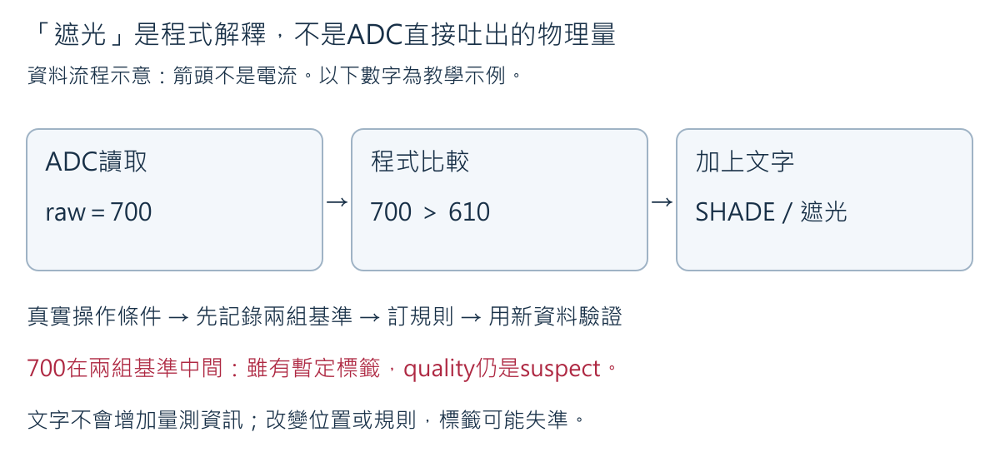
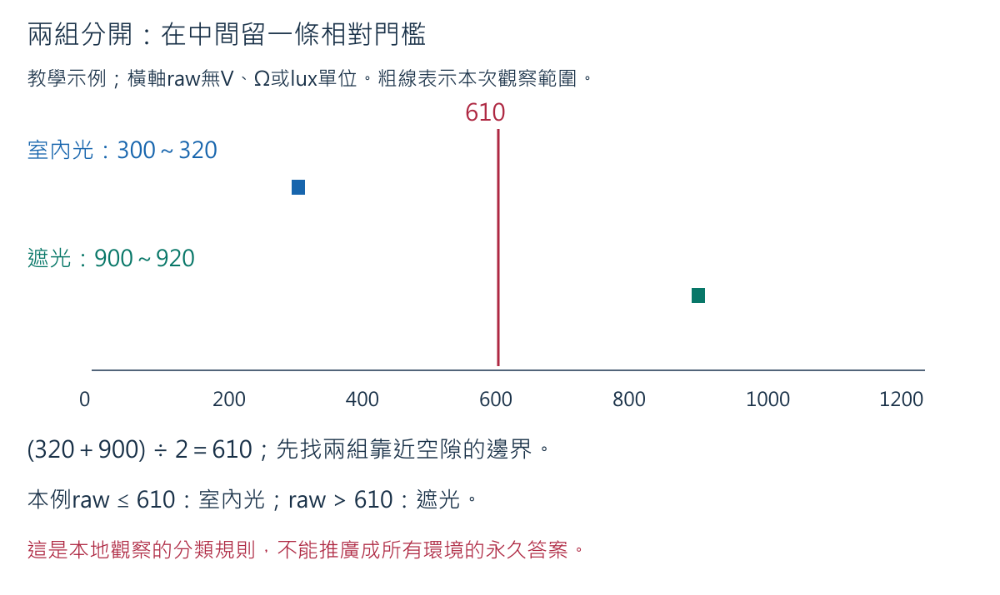
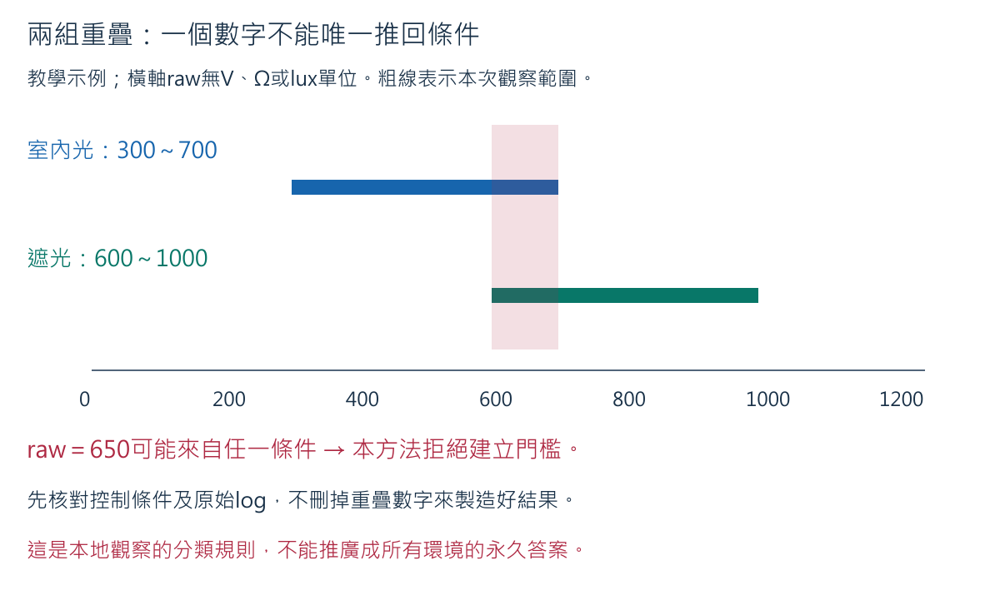

<a id="w3-classification"></a>

## 十二之一、從數字到「室內光／遮光」：讓Serial說出本地判斷

ADC只提供數字，不知道教室在哪裡，也不知道是否有人用手遮住光敏元件。
「室內光」與「遮光」是**我們先知道的操作條件**，不是感測器內建的兩個按鈕。
本節利用前面已保存的兩組資料，建立相對校正（relative calibration）：
記住「這個位置、這個模組、這套接法」在兩種條件下的反應，再訂分類規則。
這不是照度計校正，不能把raw改寫成勒克斯（lux），也不能判斷人在室內還是室外。

### 12A.1 先看數字如何成為字串

下面是資料流程示意，不是新接線圖。箭頭表示程式取得、比較與顯示資料；
不表示電流依序流過這些方框。



追一個**教學示例**：GPIO取得raw＝700，程式目前使用threshold＝610。
因為本例遮光那組較高，700＞610便印出`class=SHADE label=遮光`。
700仍是同一筆原始值，字串只是依規則加上的解釋。若規則錯了，字串也會跟著錯；
出現中文字不是感測已準確的證據。小於或等於610時，本例印出室內光。
`threshold`是程式的分類門檻，不是GPIO數位輸入的HIGH／LOW電壓規格。

**先預測，再看答案：** 本例raw＝610與611會印什麼？這是否表示610與611真實光線差很多？

**參考解答：** 610歸低側，為室內光；611歸高側，為遮光。兩者只相差一個ADC整數碼，
未必是明顯的物理變化。硬切一條門檻可能讓字串來回跳；Week 4會在此基礎上處理穩定狀態與事件，
不以「跳字串」立刻判定硬體壞掉。

### 12A.2 不重做已完成的取樣，先整理自己的兩組log

從前一節的室內光與遮光**各10筆**開始；保留時間與條件，不把不同位置、不同開機或移動途中資料拼成一組。
最小值（minimum）是該組最小的數字，最大值（maximum）是最大的數字。
最大值減最小值叫全距（range），表示這組觀察的波動寬度，不是感測器精度。

例如室內光10筆為300、305、310、308、320、312、309、315、302、319，
遮光10筆為900、905、910、915、920、908、918、912、902、916。
**以上全是教學示例，不能貼成實測成果。**

| 條件 | 最小值 | 最大值 | 全距的逐步計算 |
|---|---|---|---|
| 室內光 | 300 | 320 | 320−300＝20個raw碼 |
| 遮光 | 900 | 920 | 920−900＝20個raw碼 |

兩組都波動20，不等於它們讀到相同光線；要看區間的位置。
算平均可以補充描述，但不能刪掉原始log，也不能只拿兩個平均值就忽略兩組是否重疊。

### 12A.3 門檻的每個數字從哪裡來



橫軸是raw，兩條粗線各表示一組已觀察的最小值到最大值。紅線是程式規則，不是實測的第三種光線。
本例先找**靠近彼此的兩個邊界**：室內光最大值320，遮光最小值900。
在它們中間取一個門檻：

1. 已知：低側最靠近空隙的是320；高側最靠近空隙的是900。
2. 空隙寬度：900−320＝580。
3. 取一半：580÷2＝290。
4. 從320向右移290：320＋290＝610；也就是(320＋900)÷2＝610。
5. 回查：610−320＝290，900−610＝290，因此兩邊留一樣的教學間距。

這不是「3.3 V加電阻等於610」。所有數字都是同一ADC設定的原始碼。
程式用整數除法，若兩個邊界加總為奇數，中點小數會被捨去；低側包含門檻本身。

若自己的遮光區間反而較低，不要為了符合答案改log。先核對操作、模組電路與紀錄；
確認反向反應有根據後，程式也支持低側為遮光。不能因模組外形相似就套用別人的方向。

### 12A.4 區間重疊時，不是把門檻算得更漂亮就好



**紙上反例：** 室內光300～700、遮光600～1000。raw＝650可能出現在任一組。
此時單一raw不足以分辨操作條件。程式拒絕建立本節的門檻，印出
`calibration_missing_or_overlap`，而不是假裝平均中點能消除重疊。
兩組剛好碰到同一邊界也會拒絕，因為該數字沒有唯一歸屬。

第一個檢查是看原始條件紀錄：是不是取樣時還在移動遮光物？兩組是否混了位置或方向？
保持線路不動可以重選固定遮光方式；若要移動導線或元件，先拔USB。
只補不足的基準或另一輪驗證，不把全部電表與ADC實驗從頭再做一次。
若控制後仍重疊，誠實結論就是「目前兩種條件不足以支持這個分類方法」。

### 12A.5 完整程式與安全銜接

此時仍保留原來KY-018的3V3、GND與S→ADC線路，沒有新增零件。
如果已進行後面固定電阻分壓，須先拔USB，拆除那一組分壓與延長線，
再依第11.4節及第十二節重新確認KY-018線路；不要把兩種實驗同時接上。
ADC腳必須沿用已核准輸入profile，不可把先前GPIO5輸出線誤接S。

在Arduino IDE以`File → Open`開啟
[`week03_light_classifier.ino`](../../examples/week03_light_classifier/week03_light_classifier.ino)。
下列Arduino C++程式是要由IDE編譯上傳，不是在Notebook的Python執行器按Run。

<!-- sketch:week03_light_classifier -->

### 12A.6 設定、上傳與逐欄判讀

1. 把`PIN_LIGHT`改成教師已公布的ADC profile；未核准就保留−1，只閱讀及Verify。
   `DEVICE_ID`改為不含姓名、學號的裝置代碼。
2. 將自己的兩組最小／最大值填入`INDOOR_MIN`、`INDOOR_MAX`、`SHADE_MIN`、`SHADE_MAX`。
   四個−1是「尚未設定」，不是要量到−1；不要抄610或範例範圍冒充自己的校正。
3. 以`File → Save As`另存自己的版本，保存原始20筆log及四個範圍值的來源。
   確認Board為`ESP32S3 Dev Module`、Flash Size 16 MB、OPI PSRAM，
   並沿用第十二節已核對的COM路徑設定。先點勾號Verify。
4. 線路未更動且已通過斷電檢查才接USB。選此次實際Port，關閉Serial Monitor，Upload。
   不把編譯成功當成Upload；要看到寫入與校驗成功，再開啟115200 baud的Serial Monitor。
5. `status=ready`應包含`threshold`與`shade_higher`。若`status=blocked`，
   先讀`reason`核對設定與資料，不用隨機GPIO或假造範圍繞過。
6. 約每500 ms印一筆。室內光和固定遮光各觀察一小段**新資料**，每種先保存5筆即可，
   記下當時已知條件，檢查字串是否與操作相符。這是測規則能否應用到新資料，
   不是再做一套電阻、電壓及原始ADC實驗。已有可追溯的獨立驗證片段可直接使用。

下面是用300～320／900～920範圍計算出的**程式輸出格式示例，不是實測**：

```text
week=3 status=ready device=DEMO threshold=610 shade_higher=true interval_ms=500 scope=local_only
device=DEMO sensor=ky018 source=hardware sample=1 uptime_ms=1000 light_raw=700 threshold=610 class=SHADE label=遮光 valid=true quality=suspect reason=between_baselines
```

| 欄位 | 在這筆示例的意思 | 不能據此宣稱 |
|---|---|---|
| `device`／`sensor` | 裝置代碼及KY-018資料來源 | 身分或模組型號已由軟體自動驗真 |
| `source=hardware` | 真正執行時由analogRead取得；本段文字仍只是格式示例 | 文件中的700是教師實測 |
| `sample`／`uptime_ms` | 此次開機的筆序及毫秒時間 | 日期時間，或無漏失的精確排程 |
| `light_raw`／`threshold` | 原始碼700與本地門檻610 | 700 V、610 Ω或照度 |
| `class`／`label` | 可供程式使用的SHADE及中文顯示遮光 | 必定真的有人遮光 |
| `valid=true` | raw沒有被本程式的端點檢查拒絕 | 已校正、準確或接線永遠正常 |
| `quality`／`reason` | 700落在兩個基準區間之間，判為suspect | 硬體一定壞掉 |

`within_baseline_range`表示落在任一已觀察基準區間，仍只有`relative_only`的證據。
`outside_observed_span`表示比兩組合起來的最小值還低或最大值還高；
`between_baselines`表示落在中間未充分觀察的空隙。這兩者可能仍印出暫定標籤，
但品質欄會提醒可疑，不把字串直接當成可靠控制命令。
raw在0或4095時印出`UNDECIDED／未判定`及`valid=false`；
這是保守課堂政策，端點也可能來自有效但飽和的訊號，不能僅靠它確診斷線。

### 12A.7 程式為什麼分成這些部分

- `configureCalibration()`先檢查四個值是否設定、順序合理且區間不重疊，
  再算門檻及方向。`return false`讓setup停在blocked，loop不讀未核准腳位。
- `ready`是程式能否開始本節採樣的開關，不是硬體合格證。
- `classifyLight()`先排除不能判定的資料，再比較`raw <= threshold`。
  `shadeHigher`決定高側還是低側叫遮光；`chineseLabel()`只把類別換成可讀文字。
- `qualityReason()`把「有暫定標籤」和「資料在哪裡」分開。
  例如700雖然在高側，卻不是900～920的基準證據，不能漏掉suspect。
- `now - lastSampleMs`是距離上次採樣的毫秒數；不足500就離開loop，
  讓下一輪再檢查，不用`delay(500)`整段等待。當程式延後，只採一筆當下值，
  不補造錯過時刻的歷史數字。unsigned時間相減的做法支持計時器繞回；
  本例每次間隔很短，不能拿它推廣成任意長期離線計時。
- `++sample`讓筆序加一；`Serial.printf`中的`%d`放整數、`%lu`放本例的unsigned long，
  `%s`放字串。字串比較用`strcmp(...) == 0`，不是比較兩個字串指標是否同一地址。

### 12A.8 練習與參考答案：標籤好看，規則就可靠嗎？

**題一：** 示例門檻610，raw依序609、612、608、615。先預測四個標籤，
再說明是否已證明遮光物被放上及拿開兩次。

**參考答案：** 室內光、遮光、室內光、遮光。這只證明四次比較跨過門檻；
可能是邊界波動，不一定是四次動作。四筆都在基準空隙，品質提示可疑。
錯誤是把分類次數直接當玩家動作次數；後續需穩定判定與解除後重新計數。

**題二：** 室內光300～700、遮光600～1000，能不能強制用650然後宣稱完成？

**參考答案：** 不能。兩組都包含650，單值沒有唯一答案。
檢查控制變因及原始log；仍重疊則記錄「不足以分類」，不是刪掉不喜歡的樣本。
此結論只針對本方法，不表示任何感測方法都不可能分辨。

**題三：** 到另一張桌子，沒有遮光也讀到1200，程式印遮光，誰對？

**參考答案：** 操作紀錄是新條件的依據；原門檻已不能直接代表這張桌子。
分類程式仍正確執行比較，卻可能使用不適合的新情境規則。1200超出原觀察總範圍，
應有`outside_observed_span`。先檢查位置、方向、照明、供電與ADC設定，必要時在新位置重新建立基準。
不能把遮光字串改名「室外」，因為沒有地點感測證據。

**題四：** 用自己的新資料逐筆列「已知操作／raw／預測標籤／實際標籤／quality」。
若5筆都相符，可以寫100%準確嗎？

**預期作法：** 保存原始10筆驗證資料與兩種條件；計算這次吻合筆數除以10。
例如10筆吻合是「本次10／10符合已知條件」，不是未來所有場景100%準確。
不吻合也照實列出，先核對校正來源與控制條件。沒有實測時答案應寫待測，不能抄示例。

### 12A.9 本節完成與下一步

保存`week3_light_baseline.txt`（原始20筆，不重複採集）、
`week3_light_validation.txt`（新條件紀錄及兩組各5筆，已有獨立紀錄可引用）、
自己的sketch及門檻計算。能說出raw、標籤、品質與真實操作的差別，才算本節完成。
這些檔案留在個人實驗資料夾，不把個資或私人路徑提交課程repository。
結束後先關Serial Monitor、拔USB、確認PWR熄滅；
若繼續第13.7節固定電阻實驗，依該節拆除KY與GPIO線，不同實驗不混接。

[Espressif ADC官方說明](https://docs.espressif.com/projects/arduino-esp32/en/latest/api/adc.html)
支持raw解析度與ADC設定；本節分類門檻、端點排除及quality政策是課堂設計，不是官方保證。
