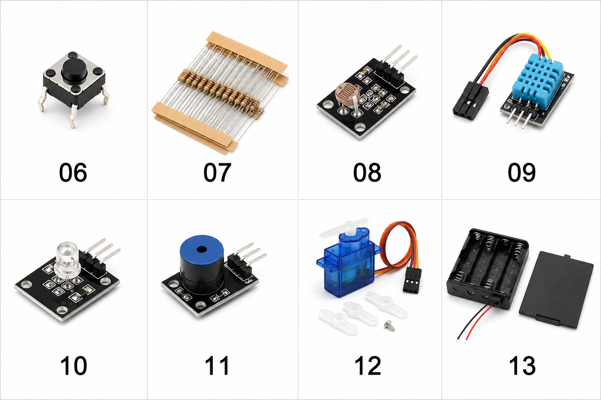

# 蝦皮商品圖與實物照片補拍清單

本表把26個已購品項及後來在現有零件中找到的10顆散裝四腳輕觸按鈕，逐一對應
目前購買狀態、圖片來源、清晰度與補拍需求。
目的不是美化訂單，而是建立之後可用來和學生討論「這是什麼、接頭在哪裡、接線前
還缺什麼證據」的可靠圖鑑。

原始訂單縮圖只能支持品名、選項、數量與基本外觀。後製或生成圖片不能恢復原圖中
不存在的腳位文字、晶片型號、線序或電氣規格；這些內容必須由較清楚的蝦皮商品圖、
收到的實物照片、官方文件及實機測試補足。

## 補拍方式

每個需要補拍的電子品項，優先保存：

1. `shopee-main`：商品主圖、完整商品名稱及已選規格同時可見。
2. `shopee-pins`：賣場中的正面／背面、腳位或尺寸圖；若賣場沒有就不要補造。
3. `actual-front`：收到實物的正面，型號與元件清楚。
4. `actual-back`：收到實物的背面，PCB版號與焊點清楚。
5. `actual-connector`：排針、端子、線色、插頭或電源入口特寫。

蝦皮截圖不得包含姓名、地址、電話、取件門市、訂單編號、聊天內容或付款資料。
原始補拍先放在：

```text
C:\Users\User\Pictures\IoT_Shopee_Reshoots
```

建議檔名為`NN-short-name-shopee-main.png`、`NN-short-name-shopee-pins.png`及
`NN-short-name-actual-front.jpg`。`NN`使用下表編號，避免同名檔案混在一起。

## 狀態說明

- `可用`：已有可辨識卡或實物照，可先進行基本討論。
- `補拍優先`：屬學生共同材料或接線安全相關，現有縮圖不足，應先補。
- `補拍建議`：外形可辨識，但若要談接線、尺寸、接頭或品質仍需清楚圖。
- `低優先`：目前縮圖足以辨識用途，只有實際使用前才需補拍。

## 26項已購設備與1項來源待確認的散裝按鈕

| 編號 | 品項與已購規格 | 數量 | 目前來源 | 狀態 | 下一張需要的圖 |
|---:|---|---:|---|---|---|
| 01 | ESP32-S3-WROOM-1 N16R8、向下44腳；第一片實物PCB為YD-ESP32-S3 Type-A V1.5 | 3 | [訂單圖3](orders/shopee-aroundtw-03-esp32-sensors-lighting-power.png)；[實物圖](README.md#設備與圖片狀態) | 可用 | BOARD-T01已完成；再拍BOARD-T02與BOARD-T03正反面及兩個USB標示 |
| 02 | 400孔麵包板、8.5×5.5 cm | 4 | [單品卡](product-cards/shopee-breadboard-400-product-card.png) | 可用 | 實物正面，需看得到中央溝槽、A～J與電源軌是否中斷 |
| 03 | 20 cm公對母杜邦線、40P | 6排 | [單品卡](product-cards/shopee-jumper-wire-20cm-male-to-female-product-card.png) | 可用 | 實物拆出2～3條，兩端並排特寫，確認一端公針、一端母孔 |
| 04 | 20 cm母對母杜邦線、40P | 6排 | [單品卡](product-cards/shopee-jumper-wire-20cm-female-to-female-product-card.png) | 可用 | 實物拆出2～3條，兩端並排特寫，確認兩端都是母孔 |
| 05 | 20 cm公對公杜邦線、40P | 6排 | [單品卡](product-cards/shopee-jumper-wire-20cm-male-to-male-product-card.png) | 可用 | 實物拆出2～3條，兩端並排特寫，確認兩端都是公針 |
| 06 | 外形符合6×6輕觸開關；5 mm高度尚未量測 | 10顆；來源待核對 | [購物車參考圖](orders/shopee-aroundtw-01-prototyping-motors-power.png)；[實物俯視](actual/tact-switch-6x6mm-4pin-actual-top.jpg)；[實物側視](actual/tact-switch-6x6mm-4pin-actual-side.jpg) | 外形與數量已確認；功能待驗 | 補拍底面四腳排列；以萬用電表在斷電狀態確認同側與跨側的按下前後導通關係 |
| 07 | 常用電阻包：220Ω、330Ω、1kΩ、10kΩ、2.2kΩ、4.7kΩ、100kΩ | 3包 | [訂單圖5](orders/shopee-loyi-maker-05-resistors-storage.png) | 已購、存放學校 | 到校後拍包裝完整標籤或阻值清單，以及各阻值分裝標示 |
| 08 | KY-018光敏模組 | 3 | [訂單圖4](orders/shopee-aroundtw-04-photoresistor-servo-breadboard.png)；[排針近照](actual/ky018-photoresistor-module-actual-pin-labels.jpg)；[實物元件面](actual/ky018-photoresistor-module-actual-component-side.jpg)；[實物焊接面](actual/ky018-photoresistor-module-actual-solder-side.jpg) | 左側`S`與右側`-`已確認；中間腳待電氣確認 | 中央`A`／`S1`／`R1`只記錄為可見文字，不以照片推定其完整用途，也不當成中間排針標示；保持斷電，以電阻量測確認分壓關係 |
| 09 | 購買頁稱YS-31的DHT11溫濕度模組 | 3 | [訂單圖3](orders/shopee-aroundtw-03-esp32-sensors-lighting-power.png)；[實物元件面與線](actual/dht11-3pin-module-actual-component-side-with-cable.jpg)；[實物焊接面與線](actual/dht11-3pin-module-actual-solder-side-with-cable.jpg) | 實物已辨識；腳位待確認 | 斷電取下三線接頭，補拍PCB三針旁絲印；另拍線材兩端，不以線色猜腳位 |
| 10 | 購買頁稱KY-016；實物PCB為`HW-479` RGB LED模組 | 3 | [訂單圖3](orders/shopee-aroundtw-03-esp32-sensors-lighting-power.png)；[實物元件面](actual/hw479-rgb-led-module-actual-component-side.jpg)；[實物焊接面](actual/hw479-rgb-led-module-actual-solder-side.jpg)；[補充失焦焊接面](actual/hw479-rgb-led-module-actual-solder-side-view-02-soft-focus.jpg) | 型號與絲印可辨識；未驗證 | 失焦照片只保留為實物紀錄；通電前仍須確認`B`／`G`／`R`／`-`與共用腳電氣行為 |
| 11 | 購買頁稱KY-012有源蜂鳴器；實物PCB為`HW-508` | 3 | [訂單圖3](orders/shopee-aroundtw-03-esp32-sensors-lighting-power.png)；[目前實物元件面](actual/hw508-buzzer-module-actual-component-side.jpg) | 補拍優先 | 目前失焦；補拍垂直元件面、焊接面、三針絲印與蜂鳴器標籤，未確認有源／無源前不通電 |
| 12 | Tower Pro SG90 Micro Servo 9g；購買選項為180度 | 6 | [訂單圖4](orders/shopee-aroundtw-04-photoresistor-servo-breadboard.png)；[實物標籤、插頭與附件](actual/sg90-tower-pro-9g-servo-actual-label-connector-accessories.jpg)；[實物包裝補充視角](actual/sg90-tower-pro-9g-servo-actual-packaging-view-02.jpg) | 外形可用；功能待驗 | 若能拆袋，再拍無反光標籤與三線插頭近照；180度行程只由後續安全實測確認 |
| 13 | 購買頁稱4AA帶開關電池盒、標示6V | 2 | [訂單圖3](orders/shopee-aroundtw-03-esp32-sensors-lighting-power.png)；[實物盒蓋與紅黑裸線](actual/4aa-battery-holder-actual-cover-and-leads.jpg) | 補拍優先 | 照片未顯示開關；補拍開關側、盒內四槽、紅黑線末端與極性，暫不裝電池 |
| 14 | LM2596S可調式DC-DC降壓模組 | 3 | [訂單圖1](orders/shopee-aroundtw-01-prototyping-motors-power.png) | 補拍優先 | 已選LM2596S穩壓電源模組；商品／實物正反面、端子與可調電位器 |
| 15 | L298N雙通道馬達驅動板 | 2 | [訂單圖2](orders/shopee-aroundtw-02-drivers-servos-sensors-displays.png) | 補拍優先 | 商品正反面及端子標示圖；實物輸入、輸出、ENA／ENB與跳線帽 |
| 16 | HC-SR04超音波距離模組 | 3 | [訂單圖2](orders/shopee-aroundtw-02-drivers-servos-sensors-displays.png) | 補拍優先 | 商品／實物正反面，需讀到`VCC`／`Trig`／`Echo`／`GND` |
| 17 | HC-SR501 PIR人體紅外線模組 | 3 | [訂單圖3](orders/shopee-aroundtw-03-esp32-sensors-lighting-power.png) | 補拍優先 | 商品／實物正反面、三針絲印、兩個旋鈕與觸發跳線 |
| 18 | OLED顯示模組、0.96吋、4針I2C | 5 | [訂單圖2](orders/shopee-aroundtw-02-drivers-servos-sensors-displays.png) | 補拍優先 | 商品／實物正反面，需讀到四針順序與控制晶片／PCB版號 |
| 19 | 8位WS2812B可定址RGB LED | 2 | [訂單圖3](orders/shopee-aroundtw-03-esp32-sensors-lighting-power.png) | 補拍優先 | 目前縮圖過暗；拍正反面、輸入／輸出方向箭頭與5V／GND／DIN／DOUT |
| 20 | MG90S舵機、全金屬齒輪 | 4 | [訂單圖2](orders/shopee-aroundtw-02-drivers-servos-sensors-displays.png) | 補拍建議 | 已選全金屬齒輪MG90；實物標籤、三線插頭、線色與附件 |
| 21 | A830L萬用電表、含電池 | 1 | [訂單圖1](orders/shopee-aroundtw-01-prototyping-motors-power.png) | 補拍建議 | 商品／實物正面，旋鈕檔位與三個表筆插孔須可讀；另拍表筆 |
| 22 | TT雙軸馬達、減速比1:120 | 4 | [訂單圖1](orders/shopee-aroundtw-01-prototyping-motors-power.png) | 補拍建議 | 已選1:120；拍兩側軸、接線端子、標籤與實物尺寸參考 |
| 23 | TT馬達橡膠輪胎 | 4 | [訂單圖1](orders/shopee-aroundtw-01-prototyping-motors-power.png) | 低優先 | 實物正面、側面與中心孔，確認能套上TT馬達軸 |
| 24 | 15 mm金屬萬向球 | 2 | [訂單圖2](orders/shopee-aroundtw-02-drivers-servos-sensors-displays.png) | 補拍建議 | 現有縮圖靠近截圖底部；拍完整底板、球體與安裝孔 |
| 25 | OLED 0.96吋螢幕支架、不含螢幕 | 2 | [訂單圖1](orders/shopee-aroundtw-01-prototyping-motors-power.png) | 補拍建議 | 商品所有木板片與組裝完成圖，避免與OLED模組混淆 |
| 26 | 無格透明零件收納盒 | 4 | [訂單圖2](orders/shopee-aroundtw-02-drivers-servos-sensors-displays.png) | 低優先 | 實物打開與關閉各一張，確認容量與扣具即可 |
| 27 | 手提雙層零件盒、3L | 3 | [訂單圖5](orders/shopee-loyi-maker-05-resistors-storage.png) | 低優先 | 實物外觀、上下層打開及內部分格 |

## UCI先前購物車／訂單待重新確認

下列項目出現在先前UCI畫面與文字紀錄，但不在上述NT$4,437已確認購買合計內。
在把它們併入正式已購圖鑑前，需再提供不含個資的完成訂單截圖，確認是否實際購買、
最終數量與規格。

| 品項 | 畫面中的規格／數量 | 目前問題 | 需要補拍 |
|---|---|---|---|
| VH3.96端子線 | 2P ×10 | 只有購物車畫面 | 完成訂單列、插頭正面與線端 |
| 熱縮套管 | 128根袋裝 ×1 | 只有購物車畫面 | 完成訂單列及尺寸內容表 |
| 6AA電池盒 | 無蓋帶線 ×2 | 只有購物車畫面 | 完成訂單列、盒內、紅黑線端 |
| 3A圓形電源開關 | KCD1／KCD11、2腳2檔 ×4 | 只有購物車畫面 | 完成訂單列、正面、背面兩腳 |
| L298N馬達驅動板 | ×1 | 可能與環島科技的2片重複 | 完成訂單列，確認最終總數 |
| K-4 4WD智能小車底盤 | ×2 | 是否保留／完成購買未由本批訂單證明 | 完成訂單列與實物全貌、底面、馬達線與零件 |

## 第一批補拍順序

為了接續Week 2至Week 5，依序處理編號`06`至`13`。06已找到10顆散裝實物，
補拍底面並完成斷電通斷量測後才能決定麵包板插法；07已購但在學校，到校後再拍；
08已有元件面與焊接面，下一張只需補排針絲印近照。
09、10與12已有可用實物照片，其中09仍需腳位近照，10與12等待實機驗證。11的
`HW-508`照片失焦，13未拍到開關與盒內，這兩項是目前最優先補拍。



上圖是依既有訂單縮圖製作的**外形辨識示意圖**，只用來協助從零件堆中找到品項，
不是實物照片、腳位圖或接線依據。請依下表確認外觀，再拍蝦皮商品頁與收到的實物。

| 編號 | 要找的零件 | 快速辨認方式 |
|---:|---|---|
| 06 | 四腳輕觸按鈕 | 很小的方形金屬按鈕，底部有四隻腳 |
| 07 | 常用電阻包 | 米黃色細長圓柱，表面有多條色環，通常成排黏在紙帶上 |
| 08 | KY-018光敏模組 | 黑色小板上有一顆表面呈鋸齒紋的圓形光敏電阻 |
| 09 | YS-31 DHT11模組 | 藍色、有通風格柵的長方形感測器，通常附三條線與插頭 |
| 10 | KY-016 RGB LED模組 | 黑色小板上有一顆透明圓形LED，另一端有排針 |
| 11 | KY-012有源蜂鳴器模組 | 黑色小板上有一顆圓柱形蜂鳴器，另一端有三根排針 |
| 12 | SG90舵機 | 藍色長方形小型舵機，附三色線、插頭及白色舵盤 |
| 13 | 4AA帶開關電池盒 | 黑色四槽AA電池盒，有開關、上蓋及紅黑電線 |
