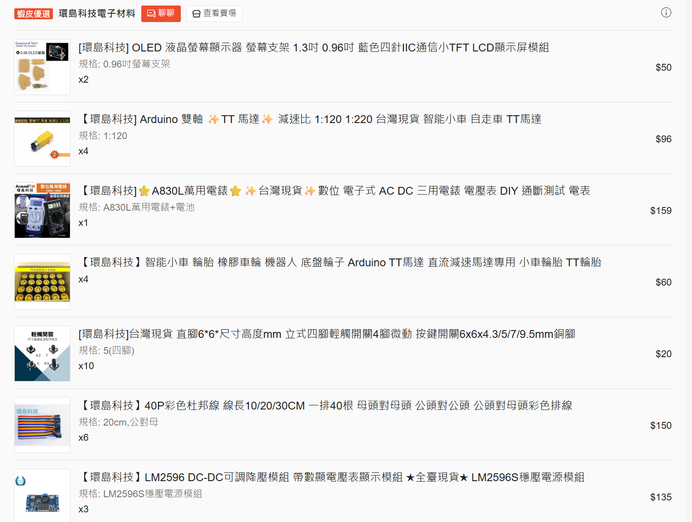
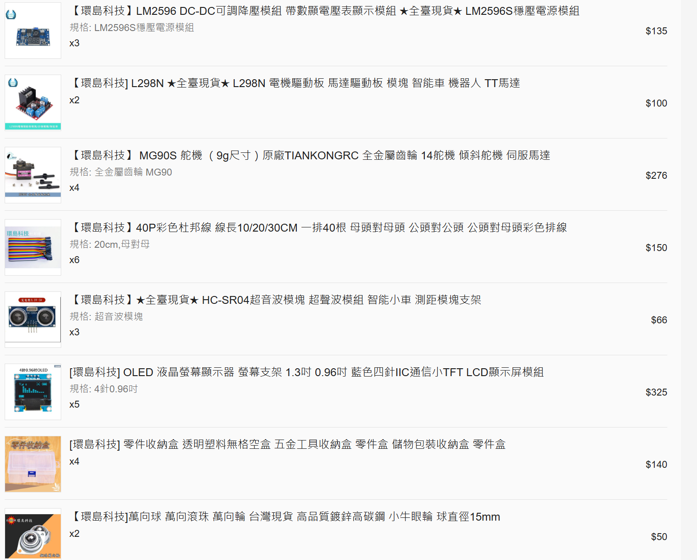
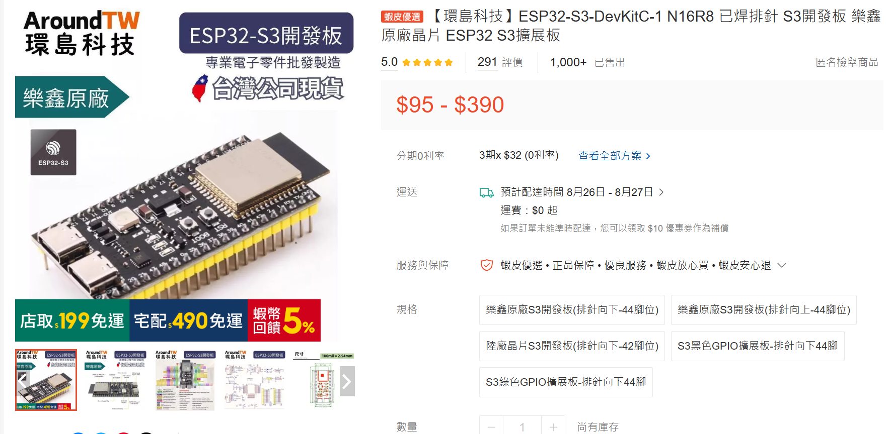
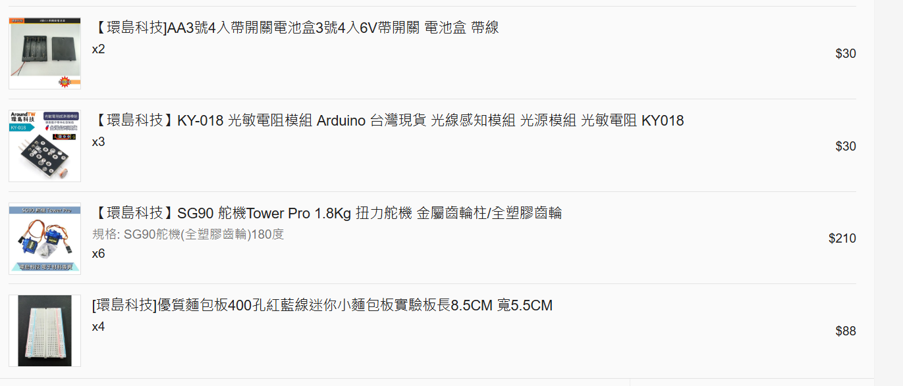

# Week 1教材：課程大綱、評量與作品方向

日期：2026-09-09<br>
課程：物聯網與雲端運算（Internet of Things and Cloud Computing）

第一週不攜帶硬體、不接線、不上電，也不進行程式上傳。本週先確認整學期
要完成的作品、18週學習路徑、評量方式、材料責任及第二週前的準備工作。

## 一、本週完成後應能說明

1. 這門課的作品為何同時需要實體硬體與軟體。
2. ESP32-S3、Backend、Database與手機介面在完整IoT系統中的位置。
3. Week 7、8、13、15、17分別要接受什麼檢查。
4. 六個評量項目的比例及主要證據。
5. 哪些材料由學生自備，以及課堂只提供萬用電表。
6. 一個初步作品構想的使用者、輸入、輸出、軟體用途及風險。
7. Week 2上課前必須完成的安裝、採購與資料準備。

## 二、課程基本資料

| 項目 | 內容 |
|---|---|
| 開課班級 | 四技資二乙 |
| 任課教師 | 李文毅 |
| 上課時間 | 星期三第5～7節，13:30～16:15 |
| 每週時數 | 3小時 |
| 先備能力 | 具任一程式語言基礎；不要求電子電路或機器人經驗 |
| 主要開發板 | ESP32-S3-DevKitC-1 N16R8、已焊排針、向下44腳位 |
| 教材語言 | 繁體中文為主，保留必要英文介面與專業術語 |
| 教科書與服務 | 不指定購買教科書，不要求付費雲端服務 |

學分數、科目代碼、必修／選修及正式授課語言等行政欄位，以校務系統最後
公告為準。完整教學大綱見[115-1課程教學大綱](../../docs/1151_course_syllabus_draft.md)。

## 三、這門課要完成什麼

這門課的目標不是把一個感測器接上ESP32，也不是只做一個手機網頁。學生要
逐步完成一個Full-stack IoT系統：實體裝置能感測或回應，網路能傳送事件與
命令，後端能處理資料，Database能保存歷史，手機介面能協助使用者監看或操作。

```text
感測器／按鈕
  → ESP32-S3判斷狀態
  → 燈、聲音、舵機或其他實體輸出
  → Wi-Fi與HTTP／MQTT
  → 學生建立的Backend
  → Database與structured log
  → WebSocket
  → 手機可用介面

手機命令
  → Backend記錄與派送
  → ESP32-S3判斷是否接受
  → 執行、拒絕或timeout
  → 結果回到Backend、Database與手機
```

作品題目不限定為無人車。互動玩具、智慧教室、環境裝置、警報器、遊戲、
輔助裝置、移動平台或其他合理題目都可以，但必須具備可說明的使用情境、
真實硬體行為及有用途的軟體。

## 四、學習成果

完成課程後，學生應能：

1. 分辨開發板、感測器、致動器、網路、Backend、Database與手機介面的責任。
2. 依電壓、邏輯準位、供電與共地原則安全接線，並使用萬用電表取得證據。
3. 將輸入、狀態、決策與輸出組成可重複操作且能安全停止的互動硬體。
4. 使用HTTP／MQTT、JSON與WebSocket串接裝置、後端、資料庫及手機介面。
5. 使用歷史資料與structured log解釋一次成功、失敗或修正。
6. 完成並說明一件具實體行為、軟體用途、安全機制與重建文件的IoT作品。

## 五、18週課程大綱

| 週次 | 日期 | 核心內容 | 當週主要成果 |
|---:|---|---|---|
| 1 | 09-09 | 課程介紹、配分、作品、材料與安全責任 | 課程確認及作品構想卡；不操作硬體 |
| 2 | 09-16 | ESP32-S3、Upload、Serial、GPIO、GND與量測 | 上傳、按鈕輸入、GPIO測試輸出及量測證據 |
| 3 | 09-23 | KY-018、DHT11、校正、取樣與異常值 | 光線與溫溼度的有效／無效資料紀錄 |
| 4 | 09-30 | RGB、蜂鳴器、SG90、4AA供電、共地與安全停止 | 狀態提示、受限動作及timeout測試 |
| 5 | 10-07 | 單機互動、狀態機與錯誤復原 | 可重複操作的光線互動狀態裝置 |
| 6 | 10-14 | Wi-Fi、HTTP、JSON、WebSocket與Backend | 真實裝置事件到達後端及手機 |
| 7 | 10-21 | 個人概念筆試、手機雙向控制與題目工作坊 | 個人筆試、命令結果及題目草案 |
| 8 | 10-28 | 題目與技術可行性訪談 | 硬體片段、資料流、材料、風險與驗收條件 |
| 9 | 11-04 | 教師出國 | 不要求到校、不收新成果；提供選讀資料 |
| 10 | 11-11 | MQTT、多裝置、Topic、presence與acknowledgement | 遙測、上線／離線、命令與回應 |
| 11 | 11-18 | Database、歷史API、structured log與分析 | 資料表、歷史查詢及錯誤解釋 |
| 12 | 11-25 | 手機前台、Responsive Web／PWA與權限 | 即時、歷史、操作及錯誤／離線流程 |
| 13 | 12-02 | 期末作品進度檢查一 | 真實硬體到Database及手機的完整路徑 |
| 14 | 12-09 | 自動反應、狀態、安全與復原 | 自動行為及錯誤時的安全狀態 |
| 15 | 12-16 | 期末作品進度檢查二 | 同儕操作、歷史紀錄、log與修正 |
| 16 | 12-23 | 整合、故障注入、重建與版本凍結 | 異常測試、重建紀錄、彩排與備案 |
| 17 | 12-30 | 期末作品展示與個人問答 | 實體作品、完整軟體、資料、測試與說明 |
| 18 | 01-06 | 進階自學 | 不新增評量；雲端、Flutter、MQTT、ROS 2等選讀 |

正式週次與成果定義以[18週課程規劃](../../docs/18_week_plan.md)為準。

## 六、評量方式

| 評量項目 | 比例 | 主要證據 |
|---|---:|---|
| 每週QA、Type B活動與Lab Notebook | 15% | 判斷、接線／資料流、量測、log、修正與課末成果 |
| Week 7個人概念筆試 | 15% | 硬體安全、感測品質、狀態、通訊、資料流與除錯 |
| Week 8題目與技術可行性訪談 | 15% | 硬體片段、軟體用途、架構、材料、風險與驗收條件 |
| Week 13、15期末作品進度檢查 | 15% | 真實資料路徑、手機流程、Database、log、測試與修正 |
| Week 17期末作品 | 30% | 實體互動、前後台、資料、可靠性、測試與個人理解 |
| 文件、安全、協作與AI使用責任 | 10% | 版本、重建、安全、分工、人工修改與驗證 |
| 合計 | 100% |  |

硬體價格、機構複雜度及作品速度不是直接加分項目。基礎材料只要形成可靠的
互動、完整資料流、清楚手機流程與充分測試，也能符合高分標準。詳細標準見
[評分規準與檢核表](../../docs/course_materials/rubrics_and_checklists.md)。

## 七、重要評量週次

### Week 7：個人概念筆試與雙向操作

筆試以接線、安全、感測品質、狀態、HTTP／WebSocket／JSON、資料流、log
與AI驗證為主。筆試以個人理解為評量依據；其後再進行手機命令與裝置回應。

### Week 8：題目與技術可行性訪談

每組進行一次12～15分鐘訪談。需要準備：

1. 作品使用者及核心操作。
2. 一個可運作的真實硬體片段。
3. 軟體要記錄什麼，或如何協助使用者操作。
4. 裝置、Backend、Database與手機的資料流。
5. 已有材料、預計加購材料、供電與驅動風險。
6. Week 13可以檢查的最低成果。

完整成品不是Week 8要求。題目過大時，應刪減功能，保留可以測試的核心流程。

### Week 13與Week 15：進度檢查

Week 13必須讓期末作品的真實硬體資料到達Backend、Database與手機；Week 15
由非開發者使用手機完成核心流程三次，再依操作問題或log修正作品。

### Week 17：期末作品

每組展示實體作品、手機前台、Backend、Database、structured log、測試與
限制。每位成員須能說明一條資料／命令路徑，或一項硬體安全與錯誤處理。

## 八、期末作品最低要求

期末作品必須同時包含：

- 一件可安全運作的實體作品與清楚使用情境。
- ESP32-S3或經教師核准的控制板。
- 至少一種實體輸入及一種實體輸出；例外須在Week 8取得核准。
- Wi-Fi，以及HTTP或MQTT裝置通訊。
- 學生自行撰寫且可以重新啟動的Backend。
- Database、歷史查詢及structured log。
- 手機可用介面，呈現即時、歷史、操作／設定及錯誤／離線狀態。
- WebSocket即時更新；控制行為須留下command、result／ack或timeout。
- 至少一項自動反應、狀態機或排程。
- 至少三種測試，其中一種為斷線、錯誤輸入、感測異常或服務停止。
- 原始碼、接線圖、資料流圖、資料格式、BOM、重建步驟、AI使用與驗證紀錄、
  已知限制。

現成Dashboard或IoT平台可以作輔助，但不能取代學生自行撰寫的裝置端、
Backend、Database及手機介面核心成果。

## 九、第一週正式購買清單

### 每位學生必買的電子基本包

| 品項 | 規格 | 數量 | 單價參考 | 首次使用 |
|---|---|---:|---:|---:|
| ESP32-S3開發板 | ESP32-S3-DevKitC-1 N16R8、已焊排針、排針向下、44腳位 | 1片 | NT$390 | Week 2 |
| 麵包板 | 400孔免焊麵包板，約8.5×5.5 cm | 1片 | NT$22 | Week 2 |
| 杜邦線 | 20 cm，公對公、公對母、母對母各一排40條 | 各1排 | NT$25×3 | Week 2 |
| 常用電阻包 | 至少包含220Ω、330Ω、1kΩ與10kΩ | 1包 | NT$60 | Week 8 |
| 四腳輕觸按鈕 | 6×6 mm、常開瞬時型 | 2顆 | NT$2×2 | Week 2 |
| 光敏輸入模組 | KY-018光敏電阻模組 | 1個 | NT$10 | Week 3 |
| 溫溼度模組 | YS-31 DHT11模組 | 1個 | NT$25 | Week 3 |
| RGB LED模組 | KY-016三色RGB LED模組 | 1個 | NT$9 | Week 4 |
| 有源蜂鳴器模組 | KY-012有源蜂鳴器模組 | 1個 | NT$14 | Week 4 |
| 小型舵機 | SG90、180度、全塑膠齒輪 | 1個 | NT$35 | Week 4 |
| 電池盒 | 4AA、帶開關、帶線 | 1個 | NT$15 | Week 4 |

電子基本包依教師既有成交價估算約 **NT$659／人**，不含運費、價格波動及
下一表的既有用品。不同賣場若使用不同名稱或選項，仍須符合表中的型號與規格。

### 蝦皮購買圖片參考

下列圖片是教師先前的蝦皮訂單紀錄，只用來辨認商品外觀。圖片中的購買數量
是教師當時的訂單數量，不是每位學生應買數量；價格、庫存與賣場選項也可能
改變。學生應依上方文字表格的規格與「每人數量」下單。

訂單圖1中，本課必買的是四腳輕觸按鈕及公對母杜邦線。OLED支架、TT馬達、
輪胎與LM2596不屬於第一週必買；萬用電表由課堂提供。



訂單圖2中，本課必買的是母對母杜邦線。L298N、MG90S、HC-SR04、OLED與
萬向球不屬於第一週必買。



訂單圖3中，本課必買的是KY-016、KY-012、公對公杜邦線、DHT11、
ESP32-S3 N16R8向下44腳及4AA帶開關電池盒。HC-SR501與WS2812不屬於
第一週必買。


開發板下單時須選擇「樂鑫原廠S3開發板（排針向下－44腳位）」；商品頁圖片
只協助找到選項，收到後仍要核對板上N16R8標示。



訂單圖4中的KY-018、SG90 180度及400孔麵包板都是本課必買。畫面頂端重複
出現的4AA電池盒不需再增加數量，每人只買一個。



訂單圖5中的常用電阻包是本課必買；收納盒可以使用家中現有的合格容器，不必
購買與圖片相同的款式。


完整訂單圖說與已購數量另見[學生用訂單設備圖鑑](../../docs/images/hardware/order_gallery.md)。

### 每位學生也要自備

已有符合要求的用品就不用重買。

| 品項 | 最低要求 | 數量 | 最晚備妥 |
|---|---|---:|---:|
| 筆電與充電器 | 可安裝Arduino IDE 2並連接USB裝置 | 1套 | Week 1 |
| USB資料線 | 接頭符合開發板且確認可以傳輸資料；只有充電功能不合格 | 1條 | Week 2 |
| 收納盒或密封袋 | 可分開保存開發板、模組與線材，並標示姓名或學號 | 1個 | Week 2 |
| AA電池 | 4顆同類型、同規格且電量足夠；不可混用新舊或不同種類 | 1組4顆 | Week 4 |
| 電池盒安全轉接端子 | 使用Week 4實機驗證後公布的規格 | 1組 | Week 4 |
| 斜口鉗 | 適合電子線材的小型斜口鉗 | 1把 | Week 4 |
| 剝線鉗 | 可處理約20～30 AWG電子線材，不以剪刀或美工刀代替 | 1把 | Week 4 |

課堂只提供萬用電表。除萬用電表外，不提供開發板、線材、電池、工具或故障
替換零件。完整使用週次與到貨檢查見[學生材料採購總表](student_purchase_list.md)。

### 第一週不要購買

OLED、PIR、HC-SR04、WS2812、MG90S、TT馬達、L298N、LM2596、車輪、底盤、
6AA電池盒與小車都不屬於共同必買。Week 8確認專題題目與安全條件後，才依
實際需要加購；額外購買不會增加成績。

## 十、硬體與資料安全責任

第一週不操作硬體。從Week 2開始，每次實作都遵守：

1. 接線、改線及通斷量測前先斷電。
2. 不依購物頁圖片猜測VCC、GND或訊號腳；以實物絲印及課程接線表為準。
3. 不將5V訊號直接接入未保護的ESP32-S3 GPIO。
4. 不使用GPIO直接驅動舵機、馬達、泵、電磁閥或高電流負載。
5. 外部電源與ESP32控制訊號必須使用已驗證的共地及安全停止方式。
6. 發熱、異味、異常聲音、反覆重啟或線材鬆脫時立即斷電並停止操作。
7. 不在Git提交Wi-Fi密碼、API key、token、學生個資或可識別的成績資料。
8. 未經同意不得蒐集可識別個人的影像、聲音或其他敏感資料。

## 十一、Git、文件與AI使用責任

- 每組保留可追蹤的程式版本、接線圖、資料流、BOM、測試及已知限制。
- Lab Notebook記錄目標、操作、結果、錯誤、修正、AI使用與下一步。
- 可以使用生成式AI協助程式初稿、介面、資料格式、測試案例或除錯假設。
- AI產出不是驗證結果。提交前必須人工理解、修改、執行並保存測試證據。
- 不得以「AI說可以」取代官方規格、實物核對、編譯、log、量測或實機測試。
- 每位成員須能說明自己提交的程式、資料路徑、接線與安全限制。

## 十二、作品構想卡

第一週提出初步方向，不等於題目已定案，也不要求先購買專題特殊材料。使用
[作品構想卡](project_idea_card.md)記錄：

1. 想協助的使用者或使用情境。
2. 一項可以觀察的實體輸入。
3. 一項可以觀察的實體輸出。
4. 軟體要記錄什麼，或如何協助操作。
5. 一項目前已知的技術、安全或範圍風險。

## 十三、Week 2前完成

- [ ] 已閱讀本教材並確認評量比例與重要週次。
- [ ] 已完成作品構想卡。
- [ ] 已依正式採購總表下單或盤點既有用品。
- [ ] 已閱讀並完成[Week 2課前環境準備](preclass_setup.md)。
- [ ] Arduino IDE 2可以開啟。
- [ ] Espressif `esp32` board package已安裝。
- [ ] 已取得最新版課程repository。
- [ ] 已確認USB線可以傳輸資料。
- [ ] 材料若尚未到貨或規格不同，已在Week 2前回報。

完成上述項目即完成第一週課程要求。Week 2才開始ESP32-S3、Upload、Serial、
GPIO、按鈕接線與萬用電表量測。
