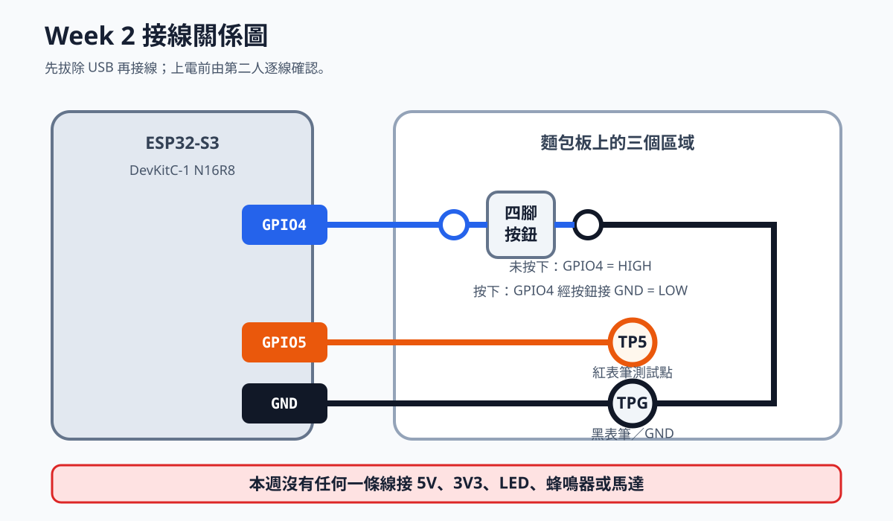

# Week2 教材：ESP32-S3 第一次完整操作

本教材由全班共同開啟並依序操作。不要跳步；每一階段完成後，先讓同組成員
互相確認，再進入下一階段。

全班依階段與檢查點同步操作，再完成基礎修改及任選變化題。完成全部驗收、
斷電與收納後，可以先離開。

## 這份教材要怎麼使用

本教材刻意把「理解」和「動手」分開，不要求任何人一邊念、一邊接線。

1. 先完成「Part A：先閱讀的觀念教材」。此時硬體留在桌上，不插 USB、
   不接杜邦線。
2. 進入「Part B：逐步操作」後，每次只閱讀一張操作卡。
3. 讀完操作卡的所有步驟，再開始動手；做完才回到教材看成功判斷。
4. 若結果不同，直接查看同一張卡下面的排錯，不要同時改很多設定。
5. 每個檢查點通過後再繼續。快速完成者做變化題，不必等待其他組。

建議開兩個視窗：左邊顯示本教材，右邊開 Arduino IDE。不要把教材、IDE、
Serial Monitor 疊在同一個小視窗中反覆切換。

## 文件導覽

- Part A：ESP32、程式流程、USB、電壓、GPIO、麵包板與萬用電表觀念。
- Part B：從接上 USB 到按鈕、GPIO5 與萬用電表的完整實作。
- Part C：必要修改、九種變化題、故障排查、繳交與驗收。

## 一、今天會完成什麼

完成本教材後，你應該能：

1. 辨認並記錄 ESP32-S3、USB、GPIO、GND、3.3V 與 5V 的用途。
2. 在 Arduino IDE 選擇正確開發板及連接埠。
3. 編譯、上傳程式並使用 Serial Monitor 查看 log。
4. 用萬用電表確認通斷與直流電壓。
5. 將按鈕接到 GPIO4，使用 `INPUT_PULLUP` 讀取狀態。
6. 使用 GPIO5 產生 HIGH／LOW，並以 Serial 與萬用電表證明結果。
7. 保存接線圖、程式、log、量測值及測試結果。

# Part A：先閱讀的觀念教材

閱讀 Part A 時不要接線。這一部分的目的，是先知道每個動作背後的原因；
稍後操作時只需依卡片做，不必在接線途中才第一次理解概念。

## A1. ESP32-S3 是什麼

ESP32-S3 是微控制器，不是縮小版的 Windows 電腦。它通常只執行一份上傳
進去的程式，透過 GPIO 接收按鈕或感測器訊號，再控制輸出或透過 Wi-Fi 傳送
資料。

下圖是本課已購買板卡的商品辨識圖。它只能協助辨識型號；接腳仍以實物絲印
與 Espressif 官方文件為準。


這塊開發板可以分成三個層次：

| 層次 | 你看到的東西 | 用途 |
|---|---|---|
| 模組 | 金屬屏蔽罩上的 ESP32-S3-WROOM 字樣 | 包含 ESP32-S3、Flash、PSRAM 與天線 |
| 開發板 | USB、按鈕、穩壓、USB-to-UART、排針 | 讓模組容易供電、上傳與接線 |
| 外部電路 | 麵包板、按鈕、感測器、致動器 | 讓程式和真實世界互動 |

本批購買規格標示 `N16R8`：`N16` 表示 16 MB Flash，`R8` 表示 8 MB PSRAM。
依 Espressif Arduino-ESP32 文件，WROOM-1 N16R8 的 Flash Mode 為 QSPI，
PSRAM 為 OPI。Flash 用來保存程式及檔案；PSRAM 是執行時可使用的額外記憶體。

本週不會使用 Wi-Fi、感測器或馬達。先把「能安全上傳、讀一個輸入、產生
一個輸出、用證據驗證」建立好，後面所有 IoT 實作都建立在這條基礎上。

## A2. 程式如何進入 ESP32

Arduino IDE 的流程不是只有按一個箭頭：

```text
撰寫 Sketch
    ↓
Verify／Compile：檢查語法並建立韌體
    ↓
選 Board：告訴工具要為哪一類晶片編譯
    ↓
選 Port：告訴工具要傳到哪一個實體裝置
    ↓
Upload：把韌體寫入 Flash
    ↓
ESP32 Reset 並開始執行
    ↓
Serial Monitor 顯示程式輸出的 log
```

常見誤解：

- Verify 成功只表示程式可以編譯，不代表已經寫進板子。
- Upload 成功只表示寫入完成，不代表接線或功能一定正確。
- Serial 出現文字仍可能是上一版程式，因此本教材要求修改版本字串再驗證。
- Port 是電腦作業系統分配的，換 USB 孔或換電腦後可能改變。

Arduino Sketch 的兩個入口：

```cpp
void setup() {
  // 每次開機或 Reset 後只執行一次
}

void loop() {
  // setup 完成後持續重複執行
}
```

如果初始化 GPIO、Serial 的程式放錯位置，結果可能和預期不同。例如遺漏
`Serial.begin()`，Serial Monitor 就無法正常顯示你的 log。

## A3. USB 線同時負責什麼

USB 在本週負責兩件不同的事：

1. **供電**：電腦透過 USB 讓開發板上電。
2. **資料**：電腦透過 USB 上傳程式與接收 Serial。

充電線只有供電線芯，可能讓電源燈亮起，卻沒有資料線芯，所以不會出現
Port，也無法 Upload。看到燈亮不能證明線材可傳資料。

DevKitC-1 有 USB-to-UART 與 ESP32-S3 原生 USB 兩條可能路徑。為了讓全班
設定一致，本週使用教師在實物上標記的 USB-to-UART 接頭。若未來改用原生
USB，USB CDC、Upload Mode 與 Serial 行為也要一起調整，不能只換插孔。

## A4. 電壓、電流、GND 與邏輯準位

### 電壓

電壓一定是兩點之間的差。說「這裡是 3.3V」時，通常是指這個測試點相對
GND 約為 3.3V。因此量電壓時，黑表筆接 GND，紅表筆接目標測試點。

### 電流

電流表示電荷流動量。GPIO 可以輸出邏輯訊號，但不能被當成馬達、舵機或
其他高耗電負載的電源。負載曾經動過，不代表接法安全。

### GND

GND 是共同參考。GPIO5 的 HIGH 是「GPIO5 相對 GND 約為 3.3V」。如果兩個
裝置交換訊號卻沒有共同參考，接收方可能無法正確判斷 HIGH 與 LOW。

### HIGH 與 LOW

本週用萬用電表觀察：

| 程式狀態 | 理想邏輯 | 實際量測預期 |
|---|---|---|
| `digitalWrite(5, LOW)` | 0 | 接近 0V |
| `digitalWrite(5, HIGH)` | 1 | 接近 3.3V |

「接近」表示實測不必剛好等於理想數字；線材、電表與供電都會造成小差異。
但若 HIGH 和 LOW 幾乎相同，就必須排查程式版本、接腳、表筆及檔位。

### 5V 安全底線

ESP32-S3 GPIO 使用 3.3V 邏輯。本週絕不把 5V 直接接到 GPIO4 或 GPIO5。
板上的 5V pin 是供電路徑，不是「更強的 HIGH」。

## A5. GPIO 輸入、輸出與 INPUT_PULLUP

GPIO 可以在程式中設定成輸入或輸出：

```cpp
pinMode(4, INPUT_PULLUP);  // GPIO4 讀取按鈕
pinMode(5, OUTPUT);        // GPIO5 產生 HIGH／LOW
```

輸入腳如果沒有接到明確的 HIGH 或 LOW，可能浮動並隨雜訊變化。`INPUT_PULLUP`
會啟用晶片內部上拉，使未按下時維持 HIGH；按下按鈕後，GPIO4 接到 GND，
所以讀到 LOW。

```text
未按下
內部 3.3V --[上拉]-- GPIO4      按鈕斷開      GND
                       ↓
                     HIGH

按下
內部 3.3V --[上拉]-- GPIO4 ----- 按鈕閉合 ----- GND
                       ↓
                      LOW
```

真值表：

| 實際動作 | `digitalRead(4)` | 程式中的 `pressed` |
|---|---|---|
| 未按下 | HIGH | false |
| 按下 | LOW | true |

所以「按下讀到 LOW」是這種接法的正常結果，不是程式寫反。

## A6. 為什麼按鈕要去抖

金屬接點按下或放開時，不一定只乾淨切換一次，可能在極短時間內反覆接通與
斷開。人只按一次，程式卻可能讀到多次事件，這叫做 bounce。

本教材的程式會等 raw 狀態維持一小段時間後，才更新 stable 狀態：

```text
raw reading 變化
    ↓
記錄變化時間
    ↓
維持超過 DEBOUNCE_MS？
    ├─ 否：繼續觀察
    └─ 是：更新 stable state 並產生一次事件
```

去抖不是把反應做得越慢越好。設定太短可能仍重複計數；設定太長則會讓快速
按壓被忽略。後面的變化題會要求用實測比較。

## A7. 麵包板和四腳按鈕

麵包板表面有很多孔，但不是每個孔都獨立。中央區通常每五個孔為一組相通，
中央溝槽左右不相通。不同品牌電源軌可能中間斷開，因此必須用通斷檔驗證。

```text
左側五孔同組       中央溝槽       右側五孔同組
A B C D E             ||             F G H I J
● ● ● ● ●             ||             ● ● ● ● ●
```

四腳按鈕內部通常是左側兩腳相通、右側兩腳相通，按下後才連接左右兩側：

```text
左側                 右側
L1 ●                 ● R1
   │     [按鈕]      │
L2 ●                 ● R2

未按下：左側和右側分離
按下：左側和右側導通
```

把按鈕跨過麵包板中央溝槽，可以讓按鈕兩側落在原本不相通的區域。方向放錯
時，程式可能永遠判定按下或永遠沒有反應。

本課的 ESP32 是「排針向下」版本。若板子尺寸和麵包板相符，兩排排針可
跨過中央溝槽，分別插入 `B` 欄與 `I` 欄。這樣 `A` 欄與 `J` 欄會留在板子
外側，可作為接線孔：

```text
外側可接線                                      外側可接線
 A   B C D E          中央溝槽          F G H I   J
 ●   ▼ ● ● ●             ||             ● ● ● ▼   ●
     左排針              ESP32              右排針

同一編號列中：A～E 相通；F～J 相通
因此排針在 B 欄時，可從同列 A 欄接線。
排針在 I 欄時，可從同列 J 欄接線。
```

這只是本批 400 孔麵包板的預定放法，不能用力硬壓。若兩排無法同時自然對準
`B`、`I`，或插入後完全沒有可用的外側孔，停止操作，改用公對母杜邦線方案，
不要扳彎、剪短或擠壓排針。

## A8. 萬用電表本週只用兩個功能

### 通斷檔

- 電路必須斷電。
- 黑表筆插 `COM`，紅表筆插 `VΩmA`；不可插 `10A` 孔。
- 用來確認兩點是否電氣連通。
- 可檢查按鈕、麵包板內部與杜邦線。
- 若 A830L 沒有蜂鳴通斷功能，改用 `Ω 200` 檔：接近 `0 Ω` 表示導通，
  顯示 `1`、`OL` 或超出量程表示不導通。

### 直流電壓檔

- 電路需要上電。
- 黑表筆仍插 `COM`，紅表筆仍插 `VΩmA`。
- A830L 旋鈕轉到 `DCV 20`，不是 `ACV`、`DCA` 或 `10A`。
- 黑表筆接 GND，紅表筆接測試點。
- 量程要高於預期的 3.3V。

本週不使用電流檔。電流量測需要把電表串入電路，接法和量電壓完全不同；
錯誤操作可能造成短路或燒斷電表保險絲。

## A9. 什麼才算成功

「我剛才看過它動」不是可再次檢查的證據。本週每個功能至少要有：

| 類型 | 證據 |
|---|---|
| 軟體 | 程式版本、Verify／Upload 結果 |
| 執行 | 含組別、事件與時間的 Serial log |
| 硬體 | 接線表與清楚照片 |
| 電氣 | 通斷及 HIGH／LOW 電壓量測 |
| 可靠性 | 五次重複測試與一次修改紀錄 |

完成 Part A 後，才拿出杜邦線並開始 Part B。

# Part B：逐步操作

## Part B 操作卡總覽

Part B 不需要從頭重念 Part A。每張卡先完整讀完，再動手，最後只檢查「通過
條件」。如果沒有通過，就留在該卡排錯。

| 操作卡 | 開始狀態 | 要完成的事 | 通過條件 |
|---:|---|---|---|
| 1 | 板子未接 USB | 環境與實物辨識 | 找到 USB、BOOT、RESET、GPIO4、GPIO5、GND |
| 2 | 只接 USB | 設定 Board 與 Port | IDE 顯示正確 Board、Port 與 N16R8 設定 |
| 3 | 只接 USB | Upload 與 Serial | log 顯示自己的組別及 `version=2` |
| 4 | USB 已拔除 | 麵包板、按鈕、TP5、TPG 接線 | 跨組或同組第二人逐線確認 |
| 5 | 接線已確認 | GPIO4 輸入與 GPIO5 輸出 | 五次按下／放開事件完全對應 |
| 6 | 量測站 | 通斷及電壓 | 通斷合理，TP5 LOW／HIGH 可分辨 |
| 7 | 核心任務完成 | 修改與變化 | 按壓計數與至少一題變化有證據 |

動手操作時若需要回看，只回到目前的操作卡，不要同時跳看三個章節。

## 二、準備器材與分組

每組使用：

- ESP32-S3-DevKitC-1 N16R8，排針向下 44 腳。
- 一條確認可傳輸資料的 USB 線。
- 400 孔麵包板。
- 6×6 mm 四腳按鈕一顆。
- 公對公杜邦線至少四條。
- 筆電與充電器。

全班共用一支 A830L 萬用電表，各組依序到量測站操作。SG90、MG90S、
TT 馬達、L298N、LM2596、電池盒及其他高耗電設備本週不使用。

上課前請確認[Week 2 必買／必帶清單](week02_purchase_list.md)。依目前三組
工作站配置，本週不需再購買電子零件。

## 三、開始前的安全規則

1. **接線或改線前，先拔除 USB。**
2. 不把 5V 接到任何 GPIO。
3. GPIO 是訊號腳，不用來直接供電給舵機或馬達。
4. 不確定接腳時，先看板身絲印與官方 pinout，不憑記憶猜測。
5. 上電前必須由另一位組員依接線表逐條檢查。
6. 發現板子、線材或零件發熱、異味或異常聲音，立即斷電並通知教師。

本次使用 GPIO4 與 GPIO5。Espressif 官方 DevKitC-1 header table 將兩者列為
一般 I/O。本批板卡標示 N16R8；為避免記憶體配置差異，本課不使用 GPIO35、
GPIO36、GPIO37。官方文件指出部分 Octal flash／PSRAM 版本會把這些腳位用於
內部通訊。

板載 RGB LED 不列入本週必要任務。DevKitC-1 初版與 v1.1 的 RGB LED 分別
可能使用 GPIO48 或 GPIO38，未確認板本版本前，不把網路上的 LED 腳位直接
套用到實物。

官方參考：[ESP32-S3-DevKitC-1 v1.1 使用指南](https://docs.espressif.com/projects/esp-dev-kits/en/latest/esp32s3/esp32-s3-devkitc-1/user_guide_v1.1.html)

## 四、階段 1：環境與板子辨識

### 步驟 1：開啟課前安裝成果

依下列順序確認，不要只看桌面上有沒有 Arduino 圖示：

1. 啟動 Arduino IDE 2，等待主視窗完整出現。
2. 點左側 **Boards Manager** 圖示；若看不到，使用選單
   **Tools → Board → Boards Manager**。
3. 在搜尋欄輸入 `esp32`。
4. 找到作者為 **Espressif Systems** 的 `esp32` package。
5. 確認按鈕顯示 `REMOVE` 或旁邊標示已安裝版本；若仍顯示 `INSTALL`，表示
   課前作業尚未完成。
6. 把已安裝版本填入：

```text
Arduino IDE 版本：____________________
Espressif esp32 package 版本：____________________
```

7. 用瀏覽器開啟本 repository，確認目前看到的檔名是 `Week2教材.md`。

最後勾選：

- [ ] Arduino IDE 2 可以正常開啟。
- [ ] Boards Manager 顯示 Espressif `esp32` platform 已安裝。
- [ ] 已取得最新版課程 repository。
- [ ] USB 線已知具有資料傳輸功能。

若任何一項未完成，立刻進入環境排錯區，不要讓其他組員代替你的個人環境
驗收。課前安裝方式見[Week 2 課前環境準備](../Week_01_Course_Orientation/preclass_setup.md)。

### 步驟 2：只觀察，不接線

拿起 ESP32-S3，依板身標示找出：

- 兩個 USB 接頭及其絲印。
- BOOT 按鈕。
- RESET／RST 按鈕。
- 3V3、5V、G／GND。
- GPIO4 與 GPIO5。

官方 v1.1 header table 中，GPIO4 是 J1 第 4 腳、GPIO5 是 J1 第 5 腳；J1
第 22 腳與 J3 第 1、21、22 腳都是 GND。**實際操作請直接找板上印的 `4`、
`5`、`G`／`GND`，不要只靠數排針位置。**

在下表填寫你看到的文字，不要直接抄同學答案：

| 項目 | 板身實際標示／位置 |
|---|---|
| 開發板或模組型號 |  |
| 預計使用的 USB 接頭 |  |
| BOOT |  |
| RESET／RST |  |
| GPIO4 |  |
| GPIO5 |  |
| GND |  |

### 檢查點 1

兩位組員各自在板卡照片上標出 USB、BOOT、RESET、GPIO4、GPIO5 與 GND，
再互相比對；有不同之處就回到板身絲印核對並修正標記。

## 五、階段 2：Arduino IDE、Board 與 Port

### 步驟 1：接上 USB

1. 確認 ESP32 尚未插在麵包板，也沒有接任何杜邦線。
2. 關閉 Arduino IDE 的 Serial Monitor，避免它占用 Port。
3. 把資料線接到教師在板子上標記的 **USB-to-UART** 接頭。
4. 把另一端接到筆電；不要使用鬆動的 USB hub。
5. 等待作業系統完成裝置辨識。
6. 確認板上電源指示燈亮起。燈亮只證明有電，下一步仍要確認 Port。

此時桌面上只能有「ESP32 + USB + 筆電」，不能接麵包板或任何模組。

### 步驟 2：選擇 Board 與 N16R8 設定

使用教師標記的 USB-to-UART 接頭時，先採用下列設定。Arduino-ESP32 版本
不同時，選單文字可能略有差異；若教師已在本批實物完成驗證，以教師公布
的截圖為準。

| 設定 | 本班使用值 |
|---|---|
| Board | `ESP32S3 Dev Module` |
| Flash Mode | `QIO 80MHz`，若選單分開則 Flash Mode 選 QIO |
| Flash Size | `16MB (128Mb)` |
| PSRAM | `OPI PSRAM` |
| USB CDC On Boot | `Disabled`（本週使用 USB-to-UART） |
| Upload Mode | `UART0 / Hardware CDC` |
| Upload Speed | 先用預設；不穩定時降低一級再試 |
| Partition Scheme | 選擇名稱含 `16M Flash` 的預設配置 |
| Erase All Flash Before Sketch Upload | `Disabled` |

這些設定來自本批 `WROOM-1 N16R8` 的記憶體標示與 Espressif Arduino-ESP32
工具選單說明：N16R8 使用 QSPI Flash、16 MB Flash 與 OPI PSRAM。若金屬
屏蔽罩實際不是 `WROOM-1 N16R8`，停止操作並請教師重新核對。

官方參考：[Arduino-ESP32 Tools Menu](https://docs.espressif.com/projects/arduino-esp32/en/latest/guides/tools_menu.html)｜[PSRAM 設定排錯](https://docs.espressif.com/projects/arduino-esp32/en/latest/troubleshooting.html)

實際點選順序：

1. 點 **Tools → Board → esp32 → ESP32S3 Dev Module**。
2. 再打開 **Tools**，逐項找到上表選項。
3. 每設定一項就回到 Tools 再設定下一項；不要以為選 Board 後全部自動正確。
4. 設完後重新打開 Tools，由上往下逐項比對一次。
5. 把 Tools 選單截圖保存為 `week02_board_settings_組別.png`。

如果 Tools 中完全看不到 ESP32-S3、Flash Size 或 PSRAM，通常是選錯 Board，
或 Espressif `esp32` package 沒有正確安裝。回到階段 1，不要繼續 Upload。

### 步驟 3：選擇 Port

用「拔除前後比較」找 Port：

1. 先拔掉 ESP32 的 USB。
2. 打開 **Tools → Port**，把目前清單記下來或截圖。
3. 關閉 Port 選單。
4. 把 ESP32 接回同一個 USB 孔，等待裝置辨識。
5. 再開 **Tools → Port**。
6. 找出新出現的 Port，例如 Windows 的 `COM5`。
7. 點選該 Port；被選取的項目前應出現勾選符號。
8. 不要依照別組的 COM 號碼選擇，每台電腦可能不同。

把實際 Port 寫下來：

```text
我的 Port：____________________
```

如果沒有新 port：

1. 先換成已知可傳資料的 USB 線。
2. 換另一個電腦 USB 接頭。
3. 關閉並重新開啟 Arduino IDE 的 port 選單。
4. 查看 Windows 裝置管理員是否出現未知裝置。
5. 保存畫面後再請教師協助，不要隨機安裝來源不明的 driver。

### 階段 2 通過條件

- [ ] Board 是 `ESP32S3 Dev Module`。
- [ ] Flash Size 是 16MB，PSRAM 是 OPI。
- [ ] 使用 USB-to-UART 時，USB CDC On Boot 是 Disabled。
- [ ] 已用拔除前後比較找到自己的 Port。
- [ ] Board 設定截圖已保存。

## 六、階段 3：第一個可辨識的程式

### 步驟 1：建立程式

1. 點 **File → New Sketch**。
2. 點 **File → Save As**。
3. 將資料夾／Sketch 名稱設為 `week02_serial_groupXX`，把 `XX` 換成組別。
4. 刪除編輯器內原本的 `setup()` 與 `loop()` 範本，避免重複定義。
5. 使用 GitHub 程式區塊右上角的 Copy 按鈕，完整複製下列程式。
6. 貼到 Arduino IDE。
7. 把 `CHANGE_ME` 改成組別，例如第 3 組改成 `03`。
8. 按 **Ctrl+S** 儲存。

完整程式：

```cpp
unsigned long lastReportMs = 0;

void setup() {
  Serial.begin(115200);
  delay(500);
  Serial.println("boot: week02 group=CHANGE_ME version=1");
}

void loop() {
  unsigned long now = millis();

  if (now - lastReportMs >= 1000) {
    lastReportMs = now;
    Serial.printf("status: uptime_ms=%lu\n", now);
  }
}
```

不要更改 baud rate。貼上後確認程式只出現一組 `setup()` 與一組 `loop()`。

### 步驟 2：分辨 Verify 與 Upload

1. 點左上角勾號 **Verify**。
2. 看視窗下方 Output，不要只看進度動畫。
3. 等待看到編譯完成及記憶體用量；若出現紅色錯誤，先找最上面的第一個
   錯誤，不要從最後一行開始猜。
4. Verify 成功後，點右箭頭 **Upload**。
5. Output 會先再次編譯，再出現連線、寫入百分比及完成訊息。
6. 等待 `Hard resetting via RTS pin...` 或 IDE 顯示 Upload 完成。
7. Upload 期間不要拔線、按 RESET 或移動板子。

Verify 成功不等於 Upload 成功；Upload 成功也不等於程式功能正確。三者需要
不同證據。

#### 若一直停在 Connecting

依下列順序做一次手動下載模式：

1. 保持 USB 連接。
2. 按住板上的 **BOOT** 不放。
3. 短按一下 **RESET／RST** 後放開 RESET。
4. 再放開 BOOT。
5. 回到 Arduino IDE，重新確認 Port。
6. 再按 Upload。

另一種常見操作是先按 Upload，看到 `Connecting...` 時按住 BOOT，連線開始
寫入後再放開。兩種方式都只在正常自動 Upload 失敗時使用。

若 Output 顯示晶片不是 ESP32-S3，立即停止，回到 Board 設定；不要用錯誤
Board 強行上傳。

### 步驟 3：查看 Serial Monitor

1. Upload 完成後，點 Arduino IDE 右上角 **Serial Monitor** 圖示，或選
   **Tools → Serial Monitor**。
2. 在 Serial Monitor 的 baud rate 選單選擇 `115200`。
3. 按一下板上的 RESET，讓開機訊息重新出現。
4. 不要在 Serial 輸入框亂輸入文字；本程式不讀取鍵盤輸入。
5. 預期看到：

```text
boot: week02 group=03 version=1
status: uptime_ms=1000
status: uptime_ms=2000
status: uptime_ms=3000
```

若是亂碼：

1. 確認 baud rate 是 115200。
2. 確認 Serial Monitor 使用的 Port 和 Upload 的 Port 相同。
3. 按 RESET 再看一次。

若完全沒有文字：

1. 關閉 Serial Monitor。
2. 重新確認 Tools → Port。
3. 再開 Serial Monitor 並選 115200。
4. 按 RESET。
5. 檢查程式是否包含 `Serial.begin(115200)`。
6. 仍無輸出時重新 Upload，保存 Output 及 Serial 畫面再求助。

### 步驟 4：證明不是舊程式

1. 關閉 Serial Monitor。
2. 在程式中把 `version=1` 改成 `version=2`。
3. 按 Ctrl+S。
4. 再按 Upload。
5. Upload 完成後重新開啟 Serial Monitor，確認 115200。
6. 按 RESET。
7. Serial 必須出現正確組別及 `version=2`。
8. 保存包含組別、版本與 uptime 的畫面，命名
   `week02_serial_version2_組別.png`。

### 檢查點 2

- [ ] Verify 成功。
- [ ] Upload 成功。
- [ ] Serial 顯示正確組別與 `version=2`。
- [ ] Lab Notebook 已各用一句文字記錄 Verify 與 Upload 的用途。

## 七、階段 4：認識麵包板與按鈕

### 步驟 1：先拔除 USB

1. 關閉 Serial Monitor。
2. 從 ESP32 端拔除 USB 線。
3. 確認板上電源燈熄滅。
4. 等待數秒後，再拿出麵包板、按鈕與杜邦線。

後面凡是寫「拔除 USB」，都要做到電源燈熄滅。只關閉 Serial Monitor 或只
停止程式，都不等於斷電。

### 步驟 2：先看懂麵包板，不放任何零件

1. 將麵包板橫放，使 `A～E` 在中央溝槽左側、`F～J` 在右側。
2. 找到列號，例如 1、5、10；列號沿著長邊增加。
3. 在同一列中，`A～E` 五孔相通，`F～J` 五孔相通。
4. `E` 和 `F` 中間有溝槽，兩側不相通。
5. 若板上有紅、藍長電源軌，本週不使用，避免把「同列」和「長條電源軌」
   混在一起。

先用筆或可移除標籤在板邊寫下：

```text
左外側接線欄：A
右外側接線欄：J
TP5 預留列：________
TPG 預留列：________
```

TP5 與 TPG 必須是兩個不同的空白列，而且不能位於 ESP32 排針占用的列。

### 步驟 3：辨認四腳按鈕方向

四腳按鈕通常是：

```text
左側                 右側
L1 ●                 ● R1
   │     [按鈕]      │
L2 ●                 ● R2

未按下：左側與右側不通
按下：左側與右側導通
```

同一側的兩腳通常原本就相通，但必須在量測站用通斷檔確認實物，不能只看
示意圖。把按鈕跨在麵包板中央溝槽，避免四腳落在錯誤的同一排導通區。

先不要插入，將按鈕放在桌上觀察：

1. 找到按鈕本體兩側各伸出的兩支腳。
2. 讓兩支腳朝左、兩支腳朝右，而不是四支腳排成上下方向。
3. 選兩個相隔約兩列的空白位置，例如第 27 與第 29 列。
4. 預定讓左側兩腳進入 `E27`、`E29`，右側兩腳進入 `F27`、`F29`。
5. 此時按鈕本體跨在 `E`、`F` 之間的中央溝槽。

若實物腳距不同，列號可以改，但必須同時滿足「左右跨槽」與「四腳自然對
孔」。不得把腳扳到明顯變形來配合例子。

### 步驟 4：把 ESP32 插到麵包板

1. 確認 USB 仍未接上。
2. 讓 ESP32 元件與絲印朝上、排針朝下。
3. 讓兩個 USB 接頭朝麵包板短邊外側，避免接上線後壓住麵包板。
4. 先讓左排針對準 `B` 欄、右排針對準 `I` 欄，不要立刻壓下。
5. 從板子兩端目視，確認每一支排針都正對一個孔，沒有任何一支偏在孔邊。
6. 兩手分別平均按住板子兩端，垂直、緩慢壓入；不可只壓單側或 USB 接頭。
7. 插入後從側面確認兩排高度大致一致，排針沒有外彎。
8. 確認 `A`、`J` 外側各留一欄可插杜邦線。

若第 4 步無法自然對準，立刻停止，不要施力。改用以下備用方式：

1. ESP32 放在不導電且穩固的桌面墊上，不讓排針碰到金屬。
2. 使用公對母杜邦線，母端套在 ESP32 的 GPIO4、GPIO5、GND。
3. 公端分別插入麵包板預定列。
4. 每條線貼上 `4`、`5`、`G` 標籤。
5. 板子不得懸吊在線材上，也不得讓裸露排針碰觸彼此。

### 步驟 5：把板身接腳轉成麵包板接線孔

ESP32 插在 `B`、`I` 欄時，不要把杜邦線硬塞到排針旁邊。請看板身絲印，
找出 GPIO4、GPIO5、GND 各自所在的「同一列」，再使用該列外側的孔：

| 板身接腳落在哪一側 | 排針所在欄 | 同列可用接線孔 |
|---|---|---|
| 左側 | B | A |
| 右側 | I | J |

例如 GPIO4 的排針若落在 `B8`，則 `A8` 就與 GPIO4 相通；若 GPIO4 落在
`I8`，則使用 `J8`。**列號只是實物位置，請依絲印找，不可照抄這個例子。**

把實際孔位填好後才接線：

| 訊號 | 板身絲印 | 外側實際孔位 |
|---|---|---|
| 按鈕輸入 | `4`／GPIO4 |  |
| 測試輸出 | `5`／GPIO5 |  |
| 地 | `G`／GND |  |

### 步驟 6：插入按鈕

1. 再確認預定的四個孔沒有被 ESP32 或導線占用。
2. 讓按鈕跨過中央溝槽。
3. 四支腳全部對孔後，從按鈕本體正上方平均壓入。
4. 輕推按鈕；它應穩定留在板上，不應只有兩腳勉強插入。
5. 用標籤把左側稱為 `BTN-A`，右側稱為 `BTN-B`。

### 步驟 7：逐條完成本週接線

一次只插一條線，每插完一條就在表中打勾：

1. [ ] GPIO4 的外側同列孔 → `BTN-A` 所在列的左側五孔組。
2. [ ] GND 的外側同列孔 → 預留的 TPG 空白五孔組。
3. [ ] TPG 同一五孔組的另一孔 → `BTN-B` 所在列的右側五孔組。
4. [ ] GPIO5 的外側同列孔 → 預留的 TP5 空白五孔組。

這樣只需使用板上一個 GND：TPG 是共同接地列，再從 TPG 分接到按鈕。四條
杜邦線分別是 `GPIO4→BTN-A`、`GND→TPG`、`TPG→BTN-B`、`GPIO5→TP5`。

本週的電氣關係必須是：



```text
ESP32 GPIO4 -------- 按鈕的一側
ESP32 GND  --------- 按鈕的另一側
```

另外建立兩個安全量測點，不要直接用表筆在相鄰排針間探測：

```text
ESP32 GPIO5 -------- 麵包板空白列（標記為 TP5）
ESP32 GND  --------- 麵包板另一空白列（標記為 TPG）
```

後面量電壓時，黑表筆接 TPG，紅表筆接 TP5，可降低表筆滑動造成短路的
風險。TP5 只接 GPIO5 與紅表筆，不接其他模組。

本接法在程式中使用 `INPUT_PULLUP`，不需要額外外接上拉電阻：

- 未按下：讀到 `HIGH`。
- 按下：GPIO4 被接到 GND，讀到 `LOW`。

### 步驟 8：上電前逐線覆核

覆核者不能只看「像不像圖片」，要從訊號起點沿線摸到終點：

1. 指著板身 `4` 絲印，沿著同列孔與線走到按鈕一側。
2. 指著板身 `G`／`GND`，沿線走到 TPG，再從 TPG 走到按鈕另一側。
3. 指著板身 `5`，沿線走到標記 TP5 的獨立列。
4. 指著 GND，沿線走到標記 TPG 的另一獨立列。
5. 確認 TP5 與 TPG 不在同一個五孔導通組。
6. 確認沒有任何線接到 `5V`、`3V3` 或未使用的 GPIO。
7. 從正上方拍一張能看清板身絲印與線路終點的照片。

### 上電前接線表

| 元件 | 元件腳位 | ESP32 腳位 | 方向／用途 |
|---|---|---|---|
| 按鈕 | 一側 | GPIO4 | 數位輸入 |
| 按鈕 | 另一側 | GND | 按下時接地 |
| TP5 測試列 | 空白麵包板列 | GPIO5 | HIGH／LOW 電壓測試 |
| TPG 參考列 | 另一空白列 | GND | 黑表筆參考點 |

請另一位組員逐線檢查，簽名後才能插回 USB：

```text
檢查者：____________________
```

### 階段 4 通過條件

- [ ] ESP32 排針筆直，或已使用安全固定的公對母備用接法。
- [ ] 按鈕四腳自然插入並跨過中央溝槽。
- [ ] GPIO4 只經按鈕連到 GND。
- [ ] GPIO5 只連到 TP5。
- [ ] TPG 連到 GND，而且 TP5、TPG 不互通。
- [ ] 另一人已逐線覆核並簽名。

## 八、階段 5：按鈕輸入與 GPIO5 輸出

### 步驟 1：接回 USB，但先不碰電路

1. 確認階段 4 的覆核者已簽名。
2. 確認沒有人握著按鈕、杜邦線或萬用電表表筆。
3. 把 USB 接回原本測試成功的 USB-to-UART 接頭。
4. 觀察數秒；若出現發熱、異味或異常聲音，立刻拔除 USB。
5. 正常時只開 Arduino IDE，不要在上電後移動任何接線。

### 步驟 2：另存按鈕程式

GPIO5 本週不接 LED、蜂鳴器、馬達或其他負載；我們直接用 Serial 與萬用
電表驗證它的輸出電壓。

1. 在 Arduino IDE 點 **File → Save As**。
2. 新名稱輸入 `week02_button_groupXX`，將 `XX` 改成兩位數組別。
3. 確認視窗標題已變成新名稱，避免覆蓋前一個 Serial 練習。
4. 按 **Ctrl+A** 全選舊程式，再貼上下列完整程式。
5. 把 `CHANGE_ME` 改成組別，例如第 3 組改成 `03`，保留雙引號。
6. 按 **Ctrl+S**。

```cpp
const int PIN_BUTTON = 4;
const int PIN_TEST_OUTPUT = 5;
const char *GROUP_ID = "CHANGE_ME";

bool stablePressed = false;
bool lastRawPressed = false;
unsigned long changedAtMs = 0;
const unsigned long DEBOUNCE_MS = 30;

void setup() {
  Serial.begin(115200);
  delay(500);

  pinMode(PIN_BUTTON, INPUT_PULLUP);
  pinMode(PIN_TEST_OUTPUT, OUTPUT);
  digitalWrite(PIN_TEST_OUTPUT, LOW);

  Serial.printf("boot: week02 group=%s button-test version=1\n", GROUP_ID);
  Serial.println("state: released output=LOW");
}

void loop() {
  bool rawPressed = digitalRead(PIN_BUTTON) == LOW;
  unsigned long now = millis();

  if (rawPressed != lastRawPressed) {
    lastRawPressed = rawPressed;
    changedAtMs = now;
  }

  if (now - changedAtMs >= DEBOUNCE_MS && rawPressed != stablePressed) {
    stablePressed = rawPressed;
    digitalWrite(PIN_TEST_OUTPUT, stablePressed ? HIGH : LOW);

    Serial.printf(
      "group=%s event=button_changed pressed=%s gpio5=%s time_ms=%lu\n",
      GROUP_ID,
      stablePressed ? "true" : "false",
      stablePressed ? "HIGH" : "LOW",
      now
    );
  }
}
```

貼上後先做人工檢查：

- [ ] `PIN_BUTTON = 4`，不是板上排針位置的數字。
- [ ] `PIN_TEST_OUTPUT = 5`。
- [ ] `GROUP_ID` 已改成自己的組別。
- [ ] 只有一組 `setup()` 與一組 `loop()`。
- [ ] 程式最後的左右大括號數量沒有因複製而缺少。

### 步驟 3：Verify、Upload、開啟 Serial

1. 先按 **Verify**。
2. Verify 成功後，再檢查一次 **Tools → Board** 與 **Tools → Port**。
3. 關閉 Serial Monitor。
4. 按 **Upload**，等待完整寫入與重設完成。
5. 開啟 Serial Monitor，設定 `115200`。
6. 按一下 RESET。
7. 第一段文字必須包含自己的組別與 `button-test version=1`。

如果 Upload 成功但仍看到前一支程式每秒輸出的 `uptime_ms`，表示目前顯示的
可能是錯誤 Port、舊程式或 Upload 未真正完成。先核對 Port 和 Upload Output，
不要改硬體接線。

### 步驟 4：只用手按按鈕觀察結果

按下與放開時，Serial 應出現：

```text
group=03 event=button_changed pressed=true gpio5=HIGH time_ms=...
group=03 event=button_changed pressed=false gpio5=LOW time_ms=...
```

請照固定節奏操作：

1. 先放開按鈕，確認沒有持續重複事件。
2. 按下並保持約一秒，只應新增一筆 `pressed=true`。
3. 放開並等待約一秒，只應新增一筆 `pressed=false`。
4. 再慢速做兩次。
5. 若一次動作印出很多筆，不要急著增大 `DEBOUNCE_MS`；先排除接觸不良和
   按鈕插錯方向。

如果按下沒有反應：

1. 拔除 USB。
2. 檢查是否真的接到 GPIO4 與 GND。
3. 確認按鈕方向及是否跨過麵包板中央溝槽。
4. 用通斷檔確認按鈕按下時兩側導通。
5. 接回 USB，按 RESET，再看 Serial。

不要在通電時一邊改線一邊猜。

### 步驟 5：依現象走固定排錯路徑

| Serial 現象 | 最可能方向 | 下一個動作 |
|---|---|---|
| 一上電就顯示 `pressed=true` | GPIO4 持續接地 | 拔 USB，檢查按鈕方向及 GPIO4、GND 是否在同一導通組 |
| 按下、放開都沒有事件 | GPIO4 未經按鈕接到 GND | 拔 USB，逐線摸查，再做通斷測試 |
| 一次按壓出現很多事件 | 接點彈跳或接觸不良 | 確認按鈕完全插入，再比較去抖設定 |
| 事件正常但組別錯誤 | 程式未改或舊程式 | 修改 `GROUP_ID`、Save、Upload、RESET |
| 完全沒有 Serial 文字 | Port／baud／USB 問題 | 回到階段 3 的 Serial 排錯，不動硬體線 |

排錯前先保存畫面。凡是要碰線，一律先拔 USB，修正後再由第二人覆核。

### 步驟 6：連續測試五次

每次完整按下再放開，記錄：

| 次數 | 按下顯示 `true/HIGH` | 放開顯示 `false/LOW` | 備註 |
|---:|---|---|---|
| 1 |  |  |  |
| 2 |  |  |  |
| 3 |  |  |  |
| 4 |  |  |  |
| 5 |  |  |  |

五次中任何一次失敗，都先留下 log，再修正並重新計算五次。

## 九、階段 6：萬用電表量測站（分組輪流）

萬用電表只有一支，所以到量測站前先完成五次 Serial 測試。量測者控制表筆，
另一人負責按鈕與記錄；兩人的手不要同時伸進電路。

### A. 通斷量測：必須斷電

#### A1. 準備表筆與確認斷電

1. 從 ESP32 端拔除 USB，確認電源燈熄滅。
2. 萬用電表旋鈕先轉到 `OFF`。
3. 黑表筆插入標示 `COM` 的孔，插到底。
4. 紅表筆插入標示 `VΩmA` 的孔，**不可插在 `10A` 孔**。
5. 輕拉兩條表筆接頭，確認沒有鬆脫。
6. 確認桌上沒有外接電池或其他電源。

#### A2. 選擇通斷或 200 Ω 檔

1. 若表上有蜂鳴器／聲波符號，選擇通斷檔。
2. 若這支 A830L 沒有蜂鳴功能，旋鈕轉到電阻區的 `200`，表示最高量測
   200 Ω 的檔位。
3. 讓紅、黑表筆金屬尖端彼此接觸：應發出聲音，或顯示接近 `0` 的小數值。
4. 把兩表筆分開：應停止蜂鳴，或顯示 `1`／`OL`／超出量程。
5. 若短接表筆仍完全無反應，先檢查檔位、插孔、電池與表筆，不要拿錯誤的
   電表結果判定按鈕壞掉。

#### A3. 確認麵包板與按鈕

下列每次量測，表筆各碰一個孔中的金屬接點或同列杜邦線金屬端，不能讓兩支
表筆尖端互相碰到。

1. 先量同一側同一五孔組，例如 `A27` 與 `E27`：應導通。
2. 再量中央溝槽兩側同一列，例如 `E27` 與 `F27`：應不導通。
3. 將一支表筆接 `BTN-A`，另一支接 `BTN-B`。
4. 不按按鈕時讀值：應不導通。
5. 保持表筆不滑動，請記錄者按住按鈕：應導通。
6. 放開按鈕：應再次不導通。

若第 4 步一開始就導通，先檢查表筆是否放在按鈕同一側，或按鈕是否轉錯
90 度；不要上電試運氣。

記錄結果：

| 狀態 | 蜂鳴／顯示 | 判定 |
|---|---|---|
| 未按下 |  | 導通／不導通 |
| 按下 |  | 導通／不導通 |

### B. 直流電壓量測：接回 USB

#### B1. 切換到正確檔位

1. 保持黑表筆在 `COM`、紅表筆在 `VΩmA`。
2. 將旋鈕從電阻／通斷轉到直流電壓區的 `DCV 20`。
3. 確認不是 `ACV 200`、`DCA 20m`、`hFE` 或 `10A`。
4. 檔位切好後才接回 USB。
5. 開啟 Serial Monitor 並確認按下、放開事件仍正常。

`DCV 20` 表示可量測到 20V 左右，適合本週約 3.3V 的訊號；它不是要把
電路設定成 20V。

#### B2. 先固定黑表筆

1. 找到貼有 `TPG` 標籤的五孔組。
2. 黑表筆只接觸 TPG，不要直接探 ESP32 密集排針。
3. 由記錄者確認 TPG 的杜邦線另一端確實回到板身 `G`／`GND`。
4. 量測過程中先保持黑表筆不移動。

#### B3. 量 LOW

1. 完全放開按鈕。
2. 看 Serial 是否出現 `pressed=false gpio5=LOW`；若沒有，先按下再放開一次。
3. 紅表筆接觸 TP5 的另一個空孔。
4. 等顯示穩定後記錄數值和正負號。
5. 正常應接近 0V。若跳動很大，先確認表筆接觸與 TP5 接線。

#### B4. 量 HIGH

1. 紅、黑表筆保持在 TP5、TPG。
2. 請另一人按住按鈕，不要由量測者同時按。
3. 看 Serial 是否出現 `pressed=true gpio5=HIGH`。
4. 等電表顯示穩定後記錄數值，正常應接近 3.3V。
5. 請另一人放開按鈕，確認電壓回到接近 0V。
6. 若顯示約 `-3.3V`，代表紅黑測點對調；停止並重新確認 TP5、TPG。

| GPIO5 狀態 | 預期 | 實測值 |
|---|---:|---:|
| LOW | 接近 0V |  V |
| HIGH | 接近 3.3V |  V |

不要把萬用電表切到電流檔。本週不量電流。

#### B5. 量測完成後

1. 先把紅表筆移離 TP5，再移開黑表筆。
2. 拔除 ESP32 USB。
3. 萬用電表旋鈕轉回 `OFF`。
4. 表筆整理好後交給下一組。
5. 將實測值連同單位 `V` 寫入表格，不可只寫 HIGH／LOW。

### 檢查點 3

- [ ] 按鈕通斷結果符合實際狀態。
- [ ] GPIO5 LOW 與 HIGH 的量測值不同且合理。
- [ ] Lab Notebook 已記錄黑表筆接 GND 的原因。
- [ ] Lab Notebook 已記錄為何程式顯示 HIGH 仍要實際量測。

# Part C：修改、變化與驗收

## 十、基礎修改與變化題庫

組員可以討論，但不能全程只由一位組員操作。先完成「必要修改」，再從
變化題庫任選至少一題。做得較快的組別可以繼續挑戰其他題，不必等待全班。

### 必要修改：加入組別與按壓次數

修改程式，使每次按下時輸出：

```text
group=03 event=button_pressed count=1
group=03 event=button_pressed count=2
```

只有「按下」增加次數，放開不增加。Reset 後從 0 重新計算。

不要一邊猜位置一邊改。照下列順序做：

1. 點 **File → Save As**，另存為 `week02_count_groupXX`。
2. 找到 `const unsigned long DEBOUNCE_MS = 30;`。
3. 在它的下一行新增：

```cpp
unsigned long pressCount = 0;
```

這一行必須放在 `setup()` 外面，讓 `loop()` 每次執行都保留原本數值。

4. 在 `loop()` 內找到這一行：

```cpp
digitalWrite(PIN_TEST_OUTPUT, stablePressed ? HIGH : LOW);
```

5. 在它的下一行、原本 `Serial.printf(` 的上一行插入：

```cpp
if (stablePressed) {
  pressCount++;
  Serial.printf(
    "group=%s event=button_pressed count=%lu\n",
    GROUP_ID,
    pressCount
  );
}
```

6. 按 **Ctrl+S → Verify → Upload**。
7. 開啟 115200 Serial Monitor，按 RESET。
8. 完整按下再放開三次。
9. 必須依序看到 `count=1`、`count=2`、`count=3`；放開事件之間不能增加
   count。
10. 再按 RESET，第一次按下必須重新顯示 `count=1`。

如果 Compile 出錯：

- `pressCount was not declared`：變數可能被放進錯誤函式或名稱拼錯。
- `expected '}'`：新增的 `if` 區塊少了一個右大括號。
- `expected ')'`：檢查 `Serial.printf` 的右括號及分號。
- Compile 成功但每次加兩次：確認增加程式只在 `if (stablePressed)` 中出現
  一次，而且不是放在每次 `loop()` 都執行的位置。

<details>
<summary>完成後展開：核對完整參考程式</summary>

```cpp
const int PIN_BUTTON = 4;
const int PIN_TEST_OUTPUT = 5;
const char *GROUP_ID = "CHANGE_ME";

bool stablePressed = false;
bool lastRawPressed = false;
unsigned long changedAtMs = 0;
const unsigned long DEBOUNCE_MS = 30;
unsigned long pressCount = 0;

void setup() {
  Serial.begin(115200);
  delay(500);

  pinMode(PIN_BUTTON, INPUT_PULLUP);
  pinMode(PIN_TEST_OUTPUT, OUTPUT);
  digitalWrite(PIN_TEST_OUTPUT, LOW);

  Serial.printf("boot: week02 group=%s button-count version=1\n", GROUP_ID);
  Serial.println("state: released output=LOW count=0");
}

void loop() {
  bool rawPressed = digitalRead(PIN_BUTTON) == LOW;
  unsigned long now = millis();

  if (rawPressed != lastRawPressed) {
    lastRawPressed = rawPressed;
    changedAtMs = now;
  }

  if (now - changedAtMs >= DEBOUNCE_MS && rawPressed != stablePressed) {
    stablePressed = rawPressed;
    digitalWrite(PIN_TEST_OUTPUT, stablePressed ? HIGH : LOW);

    if (stablePressed) {
      pressCount++;
      Serial.printf(
        "group=%s event=button_pressed count=%lu\n",
        GROUP_ID,
        pressCount
      );
    }

    Serial.printf(
      "group=%s event=button_changed pressed=%s gpio5=%s time_ms=%lu\n",
      GROUP_ID,
      stablePressed ? "true" : "false",
      stablePressed ? "HIGH" : "LOW",
      now
    );
  }
}
```

核對時仍要把 `CHANGE_ME` 換成自己的組別。

</details>

### 變化 1：切換模式

每次按下按鈕，GPIO5 在 HIGH 與 LOW 之間切換；放開按鈕不改變模式。

預期 log：

```text
event=mode_changed mode=ON gpio5=HIGH
event=mode_changed mode=OFF gpio5=LOW
```

提示：建立 `bool outputOn`，只在新的按下事件發生時反轉它。

### 變化 2：長按與短按

放開按鈕時，計算這次按住多久。小於門檻輸出 `short_press`，達到門檻輸出
`long_press`。

```text
event=short_press duration_ms=326
event=long_press duration_ms=1842
```

提示：按下時保存 `pressedAtMs`，放開時以目前 `millis()` 相減。不得使用
阻塞式的長時間 `delay()`。

### 變化 3：閒置提醒

一段時間都沒有按鈕事件時，輸出一次 idle 訊息；再次操作後重新計時。

```text
status=idle idle_ms=10000
```

提示：保存 `lastActivityMs`。為避免每次 loop 都重複印出 idle，再增加一個
`idleReported` 狀態。

### 變化 4：三段狀態循環

每次按下依序切換：

```text
NORMAL -> WARNING -> ALARM -> NORMAL
```

每個狀態要有不同的 GPIO5 行為或 Serial 文字，並能在 Reset 後回到 NORMAL。

提示：可以使用整數 0、1、2，也可以使用 `enum`。log 必須印出狀態名稱，
不能只印數字。

### 變化 5：比較不同去抖時間

將 `DEBOUNCE_MS` 分別設成 `0`、`10`、`30`、`100`，每種設定實際按十次，
比較程式記錄到幾次按下事件。

| 去抖設定 | 實際按下 | 程式計數 | 使用感覺／問題 |
|---:|---:|---:|---|
| 0 ms | 10 |  |  |
| 10 ms | 10 |  |  |
| 30 ms | 10 |  |  |
| 100 ms | 10 |  |  |

不要只寫哪個「最好」，要根據重複計數或反應延遲說明選擇。

### 變化 6：反應時間遊戲

Reset 後等待一段隨機時間，Serial 顯示 `GO` 才能按按鈕。記錄從 `GO` 到
按下的反應時間；提早按下則顯示 `too_early`。

```text
game=ready
game=go
game=result reaction_ms=418
```

提示：需要 WAIT、GO、RESULT 等狀態，並使用 `random()` 與 `millis()`；不可
用長時間 `delay()`，否則無法偵測提早按下。

### 變化 7：改成 JSON 格式 log

把按鈕事件改成單行 JSON，方便未來傳給 Backend：

```json
{"device_id":"group03","event":"button_changed","pressed":true,"gpio5":"HIGH","time_ms":12345}
```

每一行必須是完整的一筆資料。檢查雙引號、逗號、布林值與數字格式，不要
把所有值都變成字串。

### 變化 8：找出系統無法偵測的故障

先斷電，拔掉 GPIO4 的訊號線，再重新上電。觀察程式會把它看成什麼狀態，
回答：目前只有 `INPUT_PULLUP` 時，程式能否分辨「真的沒按」與「訊號線
脫落」？

提出一種未來可改善的硬體或軟體方法。這題不要求立刻加購或重新接線，重點
是理解「看起來正常」不一定代表線材仍完整。

### 變化 9：交換操作與隱藏錯誤

由另一位組員操作上傳及測試。接著在斷電狀態下，由教師或其他組製造一個
安全的小錯誤，例如換錯 GPIO4 那條線的位置。請依序使用接線表、通斷、
Serial 及電壓證據找出問題；一次只能改一個變因。

### 變化完成紀錄

| 選擇的變化 | 修改內容 | 預期結果 | 實際結果 | 修正 |
|---|---|---|---|---|
|  |  |  |  |  |
|  |  |  |  |  |

## 十一、故障排查表

| 現象 | 先檢查 | 不要立刻做什麼 |
|---|---|---|
| 沒有 Port | 資料線、USB 接頭、裝置管理員 | 隨機裝網路 driver |
| Compile 失敗 | 第一個錯誤、括號、分號、board package | 重插所有接線 |
| Upload 失敗 | Board、Port、線材、是否被其他程式占用 | 直接更換整塊板 |
| Upload 完成但無 Serial | baud rate、port、RESET、`Serial.begin` | 同時改多個設定 |
| 按鈕永遠未按 | GPIO4、GND、按鈕方向、`INPUT_PULLUP` | 帶電改線 |
| 按鈕永遠按下 | GPIO4 是否持續短接 GND | 將 5V 接入測試 |
| GPIO5 電壓不變 | 程式版本、Serial 事件、表筆位置與檔位 | 切到電流檔 |
| 板子發熱或異味 | 立即拔 USB，通知教師 | 再次上電測試 |

排錯時一次只改一個變因，保存修改前後的 log，才能知道是哪個動作解決問題。

## 十二、繳交證據

建立自己的 Week 2 Lab Notebook，至少包含：

1. Arduino IDE board、port 與 ESP32 package 版本。
2. `version=2` 的第一次 Serial log。
3. GPIO4 按鈕與 GPIO5 測試輸出的接線表。
4. 接線清楚照片。
5. 五次按壓測試表。
6. 通斷、GPIO5 LOW 及 HIGH 的量測值。
7. 修改後的完整程式。
8. 必要修改的按壓計數及至少一題變化的 log／量測／測試表。
9. 一項遇到的問題、證據、修改與結果。

不得只交「成功」兩個字，也不能只交沒有接腳標示的照片。

## 十三、提前離開驗收

完成後舉手。教師或助教會逐項檢查：

- [ ] 每組能選擇正確 board 與 port 並完成上傳。
- [ ] Serial log 有組別、版本、按鈕事件與按壓計數。
- [ ] GPIO4、GPIO5 與 GND 接線表正確。
- [ ] 按鈕連續五次測試通過。
- [ ] 通斷及直流電壓量測有檔位、測試點與實測值。
- [ ] 至少一題變化完成，包含預期、實際結果及修改證據。
- [ ] 程式、Lab Notebook 與證據已保存／提交。
- [ ] USB 已拔除，零件數量確認，桌面與線材已復原。

全部通過並簽核後，可以先離開。未保存證據、未斷電或未收納，都不算完成。
