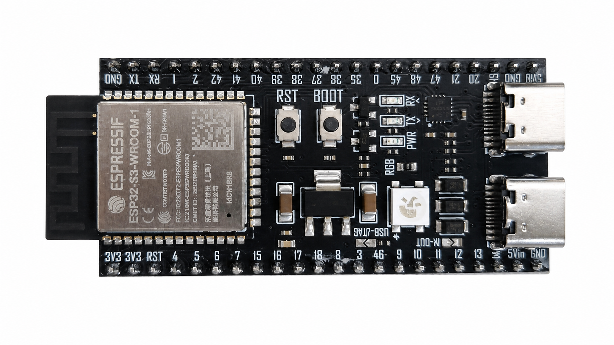
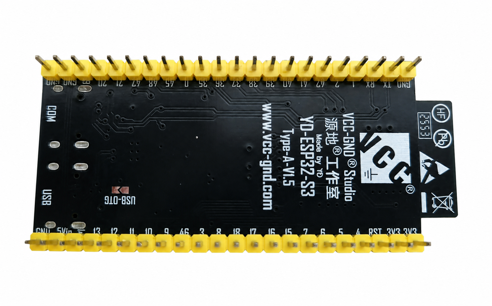
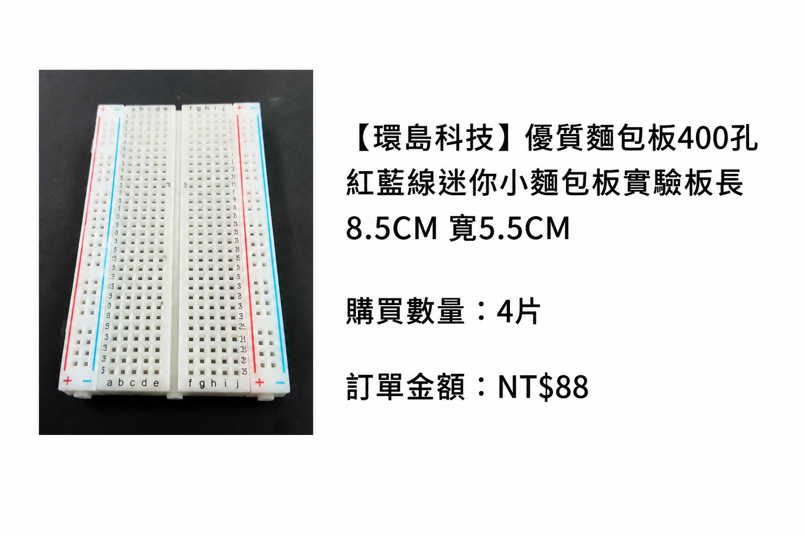
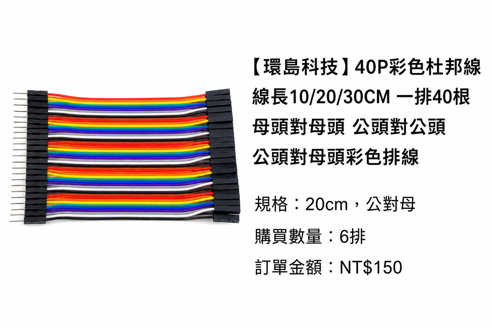
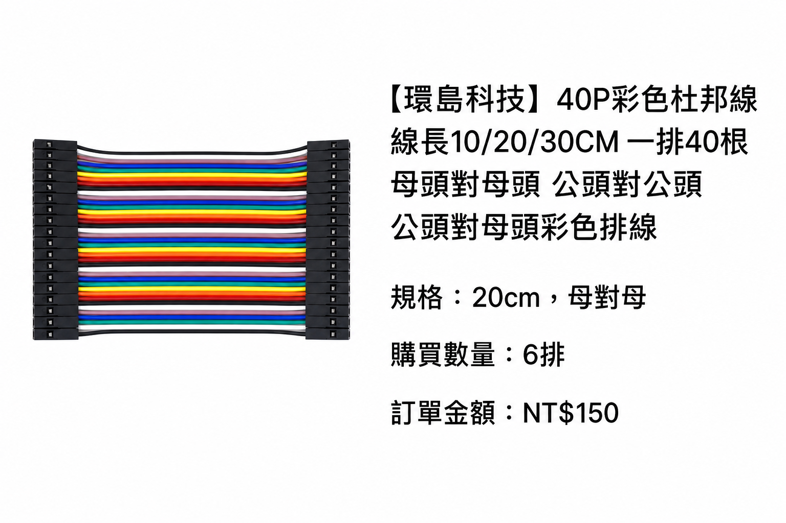

# Week 2支援資料

本檔放置上課前確認表、已購設備辨識索引、延伸實作、故障排查與回報格式。
實際操作步驟請依[Week 2主教材](week2_main.md)進行。

## 一、本週必帶與器材確認

### 個人必帶

- [ ] 已安裝Arduino IDE 2與Espressif `esp32` package的筆電。
- [ ] 筆電充電器。
- [ ] 可開啟最新版GitHub課程教材。
- [ ] 一條已確認可傳輸資料的USB線。

### 每個工作位的實驗依賴

| 品項 | 最低數量 | 本週用途 | 取得方式 |
|---|---:|---|---|
| 經教師核准的ESP32-S3 N16R8板；目前實物為YD-ESP32-S3 Type-A V1.5、排針向下44腳 | 1 | Upload、profile指定輸入與測試輸出 | 學生自備 |
| 可傳資料的USB線 | 1 | 供電、Upload、Serial | 學生自備 |
| 400孔麵包板 | 1 | 按鈕與安全測試點 | 學生自備 |
| 四腳輕觸按鈕 | 1 | 數位輸入 | 學生自備 |
| 公對公杜邦線 | 至少4條 | 兩個profile GPIO、GND及測試點 | 學生自備 |
| 常用電阻包 | 220Ω、1kΩ及10kΩ各至少1顆 | 標稱值與實測值比較 | 學生自備 |
| 萬用電表 | 輪流共用 | 電阻、通斷、LOW／HIGH電壓 | 課堂提供 |

本週不使用LED、蜂鳴器、舵機、馬達、電池盒、外部電源或感測模組。
上電前請把這些物品移出工作區。

實作前另須確認`docs/hardware_state.md`已有本批板卡的target-test組合與GPIO
profile。未公布時，GPIO4／GPIO5只屬候選值，不得依教材文字自行啟用。

### 上電前最後確認

- [ ] 開發板金屬屏蔽罩與板身絲印已拍照。
- [ ] USB線已確認可傳輸資料。
- [ ] 麵包板、按鈕與杜邦線無明顯損壞。
- [ ] 220Ω、1kΩ及10kΩ仍有原始標籤或可核對的分裝標示。
- [ ] 萬用電表的表筆、電池與DCV／電阻功能已確認。
- [ ] 桌上沒有外部電池、馬達或高電流負載。

## 二、本週學生器材辨識

本週只辨認學生必買包中的ESP32-S3、麵包板、三種指定阻值的電阻、四腳按鈕
與杜邦線。教師庫存數量及未列入共同必買的感測器、顯示器、馬達與驅動板，
不作為本週學生教材內容。

商品頁截圖只協助核對當時的購買選項，不能證明收到的PCB版型。2026-08-27第一片
實物照片確認模組為Espressif `ESP32-S3-WROOM-1 N16R8`，但開發板PCB是
`VCC-GND Studio YD-ESP32-S3 Type-A V1.5`，不是Espressif原廠DevKitC-1版型。
接腳與USB用途須以YD板實物絲印及後續target test為準。


第一片實物已拍攝正、反面，並另製作移除桌面的白底辨識圖：





白底圖用於課堂辨識外形、雙USB接頭、按鈕及排針方向。後製可能改變原本模糊的
細小文字或元件邊緣，因此不能拿來判定模組容量、固定GPIO、電氣規格或焊接品質；
這些判斷必須回看未後製原圖、實物絲印、官方文件及後續target test。

### 麵包板與三種杜邦線辨識卡

下列白底卡由原始購買截圖後製，並保留蝦皮品名、所選規格、購買數量及訂單金額。
商品外觀經放大整理，只用於課堂辨識，不取代原始訂單、實物或技術規格。
**公頭**末端是露出的金屬針，**母頭**末端是有插孔的黑色塑膠接頭；先看兩端，
不要只靠線的顏色判斷。

#### 400孔麵包板



#### 公對母杜邦線

左端為露出的公針，右端為有插孔的母頭。



#### 母對母杜邦線

兩端都是有插孔的母頭，沒有露出的金屬公針。



#### 公對公杜邦線

兩端都是露出的金屬公針。


Week 2若開發板能自然插入麵包板並留下外側接線孔，主要使用公對公杜邦線；若
YD板寬度無法自然對孔或沒有可用外側孔，停止施力，改用公對母杜邦線把開發板
排針接到麵包板。本週不需要母對母杜邦線。

其餘學生必買品項及購買圖片見
[Week 1正式採購總表](../Week_01_Course_Orientation/week1_support.md#purchase-table)。

### 使用 Windows 相機拍攝與板卡照片檢核

板卡照片用來保存實物辨識證據，不取代官方pinout或實機測試。開始前先拔除
ESP32的USB，移除所有杜邦線與外接電池，並將板卡放在乾燥、不導電的淺色紙面。

#### 開啟相機

1. 按Windows鍵，輸入`相機`或`Camera`，開啟Windows **Camera** App。
2. 第一次開啟若出現權限要求，允許Camera App使用相機；本任務不需要錄音。
3. 確認目前是相片模式，不是錄影模式。若有前後鏡頭切換，選擇能看到桌面的
   一般彩色相機，不使用IR人臉辨識畫面。
4. 若畫面全黑，先關閉Teams、Zoom或其他可能占用相機的程式，再到
   **Settings → Privacy & security → Camera**確認相機存取權限。

#### 取得可辨識照片

1. 擦拭相機鏡頭，在板卡兩側補充均勻光線，避免金屬屏蔽罩反光。
2. 先讓整片板卡平行面向鏡頭。若近距離文字模糊，將板卡移遠到絲印清楚，拍攝
   高解析度照片後再裁切，不要只把模糊板卡放大。
3. 使用畫面上的相片快門按鈕，依序拍攝：
   - 板卡正面全景：完整看見兩排排針、金屬屏蔽罩、USB端與按鈕。
   - USB端近照：看見兩個接頭、BOOT、RESET／RST及周圍絲印。
   - 板卡背面或側面：看見排針方向、兩側針數及是否有彎針。
4. 每拍一張立即開啟縮圖檢查。看不清金屬罩文字、腳位絲印或針腳時重新拍攝，
   不把「肉眼看得到」當成照片已合格。

若筆電Webcam即使移動距離仍無法對焦，不要持續提交模糊照片。改用手機後鏡頭：

1. 將斷電板卡平放在白紙上，使用一般相片模式並增加環境光。
2. 在手機畫面點一下板卡文字位置，使相機對焦；先用原始倍率拍攝，不用數位放大
   製造模糊畫面。
3. 拍完放大檢查絲印，再以USB檔案傳輸、OneDrive、Windows Phone Link或
   Quick Share傳到筆電。避免經過會自動壓縮圖片的聊天軟體。
4. 保存手機產生的原始照片檔，不以社群軟體截圖取代。

Windows通常把相片存到使用者的`Pictures\Camera Roll`；若Pictures由OneDrive
接管，路徑可能顯示為`OneDrive\圖片\Camera Roll`。找不到時，在Camera App開啟
剛拍的縮圖，再選擇在檔案總管中顯示，或依拍攝時間尋找最新相片。

#### 上傳前自我檢核

- [ ] 正面全景沒有裁掉USB端或排針。
- [ ] 金屬屏蔽罩及板面主要文字可放大閱讀。
- [ ] 能分辨兩側各有多少針，並看出排針朝上或朝下。
- [ ] USB接頭、BOOT與RESET／RST按鈕可辨認。
- [ ] 沒有發熱、燒焦、鏽蝕、斷裂或明顯彎針。
- [ ] 畫面沒有姓名、住址、帳號、密碼、學生證或其他個資。

設備核對至少檢查產品是否為ESP32-S3系列開發板、是否符合採購要求的44腳與
排針方向，以及可見型號、USB接頭、按鈕和損傷狀態。照片不能證明GPIO可用、
Flash／PSRAM容量、USB資料通訊或Upload已通過；這些項目必須在後續官方資料
核對、軟體辨識與target test中分別確認。

## 三、缺料或故障回報格式

不要只寫「不能用」。回報時提供：

1. 姓名、作業系統版本與Arduino IDE版本。
2. 開發板模組絲印、板卡正反面照片。
3. 已經完成到主教材的哪一步。
4. 完整錯誤訊息、Port畫面或Serial Monitor截圖。
5. 接線俯視圖，需清楚看到ESP32腳位絲印。
6. 已嘗試的方法與結果。

編譯失敗、上傳失敗、Serial無輸出、按鈕讀值錯誤與電壓量測錯誤是
不同問題，必須先指出失敗發生在哪一階段。

## 四、相關資料

- [Week 1正式採購總表](../Week_01_Course_Orientation/week1_support.md#purchase-table)
- [Week 2課前環境準備](../Week_01_Course_Orientation/week1_support.md#week-2-preclass-setup)
- [程式片段](../../docs/course_materials/starter_code_snippets.md)
- [安全檢核](../../docs/course_materials/rubrics_and_checklists.md)

## 五、延伸實作

完成主教材的必要練習後，可選擇下列題目繼續修改、預測、測試與記錄。

### 延伸實作1：切換模式

每次按下按鈕，`PIN_TEST_OUTPUT`在HIGH與LOW之間切換；放開按鈕不改變模式。

預期log：

```text
event=mode_changed mode=ON test_output=HIGH
event=mode_changed mode=OFF test_output=LOW
```

提示：建立`bool outputOn`，只在新的按下事件發生時反轉它。

### 延伸實作2：長按與短按

放開按鈕時，計算這次按住多久。小於門檻輸出`short_press`，達到門檻輸出
`long_press`。

```text
event=short_press duration_ms=326
event=long_press duration_ms=1842
```

提示：按下時保存`pressedAtMs`，放開時以目前`millis()`相減。不得使用
阻塞式的長時間`delay()`。

### 延伸實作3：閒置提醒

一段時間都沒有按鈕事件時，輸出一次idle訊息；再次操作後重新計時。

```text
status=idle idle_ms=10000
```

提示：保存`lastActivityMs`。為避免每次loop都重複印出idle，再增加一個
`idleReported`狀態。

### 延伸實作4：三段狀態循環

每次按下依序切換：

```text
NORMAL -> WARNING -> ALARM -> NORMAL
```

每個狀態要有不同的`PIN_TEST_OUTPUT`行為或Serial文字，並能在Reset後回到NORMAL。

提示：可以使用整數0、1、2，也可以使用`enum`建立有名稱的有限狀態。

### 延伸實作5：比較不同去抖時間

將`DEBOUNCE_MS`分別設成`0`、`10`、`30`、`100`，每種設定實際按十次，
比較程式記錄到幾次按下事件。

| 去抖設定 | 實際按下 | 程式計數 | 使用感覺／問題 |
|---:|---:|---:|---|
| 0 ms | 10 |  |  |
| 10 ms | 10 |  |  |
| 30 ms | 10 |  |  |
| 100 ms | 10 |  |  |

結果說明須以重複計數或反應延遲為依據，不得只填寫哪個設定「最好」。

### 延伸實作6：反應時間遊戲

Reset後等待一段隨機時間，Serial顯示`GO`才可按按鈕。記錄從`GO`到
按下的反應時間；提早按下則顯示`too_early`。

```text
game=ready
game=go
game=result reaction_ms=418
```

提示：需要WAIT、GO、RESULT等狀態，並使用`random()`與`millis()`；不可
使用長時間`delay()`，否則無法偵測提早按下。

### 延伸實作7：加入事件序號

替每一筆按鈕事件加入從1開始的`seq`，讓閱讀log的人能判斷是否漏掉或
重複一筆事件：

```text
group=03 seq=1 event=button_changed pressed=true test_output=HIGH time_ms=12345
group=03 seq=2 event=button_changed pressed=false test_output=LOW time_ms=13021
```

提示：建立`unsigned long eventSeq = 0;`，只在穩定狀態真正改變時先加1，
再把`eventSeq`放進同一行`Serial.printf()`。按下與放開都算一筆事件。

### 延伸實作8：找出系統無法偵測的故障

先斷電，拔掉`PIN_BUTTON`訊號線，再重新上電。觀察程式會把它看成什麼狀態，
回答：只有`INPUT_PULLUP`時，程式能否分辨「真的沒按」與「訊號線脫落」？

提出一種未來可改善的硬體或軟體方法。本題不要求立刻加購或重新接線。

### 延伸實作9：交換操作與隱藏錯誤

由另一位組員操作上傳及測試。接著在斷電狀態下，由教師或其他組製造一個
安全的小錯誤，例如換錯`PIN_BUTTON`訊號線的位置。依序使用接線表、通斷、Serial
及電壓證據找出問題；一次只能改一個變因。

### 延伸實作紀錄

| 選擇的延伸實作 | 修改內容 | 預期結果 | 實際結果 | 修正 |
|---|---|---|---|---|
|  |  |  |  |  |
|  |  |  |  |  |

## 六、故障排查表

| 現象 | 優先檢查 | 禁止或不建議的動作 |
|---|---|---|
| 沒有Port | 資料線、USB接頭、裝置管理員 | 安裝來源不明的driver |
| Compile失敗 | 第一個錯誤、括號、分號、board package | 重插所有接線 |
| Upload失敗 | Board、Port、線材、是否被其他程式占用 | 直接更換整塊板 |
| Upload完成但無Serial | baud rate、port、RESET、`Serial.begin` | 同時改多個設定 |
| 按鈕永遠未按 | `PIN_BUTTON`、GND、按鈕方向、`INPUT_PULLUP` | 帶電改線 |
| 按鈕永遠按下 | `PIN_BUTTON`是否持續短接GND | 將5V接入測試 |
| 測試輸出電壓不變 | `PIN_TEST_OUTPUT`、程式版本、Serial事件、表筆位置與檔位 | 切到電流檔 |
| 三種電阻讀值幾乎相同 | 元件標籤、Ω量程、表筆接觸與單位換算 | 把標稱值當實測值 |
| 板子發熱或異味 | 立即拔USB，通知教師 | 再次上電測試 |

故障排除時一次只改一個變因，並保存修改前後的log，以判定有效的修正動作。

## 七、軟體環境驗證紀錄

| 驗證日期 | 作業系統 | Arduino IDE | Espressif `esp32` package | 驗證範圍 | 結果與限制 |
|---|---|---|---|---|---|
| 2026-08-27 | Windows 64-bit | 2.3.10 | 3.3.11 | 官方下載、`Help → About Arduino IDE`版本確認，以及Boards Manager已安裝狀態 | IDE安裝、啟動與package已安裝狀態已確認；尚未因此宣稱Compile、Upload、Serial或實機線路通過 |

Arduino IDE 發布後仍可能更新。學生應記錄自己實際使用的版本，不能只抄上表；
教師更換課程版本時，也必須重新進行後續 package、Compile、Upload 與 target test。

2026-08-27連線觀察：清楚背面照片顯示兩個接頭分別標為`COM`與`USB`。先前接到
`USB`接頭後，Windows新增「USB序列裝置（COM7）」；這是ESP32-S3原生USB路徑，
不是本週預定的USB-to-UART路徑。此結果只確認本次USB線能供電且Windows完成原生
USB序列裝置列舉。改接背面標示`COM`的接頭後，Windows新增
`USB-Enhanced-SERIAL CH343 (COM8)`（製造商`wch.cn`、USB VID `1A86`、
PID `55D3`），確認這個接頭經過CH343 USB-to-UART橋接晶片；Compile、Upload與
Serial內容仍待測試。
`COM7`是這台電腦當次分配結果，不是學生應固定照抄的Port。
同樣地，`COM8`也不是固定答案；學生必須以拔除前後比較辨認自己的Port。

同日使用Arduino-ESP32 `3.3.11`、`ESP32S3 Dev Module`、16 MB Flash、OPI PSRAM、
USB-to-UART及16 MB partition設定編譯
[`week02_board_check.ino`](../../examples/week02_board_check/week02_board_check.ino)成功。Arduino IDE回報程式使用
274505 bytes（8%）、全域變數使用21608 bytes（6%）；容量數字是本次版本與程式的
驗證紀錄，不是學生必須得到的固定數字。此階段只證明compile通過，尚不能宣稱
Upload、Serial或實體板卡功能已通過。

同一設定隨後經CH343 `COM8`以115200 baud完成首次Upload：實際寫入274656 bytes，
寫入資料的hash驗證通過，並出現`Hard resetting via RTS pin...`。整個過程不需手動
按BOOT或RST，確認這塊板的USB-to-UART下載與自動重設路徑可用。此結果仍不等於
Serial輸出、Flash／PSRAM容量或GPIO功能已完成驗證。

第一次runtime輸出確認`chip_model=ESP32-S3`、revision 2、240 MHz、
`flash_bytes=16777216`，且`uptime_ms`每秒增加，證明UART Serial、RESET後重新執行與
16 MB Flash讀值正常。相同輸出中的`psram_bytes=0`不符合N16R8應有的8388608 bytes，
因此PSRAM尚未通過。處理順序是先關閉Serial Monitor並核對
**Tools → PSRAM → OPI PSRAM**，再重新Verify、Upload與讀值；在完成此步驟前不得把
PSRAM記為硬體故障，也不得宣稱N16R8設定已完整驗證。

實際核對發現第一次編譯時PSRAM誤選為`Disabled`。改為`OPI PSRAM`、重新Verify與
Upload後，runtime回報`psram_bytes=8388608`，確認8 MB PSRAM可初始化；問題是選單
設定錯誤，不是硬體故障。這個案例也說明設定畫面、Compile成功與Upload成功都不能
取代runtime讀值。BOARD-T01的完整基本驗證證據見
[2026-08-27 BOARD-T01 basic validation](../../docs/lab_notes/2026-08-27-board-t01-basic-validation.md)。

正面朝上、天線在左、兩個USB接頭在右時，`COM`是右上方、靠近`RX`／`TX`／
`PWR`三個指示燈的接頭；`USB`是右下方、靠近`RGB`區域的接頭。板卡若已旋轉，
仍應翻到背面讀`COM`／`USB`絲印，不靠上下記憶猜測。
