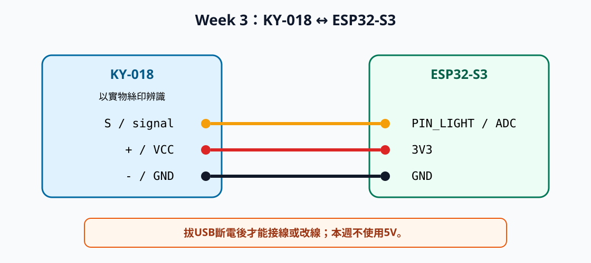
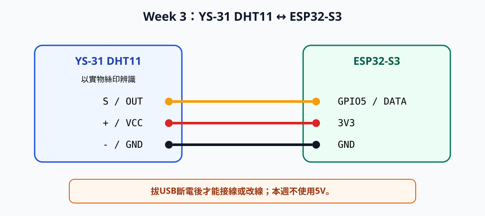

# Week 3：感測器與輸入品質實驗

日期：2026-09-23

本週使用KY-018光敏模組與YS-31 DHT11溫濕度模組。完成後，
Serial Monitor不只會顯示數字，還會標示單位、狀態、有效性與失敗原因。
光線門檻必須來自自己的重複量測，不直接複製別人的數字。

> 驗證狀態：Espressif官方資料支持GPIO4作為ADC候選輸入，GPIO5作為一般
> 數位候選腳位；但它們尚未完成本批板卡與模組的target test，因此程式預設
> `PIN_LIGHT=-1`與`PIN_DHT=-1`。三個程式已以Arduino CLI 1.4.1、Espressif `esp32` core 3.3.11、
> `esp32:esp32:esp32s3`、DHT sensor library 1.4.7及Adafruit Unified Sensor 1.1.15
> 完成compile。`docs/hardware_state.md`中的指定板卡與模組仍為`unverified`；
> 未進行指定實物的Upload、Serial輸出、接線、量測或故障注入。學生只能將教師
> 公布、且可追溯至target-test紀錄的腳位填入placeholder。

## 一、Unit Overview

### Teaching Objectives

By the end of this unit, students will be able to:

1. Identify the power, ground, and signal connections of KY-018 and YS-31 DHT11
   modules from their physical labels.
2. Collect repeated analog samples, calculate descriptive statistics, and determine
   whether measured light conditions can be separated reliably.
3. Derive DARK, NORMAL, and BRIGHT thresholds from measured data instead of copying
   fixed values.
4. Read temperature and humidity at controlled sampling intervals and distinguish a
   valid reading from a failed or out-of-range reading.
5. Preserve invalid sensor data with diagnostic `valid` and `reason` fields.
6. Use normal, fault, repair, and recovery evidence to explain whether sensor output is
   trustworthy.

### Teaching Content

This unit examines why a sensor value is not automatically reliable evidence. Students
will compare digital input, analog ADC readings, and values returned by a sensor library.
They will collect KY-018 data under controlled lighting conditions, calculate minimum,
maximum, average, and spread, test whether the observed ranges overlap, and derive two
light-state thresholds from their own measurements.

Students will also use a DHT11 temperature and humidity module, compare normal and
overly frequent sampling, and observe how a disconnected signal appears in Serial
output. The two sensors will then be combined into a consistent local data record whose
state, validity, and diagnostic reason reflect the actual quality of the measurements.
Safe power removal, physical connection checks, repeatable testing, and recovery evidence
are applied throughout the activity.

### 核心實驗流程

| 階段 | 開始前狀態 | 操作 | 完成條件 |
|---|---|---|---|
| A. 辨識 | USB已拔除 | 核對兩個模組絲印 | 腳位表與照片完成 |
| B. KY-018原始值 | 只接KY-018 | Upload類比讀取程式 | 光線改變時raw value可重複變化 |
| C. 光線校正 | KY-018正常 | 三種光線各取30筆 | 有min、max、average與重疊判斷 |
| D. DHT11讀取 | 斷電、拆KY-018 | 安裝library、接線、Upload | 溫濕度含單位、時間與有效狀態 |
| E. 故障注入 | 保留正常log | 斷電後移除一條訊號線 | 有故障、檢查、修正與恢復證據 |
| F. 整合 | 兩模組個別正常 | 以麵包板分配3V3與GND並同時接回兩模組 | 單行log的分類、`valid`與`reason`符合校正結果 |

## 二、器材、軟體與前置條件

| 品項 | 數量 | 用途 |
|---|---:|---|
| ESP32-S3-DevKitC-1 N16R8，排針向下44腳 | 1 | ADC、DHT11與Serial |
| KY-018光敏模組 | 1 | 類比原始值與光線校正 |
| YS-31 DHT11模組 | 1 | 溫度、濕度與無效狀態 |
| 400孔麵包板 | 1 | 建立3V3與GND共用接點 |
| 公對母杜邦線 | 至少6條 | ESP32或模組公針接到麵包板 |
| 母對母杜邦線 | 至少2條 | 模組訊號腳直接接ESP32 GPIO |
| USB資料線、筆電與充電器 | 各1 | Upload、Serial與紀錄 |
| 手機手電筒 | 1 | 固定的亮光條件 |

課堂只提供萬用電表輪流量測。HC-SR501、HC-SR04、OLED、RGB、蜂鳴器、
舵機與電池盒本週不使用。

軟體條件：Arduino IDE 2、Espressif `esp32` board package，以及Adafruit的
`DHT sensor library`與`Adafruit Unified Sensor`。如尚無法Verify、Upload或開啟
Serial Monitor，先回到[Week 2主教材](../Week_02_ESP32_Hardware_Basics/week2_main.md)排除開發環境問題。

硬體進入條件：`docs/hardware_state.md`已有本批板卡的Week 2 target-test紀錄，
而且教師已公布KY-018使用的ADC GPIO與DHT11資料GPIO。未達成時只執行library安裝及
compile-only，不接模組、不Upload，也不把候選GPIO4／GPIO5當成固定答案。

## 三、安全與資料原則

### 改線前一律斷電

1. 關閉Serial Monitor不等於斷電。
2. 將USB線從ESP32拔除。
3. 確認開發板電源指示燈熄滅。
4. 才能安裝、移除或重插杜邦線。

通斷與電阻檔只在斷電時使用。直流電壓量測需上電時，黑表筆固定在GND，
紅表筆只觸碰一個測試點，不讓筆尖橫跨兩腳。

### 本週統一使用3.3V

兩個模組都從ESP32的`3V3`腳供電，不使用`5V`或外部電池。
如果實物沒有清楚標示`S`／`OUT`、`+`／`VCC`與`-`／`GND`，
停止接線並拍照回報，不依購物圖或左右順序猜測。

### 本週固定使用麵包板分配電源

ESP32與兩個模組的排針都是公針，不能用一條公對母杜邦線直接連接兩個公針。
本週統一採用以下方式：

- **母對母杜邦線**：直接連接模組訊號腳與ESP32 GPIO。
- **公對母杜邦線**：母端套住ESP32或模組的電源腳，公端插入麵包板。
- **麵包板五孔組**：讓兩個模組共用同一個3V3接點與同一個GND接點。

先在麵包板同一側選兩個彼此分開、尚未使用的五孔組。若板上有座標，可用
`A5～E5`與`A7～E7`；若這兩列已被占用，可改用其他兩個五孔組。將第一組貼上
`P3V3`標籤，第二組貼上`PGND`標籤，並把實際座標寫入支援資料。中央溝槽左右
兩側不互通，不可把同一個共用接點分放在溝槽兩側。

1. USB保持拔除。
2. 用一條公對母線將ESP32 `3V3`接到`P3V3`。
3. 用另一條公對母線將ESP32 `GND`接到`PGND`。
4. 用手指沿線確認`P3V3`只回到`3V3`，`PGND`只回到`GND`。
5. 確認`P3V3`與`PGND`不是同一個五孔組，也沒有杜邦線跨接兩組。

接入單一模組時，該模組的VCC與GND分別接到`P3V3`與`PGND`；訊號腳再用
母對母線直接接指定GPIO。整合兩個模組時，兩個VCC都接到`P3V3`，兩個GND
都接到`PGND`。任何線無法自然插入時立即停止，不用施力改變排針形狀。

### 感測數字不等於事實

數字只代表程式取得一個值。還必須檢查單位、取樣間隔、重複性、
條件間是否可分，以及斷線時是否顯示無效。

## 四、辨識兩個模組

### KY-018

KY-018的光敏電阻會隨光線改變電阻，模組將變化轉成訊號電壓。
ESP32讀到的是ADC raw value，不是lux或絕對照度。

1. 拔除USB。
2. 找到光敏電阻與三個腳位旁的絲印。
3. 將絲印寫入下表，拍攝可同時看見元件與絲印的照片。

| 實物絲印 | 作用 | 將連接到 |
|---|---|---|
| ______ | 訊號 | profile的`PIN_LIGHT`／ADC GPIO |
| ______ | 電源 | 3V3 |
| ______ | 參考地 | GND |

### YS-31 DHT11

DHT11模組將溫度與相對濕度以數位通訊送給ESP32，不使用`analogRead()`。

1. 找到有通風孔的DHT11感測元件。
2. 核對模組板或附帶線材旁的腳位絲印，不依線色猜測。
3. 寫入下表並拍照。

| 實物絲印 | 作用 | 將連接到 |
|---|---|---|
| ______ | 資料 | profile的`PIN_DHT` |
| ______ | 電源 | 3V3 |
| ______ | 參考地 | GND |

任一模組無法確定腳位時，本階段就停止，不嘗試上電。

## 五、KY-018類比讀取與校正

### ADC、raw value與`PIN_LIGHT`

ADC是Analog-to-Digital Converter（類比數位轉換器）。本程式設為12-bit，
`analogRead()`預期回傳0～4095的raw value。官方資料將候選GPIO4列為
ESP32-S3 ADC1腳位；真正使用值以教師公布的`PIN_LIGHT`為準。本週不保留
Week 2的按鈕輸入線路。

### 步驟1：接線

確認USB已拔除，依功能接線：

| KY-018 | 連接方式 | 接到 | 接回USB前確認 |
|---|---|---|---|
| `S`或訊號 | 母對母線 | profile的`PIN_LIGHT` | 不是5V、3V3或GND |
| `+`或VCC | 公對母線 | `P3V3`五孔組 | `P3V3`另一條線回到ESP32 3V3 |
| `-`或GND | 公對母線 | `PGND`五孔組 | `PGND`另一條線回到ESP32 GND |



此圖只表示三條線的電氣關係；實際供電依前述方法經`P3V3`與`PGND`分接，
不將模組VCC或GND直接套接到已被占用的ESP32排針。

用手指沿著每一條線走完整條路徑：訊號→`PIN_LIGHT`、VCC→P3V3→ESP32 3V3、
GND→PGND→ESP32 GND。接著從`PIN_LIGHT`、3V3與GND反向檢查回模組。確認正向與
反向結果一致，而且沒有任何線接到5V後，拍攝能看見模組絲印、ESP32腳位及
P3V3／PGND的俯視照片，才能接回USB。

### 步驟2：建立校正程式

在Arduino IDE選擇 **File > New Sketch**，以 **File > Save As...** 存為
`week3_ky018_calibration`，貼上完整程式：

```cpp
// 由教師公布的ADC target-test profile填入；未公布時保持-1。
const int PIN_LIGHT = -1;
const int SAMPLE_COUNT = 30;
const unsigned long SAMPLE_INTERVAL_MS = 100;

struct Profile {
  const char* label;
  int minimum;
  int maximum;
  int average;
  bool ready;
};

Profile darkProfile = {"DARK", 0, 0, 0, false};
Profile normalProfile = {"NORMAL", 0, 0, 0, false};
Profile brightProfile = {"BRIGHT", 0, 0, 0, false};

bool pinProfileReady() {
  return PIN_LIGHT >= 0;
}

void captureProfile(Profile& profile) {
  long total = 0;
  int minimum = 4095;
  int maximum = 0;

  Serial.printf("capture=started label=%s samples=%d\n",
                profile.label, SAMPLE_COUNT);
  for (int index = 0; index < SAMPLE_COUNT; index++) {
    int raw = analogRead(PIN_LIGHT);
    total += raw;
    if (raw < minimum) minimum = raw;
    if (raw > maximum) maximum = raw;
    Serial.printf("sample=%d label=%s light_raw=%d\n",
                  index + 1, profile.label, raw);
    delay(SAMPLE_INTERVAL_MS);
  }

  profile.minimum = minimum;
  profile.maximum = maximum;
  profile.average = total / SAMPLE_COUNT;
  profile.ready = true;
  Serial.printf("capture=done label=%s min=%d max=%d average=%d spread=%d\n",
                profile.label, profile.minimum, profile.maximum,
                profile.average, profile.maximum - profile.minimum);
}

bool allReady() {
  return darkProfile.ready && normalProfile.ready && brightProfile.ready;
}

bool profilesOverlap() {
  Profile* p[] = {&darkProfile, &normalProfile, &brightProfile};
  for (int a = 0; a < 3; a++) {
    for (int b = a + 1; b < 3; b++) {
      bool separated = p[a]->maximum < p[b]->minimum ||
                       p[b]->maximum < p[a]->minimum;
      if (!separated) return true;
    }
  }
  return false;
}

int lightDirection() {
  if (darkProfile.average < normalProfile.average &&
      normalProfile.average < brightProfile.average) return 1;
  if (darkProfile.average > normalProfile.average &&
      normalProfile.average > brightProfile.average) return -1;
  return 0;
}

int darkNormalThreshold() {
  if (lightDirection() == 1) {
    return (darkProfile.maximum + normalProfile.minimum) / 2;
  }
  return (darkProfile.minimum + normalProfile.maximum) / 2;
}

int normalBrightThreshold() {
  if (lightDirection() == 1) {
    return (normalProfile.maximum + brightProfile.minimum) / 2;
  }
  return (normalProfile.minimum + brightProfile.maximum) / 2;
}

const char* classifyLight(int raw) {
  int direction = lightDirection();
  int thresholdDarkNormal = darkNormalThreshold();
  int thresholdNormalBright = normalBrightThreshold();

  if (direction == 1) {
    if (raw <= thresholdDarkNormal) return "DARK";
    if (raw >= thresholdNormalBright) return "BRIGHT";
  } else {
    if (raw >= thresholdDarkNormal) return "DARK";
    if (raw <= thresholdNormalBright) return "BRIGHT";
  }
  return "NORMAL";
}

void reportCalibration() {
  if (!allReady()) return;
  if (profilesOverlap()) {
    Serial.println("calibration_valid=false reason=profiles_overlap");
    return;
  }
  int direction = lightDirection();
  if (direction == 0) {
    Serial.println("calibration_valid=false reason=profiles_not_ordered");
    return;
  }
  Serial.printf("calibration_valid=true direction=%s "
                "threshold_dark_normal=%d threshold_normal_bright=%d\n",
                direction == 1 ? "raw_rises_with_light" :
                                 "raw_falls_with_light",
                darkNormalThreshold(), normalBrightThreshold());
}

void reportCurrent() {
  int raw = analogRead(PIN_LIGHT);
  if (!allReady()) {
    Serial.printf("sensor=ky018 light_raw=%d light_state=UNKNOWN "
                  "valid=false reason=not_calibrated\n", raw);
  } else if (profilesOverlap()) {
    Serial.printf("sensor=ky018 light_raw=%d light_state=UNCERTAIN "
                  "valid=false reason=profiles_overlap\n", raw);
  } else if (lightDirection() == 0) {
    Serial.printf("sensor=ky018 light_raw=%d light_state=UNCERTAIN "
                  "valid=false reason=profiles_not_ordered\n", raw);
  } else {
    Serial.printf("sensor=ky018 light_raw=%d light_state=%s "
                  "valid=true reason=none\n", raw, classifyLight(raw));
  }
}

void setup() {
  Serial.begin(115200);
  delay(1000);
  if (!pinProfileReady()) {
    Serial.println("week=3 sensor=ky018 status=blocked reason=gpio_profile_missing");
    return;
  }
  analogReadResolution(12);
  Serial.println("week=3 sensor=ky018 status=ready adc_bits=12");
  Serial.println("commands: d=DARK n=NORMAL b=BRIGHT r=read");
}

void loop() {
  if (!pinProfileReady()) return;
  if (Serial.available() == 0) return;
  char command = Serial.read();
  while (Serial.available() > 0) Serial.read();
  bool profileChanged = false;

  if (command == 'd' || command == 'D') {
    captureProfile(darkProfile);
    profileChanged = true;
  } else if (command == 'n' || command == 'N') {
    captureProfile(normalProfile);
    profileChanged = true;
  } else if (command == 'b' || command == 'B') {
    captureProfile(brightProfile);
    profileChanged = true;
  }
  else if (command == 'r' || command == 'R') reportCurrent();
  else Serial.printf("command=unknown value=%c\n", command);

  if (profileChanged && allReady()) reportCalibration();
}
```

### 步驟3：Verify、Upload與原始值

1. 接回USB，確認 **Tools > Board**與 **Tools > Port** 沿用Week 2驗證設定。
2. 按 **Verify**，再按 **Upload**。
3. 開啟 **Tools > Serial Monitor**，baud rate設`115200`，行結尾設 **Newline**。
4. 輸入`r`。未校正前應看到：

```text
sensor=ky018 light_raw=<0至4095的實測值> light_state=UNKNOWN valid=false reason=not_calibrated
```

如無輸出，先檢查baud rate與Port，不立即改線。raw永遠0或4095時，
拔除USB後才核對訊號、3V3與GND。

### 步驟4：收集三種光線

1. **DARK**：用不透光物固定遮住光敏電阻，等2秒後送出`d`。
2. **NORMAL**：移除遮光物，保持室內光線不變，送出`n`。
3. **BRIGHT**：固定手機與模組距離，開手電筒，等2秒後送出`b`。
4. 每次保持條件不變直到`capture=done`。
5. 把三組min、max、average與spread填入[Week 3支援資料](week3_support.md)。

比較三組average，實測光線變亮時raw上升或下降。再檢查範圍是否重疊。
若重疊，程式會回報`profiles_overlap`；這是有效結果，代表當前條件不足以穩定分類。

三組範圍沒有重疊，而且average依光線變化保持同一方向時，程式會輸出：

```text
calibration_valid=true direction=<raw_rises_with_light或raw_falls_with_light> threshold_dark_normal=<實測> threshold_normal_bright=<實測>
```

這兩個threshold（門檻）不是教材預設值，而是取兩個相鄰、不重疊範圍之間的
中點。如果raw隨光線增加，DARK／NORMAL門檻使用`(DARK max + NORMAL min) / 2`；
如果raw隨光線降低，則使用`(DARK min + NORMAL max) / 2`。NORMAL／BRIGHT門檻
以相同方式由兩個相鄰邊界計算。將方向與兩個門檻完整記入支援資料。

若程式回報`profiles_not_ordered`，代表三組average沒有依亮度形成一致的上升或
下降順序。先固定遮光方式、室內光與手機距離，再重新量測，不直接修改數字。

### 步驟5：重複測試與故障

1. 在DARK、NORMAL、BRIGHT下各送出`r`三次，記錄分類。
2. 保留一筆正常log後拔除USB。
3. 只移除KY-018訊號線，保留3V3與GND，拍照後復電並送出`r`。
4. 記錄raw固定、漂動或靠近0／4095；不先假設特定數字。
5. 斷電後將訊號線恢復到profile的`PIN_LIGHT`，復電、重新校正並保留正常log。

本程式無法可靠辨識所有KY-018斷線狀況，這項限制必須寫入Lab Note。

## 六、DHT11取樣與無效狀態

### 步驟1：斷電、更換線路

1. 儲存KY-018結果後拔除USB。
2. 移除KY-018的三條模組接線並收好模組；ESP32到`P3V3`與`PGND`的兩條線保留。
3. 依DHT11實物絲印接線：

| DHT11 | 連接方式 | 接到 | 接回USB前確認 |
|---|---|---|---|
| `S`或`OUT` | 母對母線 | profile的`PIN_DHT` | 不是5V、3V3或GND |
| `+`或`VCC` | 公對母線 | `P3V3`五孔組 | `P3V3`另一條線回到ESP32 3V3 |
| `-`或`GND` | 公對母線 | `PGND`五孔組 | `PGND`另一條線回到ESP32 GND |



此圖只表示電氣關係；實際VCC與GND仍分別接到`P3V3`與`PGND`。

用手指先依DATA→`PIN_DHT`、VCC→P3V3→3V3、GND→PGND→GND正向檢查，再從
ESP32反向檢查回DHT11。兩次結果一致且沒有線接到5V後，拍攝可看見DHT11
絲印、`PIN_DHT`、P3V3與PGND的俯視照片。

### 步驟2：安裝library

1. 選擇 **Tools > Manage Libraries...**。
2. 搜尋`DHT sensor library`，安裝作者為 **Adafruit** 的版本。
3. 一併安裝`Adafruit Unified Sensor`依賴。
4. 在Library Manager把兩個已安裝版本寫入support。

`DHT.h: No such file or directory`代表library不在當前IDE環境；先檢查Library Manager，
不改GPIO或重插線。

### 步驟3：建立程式

建立sketch並存為`week3_dht11_quality`：

```cpp
#include <DHT.h>

// 由教師公布的DHT11 target-test profile填入；未公布時保持-1。
const int PIN_DHT = -1;
const int DHT_TYPE = DHT11;
const unsigned long SAMPLE_INTERVAL_MS = 2500;
const char* DEVICE_ID = "student01";

DHT dht(PIN_DHT, DHT_TYPE);
unsigned long lastSampleMs = 0;

bool pinProfileReady() {
  return PIN_DHT >= 0;
}

void reportReading(float temperatureC, float humidityPct) {
  if (isnan(temperatureC) || isnan(humidityPct)) {
    Serial.printf("device=%s uptime_ms=%lu sensor=dht11 "
                  "temperature_c=nan humidity_pct=nan "
                  "valid=false reason=read_failed\n", DEVICE_ID, millis());
    return;
  }

  bool inRange = temperatureC >= 0.0 && temperatureC <= 50.0 &&
                 humidityPct >= 20.0 && humidityPct <= 90.0;
  if (!inRange) {
    Serial.printf("device=%s uptime_ms=%lu sensor=dht11 "
                  "temperature_c=%.1f humidity_pct=%.1f "
                  "valid=false reason=outside_dht11_range\n",
                  DEVICE_ID, millis(), temperatureC, humidityPct);
    return;
  }

  Serial.printf("device=%s uptime_ms=%lu sensor=dht11 "
                "temperature_c=%.1f humidity_pct=%.1f "
                "valid=true reason=none\n",
                DEVICE_ID, millis(), temperatureC, humidityPct);
}

void setup() {
  Serial.begin(115200);
  delay(1000);
  if (!pinProfileReady()) {
    Serial.println("week=3 sensor=dht11 status=blocked reason=gpio_profile_missing");
    return;
  }
  dht.begin();
  Serial.printf("week=3 sensor=dht11 status=ready interval_ms=%lu\n",
                SAMPLE_INTERVAL_MS);
}

void loop() {
  if (!pinProfileReady()) return;
  unsigned long now = millis();
  if (now - lastSampleMs < SAMPLE_INTERVAL_MS) return;
  lastSampleMs = now;
  float humidityPct = dht.readHumidity();
  float temperatureC = dht.readTemperature();
  reportReading(temperatureC, humidityPct);
}
```

`NaN`是Not a Number，代表library沒有取得可當一般數值使用的結果。
`isnan()`檢查失敗，程式不把上一筆正常值當成新資料。

將程式中的`student01`改成課堂指定的裝置代碼，不使用姓名、學號或其他個人資料。
程式中的溫度`0～50°C`與濕度`20～90%`只作為DHT11明顯超出範圍的初步檢查，
不能證明模組準確；指定YS-31模組的實際範圍仍須依實物資料與target test確認。

### 步驟4：上傳與觀察

1. 依接線表正向、反向各檢查一次：VCC→P3V3→3V3、GND→PGND→GND、
   DATA→profile的`PIN_DHT`。
2. 接回USB，Verify、Upload，再開啟115200 baud的Serial Monitor。
3. 等待至少5筆，不對感測器吹氣、潑水或加熱。
4. 正常格式為：

```text
device=<你的裝置代碼> uptime_ms=<實測> sensor=dht11 temperature_c=<實測> humidity_pct=<實測> valid=true reason=none
```

記錄相鄰資料的`uptime_ms`差，應約為2500 ms。如差異完全不同，
先檢查上傳的是否為正確sketch。

### 步驟5：比較過快取樣

1. 保留2500 ms的5筆記錄。
2. 將`SAMPLE_INTERVAL_MS`改為`500`，Verify、Upload後記錄10筆。
3. 比較重複值、讀取失敗或其他現象；不預先假設一定失敗。
4. 將間隔恢復為`2500`，再次Verify與Upload。

### 步驟6：斷線與恢復

1. 保留一筆`valid=true`，拔除USB。
2. 只移除DHT11資料線，拍照後復電。
3. 等至少3次取樣並保留實際log。常見格式是：

```text
device=<你的裝置代碼> uptime_ms=<實測> sensor=dht11 temperature_c=nan humidity_pct=nan valid=false reason=read_failed
```

4. 如現象不同，記錄實際結果，不修改證據去符合範例。
5. 拔除USB，將資料線恢復到profile的`PIN_DHT`。
6. 復電後保留至少兩筆`valid=true`。

## 七、整合兩種感測資料

本階段不傳Wi-Fi、JSON或Backend；先將本機資料整理成一致欄位。

1. 拔除USB，保留DHT11線路以及ESP32到`P3V3`、`PGND`的兩條電源線。
2. 用母對母線將KY-018訊號腳接到profile的`PIN_LIGHT`。
3. 用公對母線將KY-018 VCC接到`P3V3`，再用一條公對母線將KY-018 GND
   接到`PGND`。
4. 確認`P3V3`五孔組共有三條線，分別通往ESP32 3V3、KY-018 VCC與DHT11
   VCC；`PGND`也有三條線，分別通往ESP32 GND與兩個模組的GND。
5. 確認`PIN_LIGHT`只接KY-018訊號、`PIN_DHT`只接DHT11資料，沒有任何線接到5V。
6. 先正向、再反向逐線檢查，拍攝能辨識所有端點的俯視照片後才能復電。
7. 建立`week3_combined_sensors`並貼上程式。依target-test紀錄填入`PIN_LIGHT`與
   `PIN_DHT`，再依校正輸出修改`DEVICE_ID`、`LIGHT_DIRECTION`及兩個threshold。
   只有校正輸出為`calibration_valid=true`時，才能把
   `LIGHT_PROFILES_SEPARATED`改成`true`。

```cpp
#include <DHT.h>

// 由教師公布的target-test profile填入；未公布時保持-1。
const int PIN_LIGHT = -1;
const int PIN_DHT = -1;
const int DHT_TYPE = DHT11;
const unsigned long SAMPLE_INTERVAL_MS = 2500;
const char* DEVICE_ID = "student01";

// 1代表raw隨光線增加；-1代表raw隨光線降低；0代表尚未填寫。
const int LIGHT_DIRECTION = 0;
const int LIGHT_THRESHOLD_DARK_NORMAL = -1;
const int LIGHT_THRESHOLD_NORMAL_BRIGHT = -1;
const bool LIGHT_PROFILES_SEPARATED = false;

DHT dht(PIN_DHT, DHT_TYPE);
unsigned long lastSampleMs = 0;

bool pinProfileReady() {
  return PIN_LIGHT >= 0 && PIN_DHT >= 0 && PIN_LIGHT != PIN_DHT;
}

bool lightConfigured() {
  bool directionReady = LIGHT_DIRECTION == 1 || LIGHT_DIRECTION == -1;
  bool thresholdsReady = LIGHT_THRESHOLD_DARK_NORMAL >= 0 &&
                         LIGHT_THRESHOLD_DARK_NORMAL <= 4095 &&
                         LIGHT_THRESHOLD_NORMAL_BRIGHT >= 0 &&
                         LIGHT_THRESHOLD_NORMAL_BRIGHT <= 4095;
  bool thresholdOrder =
      (LIGHT_DIRECTION == 1 &&
       LIGHT_THRESHOLD_DARK_NORMAL < LIGHT_THRESHOLD_NORMAL_BRIGHT) ||
      (LIGHT_DIRECTION == -1 &&
       LIGHT_THRESHOLD_DARK_NORMAL > LIGHT_THRESHOLD_NORMAL_BRIGHT);
  return directionReady && thresholdsReady && thresholdOrder;
}

const char* classifyLight(int raw) {
  if (LIGHT_DIRECTION == 1) {
    if (raw <= LIGHT_THRESHOLD_DARK_NORMAL) return "DARK";
    if (raw >= LIGHT_THRESHOLD_NORMAL_BRIGHT) return "BRIGHT";
  } else {
    if (raw >= LIGHT_THRESHOLD_DARK_NORMAL) return "DARK";
    if (raw <= LIGHT_THRESHOLD_NORMAL_BRIGHT) return "BRIGHT";
  }
  return "NORMAL";
}

void reportCombined() {
  int lightRaw = analogRead(PIN_LIGHT);
  float humidityPct = dht.readHumidity();
  float temperatureC = dht.readTemperature();

  const char* lightState = "UNKNOWN";
  bool valid = true;
  const char* reason = "none";
  bool dhtInRange = temperatureC >= 0.0 && temperatureC <= 50.0 &&
                    humidityPct >= 20.0 && humidityPct <= 90.0;

  if (!lightConfigured()) {
    valid = false;
    reason = "light_not_calibrated";
  } else if (!LIGHT_PROFILES_SEPARATED) {
    valid = false;
    reason = "light_profiles_overlap";
  } else {
    lightState = classifyLight(lightRaw);
    if (isnan(temperatureC) || isnan(humidityPct)) {
      valid = false;
      reason = "dht_read_failed";
    } else if (!dhtInRange) {
      valid = false;
      reason = "outside_dht11_range";
    }
  }

  Serial.printf("device=%s uptime_ms=%lu light_raw=%d "
                "light_state=%s temperature_c=%.1f humidity_pct=%.1f "
                "valid=%s reason=%s\n",
                DEVICE_ID, millis(), lightRaw, lightState,
                temperatureC, humidityPct,
                valid ? "true" : "false", reason);
}

void setup() {
  Serial.begin(115200);
  delay(1000);
  if (!pinProfileReady()) {
    Serial.println("week=3 mode=combined status=blocked reason=gpio_profile_missing");
    return;
  }
  analogReadResolution(12);
  dht.begin();
  Serial.println("week=3 mode=combined status=ready");
}

void loop() {
  if (!pinProfileReady()) return;
  unsigned long now = millis();
  if (now - lastSampleMs < SAMPLE_INTERVAL_MS) return;
  lastSampleMs = now;
  reportCombined();
}
```

8. Verify、Upload後，在三種光線下各保留一筆。校正有效時，三筆應分別顯示
   DARK、NORMAL、BRIGHT及`valid=true`。
9. 如果先前範圍重疊，保留`LIGHT_PROFILES_SEPARATED=false`；程式應顯示
   `valid=false reason=light_profiles_overlap`，不可為了通過而改成`true`。
10. 校正有效時，斷電後移除DHT11資料線，保留一筆
    `valid=false reason=dht_read_failed`。
11. 斷電恢復資料線，保留恢復後的`valid=true`。如果結果仍無效，依實際
    `reason`排查，不修改log。

Week 6會將`device`、`uptime_ms`、`light_raw`、`light_state`、`temperature_c`、
`humidity_pct`、`valid`與`reason`轉成JSON，不改變欄位意義。

## 八、變化實作

先寫預測，再保留實測證據：

1. 將KY-018取樣筆數改為10與100，比較average、spread與所需時間。
2. 固定30筆，將間隔改為20 ms與500 ms，比較穩定性與時間。
3. 固定手電筒距離5、10、20 cm，各量30筆並比較average。
4. 在分類切換處新增`UNCERTAIN`區，不讓靠近threshold的讀值直接成為確定狀態。
5. 在整合程式增加`valid_count`與`invalid_count`，用DHT11斷線測試驗證。
6. 找一種程式可能顯示`valid=true`但實際不可信的情境，不使用短路、潑水或加熱等危險方式。

## 九、故障排查表

| 現象 | 第一個安全檢查 | 後續檢查 | 不要做 |
|---|---|---|---|
| 無Port | 更換已知可傳資料的USB線與USB孔 | 檢查Week 2環境 | 不先改感測腳 |
| `DHT.h`找不到 | 查Library Manager | 核對Adafruit作者與依賴 | 不改接線 |
| KY-018永遠0 | 拔USB | 核對S→`PIN_LIGHT`、VCC→3V3、GND→GND | 不帶電改線 |
| KY-018永遠4095 | 拔USB | 檢查訊號浮接或誤接3V3 | 不用手指短接 |
| raw不隨光變 | 確認光真正照到光敏電阻 | 斷電核對`PIN_LIGHT`與絲印 | 不猜測數值方向 |
| `profiles_overlap` | 保留原始資料 | 重新固定遮光與手電筒距離 | 不任意改數字 |
| `profiles_not_ordered` | 保留三組統計 | 固定三種條件後重新量測 | 不交換標籤掩蓋結果 |
| DHT持續`read_failed` | 拔USB | 核對DATA→`PIN_DHT`、VCC→3V3、GND→GND | 不改5V試錯 |
| DHT重複舊值 | 恢復2500 ms間隔 | 核對library版本 | 不吹氣、潑水或加熱 |
| ESP32反覆重啟 | 立即拔USB | 拆模組，先驗證空板 | 不連續復電 |
| `light_not_calibrated` | 檢查direction或threshold是否仍為預設值 | 填入自己的校正輸出並重上傳 | 不複製別組數字 |
| `light_profiles_overlap` | 保留`false`與原始資料 | 改善三種條件後重新校正 | 不直接把設定改成`true` |

## 十、繳交內容

1. KY-018與DHT11正反面及腳位絲印照片。
2. 兩張單模組接線俯視照與一張整合接線照。
3. KY-018三種光線各30筆的min、max、average與spread。
4. 光線數值方向、門檻建立、範圍重疊與限制。
5. DHT11的2500 ms與500 ms記錄與比較結論。
6. 各一筆有效與無效log，保留`valid`與`reason`。
7. 故障前、斷電、故障、檢查、修正與恢復證據。
8. 三個sketch與Lab Note，含GPIO、供電、board package、library版本及未驗證限制。

## 十一、完成檢核與器材復原

- [ ] 能說明ADC raw value不是lux。
- [ ] KY-018三種條件各有30筆與統計。
- [ ] 光線狀態來自自己數據，並已檢查重疊。
- [ ] DHT11正常、過快、斷線與恢復都有記錄。
- [ ] 整合程式含一致欄位、`valid`與`reason`；若光線範圍重疊，程式保持
      `valid=false reason=light_profiles_overlap`。
- [ ] 所有改線都在USB拔除後進行。

復原順序：儲存程式與紀錄，拔USB，先拆3V3線，再拆訊號與GND，
分別收納兩模組，檢查無裸線或歪針後收好ESP32。

## 參考資料

- [Espressif Arduino-ESP32 ADC API](https://docs.espressif.com/projects/arduino-esp32/en/latest/api/adc.html)
- [ESP32-S3-DevKitC-1 User Guide](https://docs.espressif.com/projects/esp-dev-kits/en/latest/esp32s3/esp32-s3-devkitc-1/index.html)
- [Adafruit DHT sensor library](https://github.com/adafruit/DHT-sensor-library)
- [Week 2～5硬體教材藍圖](../../docs/hardware_course_material_plan.md)
