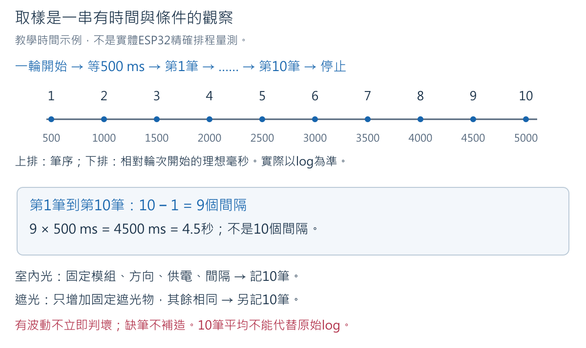
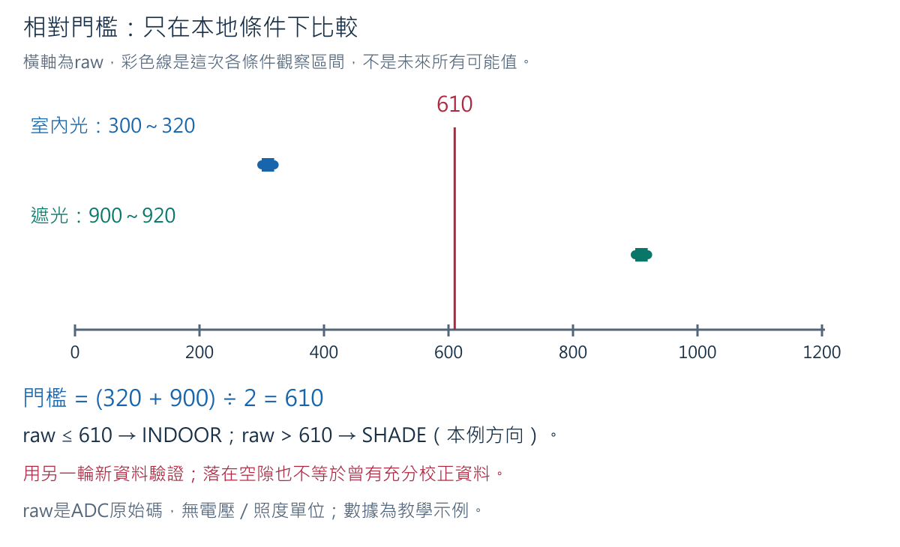
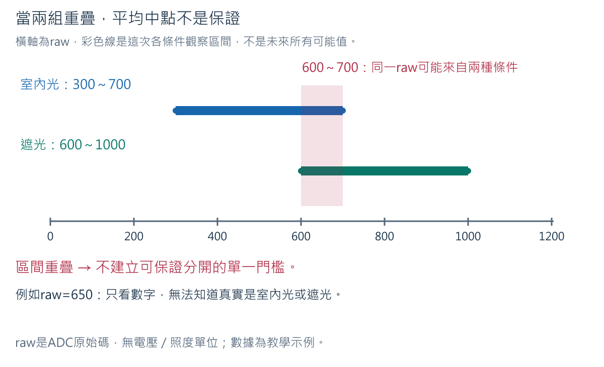
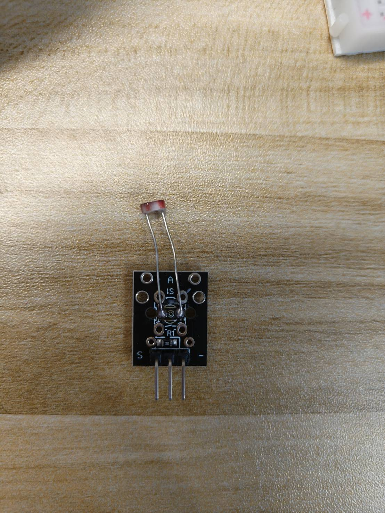
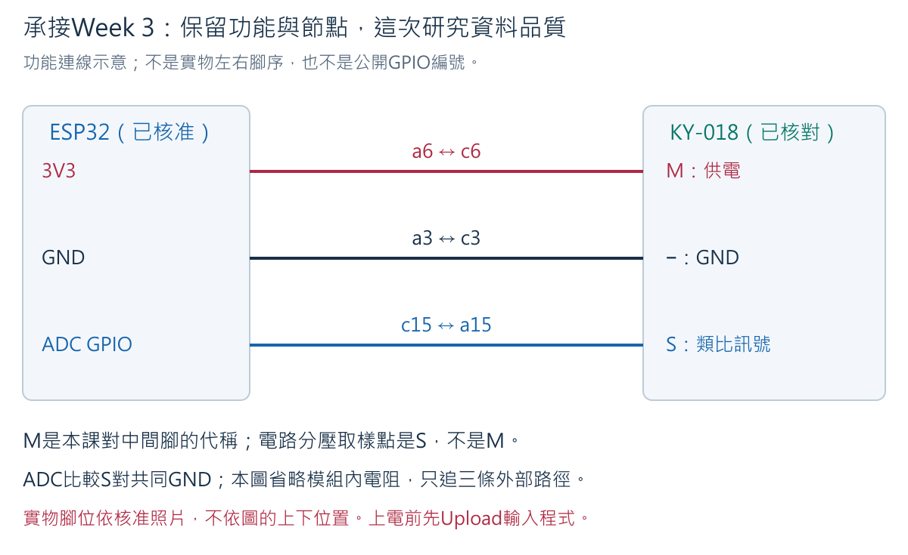
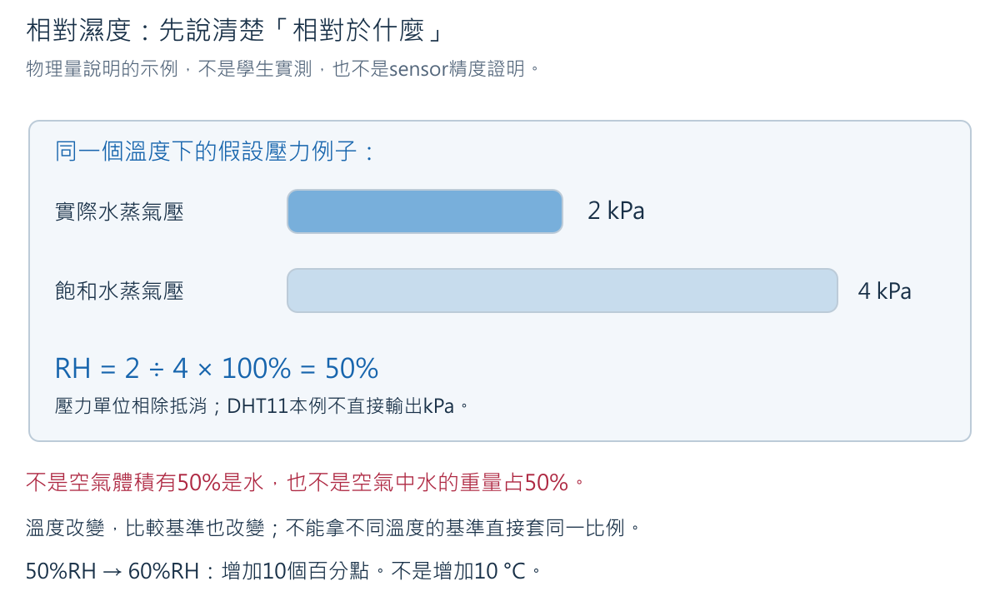
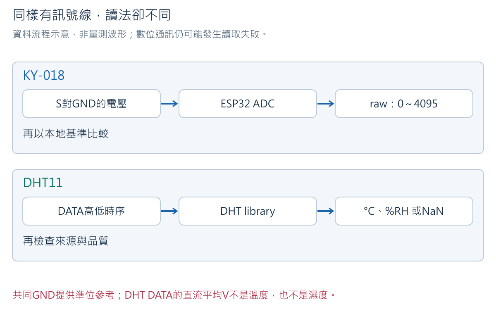
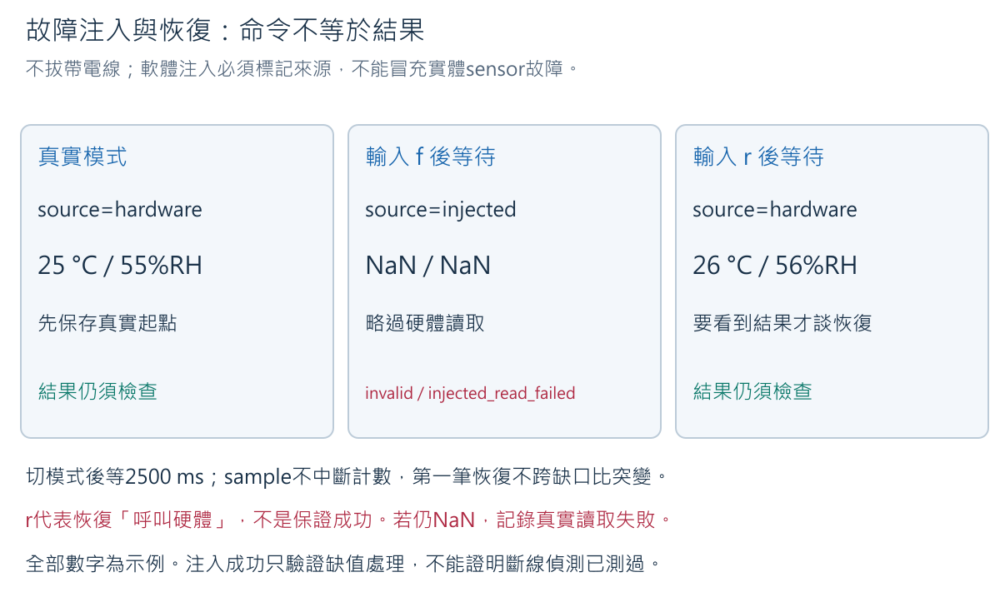

<!-- Week 4 editable notebook source. Cell/sketch markers are consumed by build_week4_materials.cjs. -->
# Week 4：感測、取樣、相對校正與資料品質

**完整備課版（含參考解答）**。本冊的課中練習與Discussion均先列問題，再列預期回答、
推理與限制。自己的預測與原始量測仍須保留，不用示例代填實測。

本週從「電表／Serial出現數字」走到「這個數字能支持哪一種判斷」。
Week 3已完成的GPIO電壓、ADC原理及1 kΩ／10 kΩ分壓不重做；
本週新增220 Ω／330 Ω量程比較、KY-018兩條件校正與DHT11資料品質。
不接致動器、外部電池，也不使用Wi-Fi或Backend。

### Teaching Objectives

1. Identify and measure 220-ohm and 330-ohm resistors, interpret units and range indications, and distinguish nominal values from observations.
2. Collect labeled light samples under two controlled conditions and explain their timing, spread, and limitations.
3. Derive a local threshold from non-overlapping calibration samples and evaluate it with separate observations.
4. Trace approved sensor power, ground, and data paths and justify a female-to-female DHT11 data connection.
5. Explain temperature, relative humidity, library-mediated digital readings, and the meaning of each recorded field.
6. Distinguish missing, implausible, suspicious, and usable readings, and document software-injected failure and subsequent hardware-read recovery honestly.
7. Support a sensor-quality conclusion with traceable evidence rather than the mere presence of numbers.

### Teaching Content

This unit connects electrical measurement to the interpretation of sensor data. Students compare resistor markings with isolated measurements, study repeated KY-018 samples under indoor and shaded conditions, and derive a local decision threshold whose limits are tested with new data. An approved DHT11 module introduces digital sensor communication, temperature and relative humidity, controlled read intervals, and explicit handling of missing or suspicious observations. A single discussion develops evidence-based judgments about whether sensor data are sufficient for a stated purpose.

## 一、從起點到完成成果

| 閱讀順序 | 要回答的問題 | 實際產出 |
|---|---|---|
| [2：準備與安全](#w4-start) | 哪些材料現在可以接電？ | 起始狀態、版本及profile紀錄 |
| [3～4：電阻與量程](#w4-resistor) | 220為何不一定顯示220？換量程改變了什麼？ | 兩顆獨立量測與量程比較 |
| [5～7：KY-018](#w4-sampling) | 波動的數字，如何形成有條件的判斷？ | 兩組基準、門檻、另兩組驗證資料 |
| [8～10：DHT11](#w4-dht) | 為何DATA不是另一個類比電壓測點？ | 三線接法、真實溫濕度log與欄位解釋 |
| [11～12：品質與恢復](#w4-quality) | 讀取失敗、超範圍與突變，有什麼不同？ | 真實→軟體注入→真實的分開紀錄 |
| [13：Discussion](#w4-discussion) | 有數字，就代表感測資料可信嗎？ | 七題連續推理與有界限的結論 |
| [14～16：排查、紀錄與收尾](#w4-records) | 別人如何重查我的判斷？ | 個人證據與安全收納 |

本冊中的Arduino C++程式要在Arduino IDE開啟對應`.ino`後Verify／Upload，
不是在Python Notebook按Run就會送進ESP32。GitHub可閱讀文字、程式及內嵌圖片；
實驗仍在自己的板卡與IDE執行。

<!-- cell -->
<a id="w4-start"></a>

## 二、課前條件與安全邊界

### 2.1 材料只取本週會用的部分

每位學生使用自己的ESP32-S3、USB資料線、400孔麵包板、KY-018、YS-31 DHT11，
以及電阻包中的220 Ω、330 Ω各一顆。三種20 cm杜邦線都會實際使用：
公對母連排針與麵包板，公對公延長電表測點，母對母直接連兩端都是排針的DATA路徑。
電阻仍是原來的一包、DHT11仍是原來的一個，不增加採購數量。

每組1～3人準備一台具Ω、通斷與直流V功能的萬用電表；1人組可與別組共用。
每人分別保存自己的讀值、條件與結論。其他組的電表可共用，量測證據不能直接共用代填。
預備一塊已有的不導電、不透光紙或布作遮光物，不需另外購買工具。

完成Week 3後應能辨認3V3、GND及自己的KY-018訊號S，知道同列a～e相通、
f～j是中央溝槽另一側；也能說明電壓表讀「紅表筆電位減黑表筆電位」。
不要求為證明記得而重做所有舊實驗；若實物或接線換了，須重新核對受影響的部分。

### 2.2 本次從已收納的狀態開始

1. 保存上一週檔案；關閉Serial Monitor，拔除ESP32端USB，確認PWR熄滅。
2. 電表OFF。取下上一週1 kΩ／10 kΩ分壓及所有舊GPIO線；兩顆依標示收回原包。
   若已收好，直接核對空板，不必重新接出來再拆。
3. ESP32留在麵包板旁，USB與排針均未接。電阻量測區不接ESP32或感測模組。
4. 每個元件更換、插頭調整及通斷／Ω量測都在外部電源分離後進行。
   不量市電、不用10A孔，也不把電流檔跨在電源兩端。

**為何要拔USB？** Ω檔使用電表自己的測試電路估計阻值。外部電源會干擾量測，
並可能傷害儀表；「程式沒在動」不是斷電。量電阻時也要移除其他並聯支路，
否則顯示的是整個量測路徑，不一定是這一顆電阻。
[Fluke電阻量測原則](https://www.fluke.com/en-ie/learn/blog/digital-multimeters/how-to-measure-resistance)

### 2.3 感測器接電有兩道前提

**硬體profile**是指定板卡與模組已核對的設定紀錄，至少包含實物型號、腳位、
供電、訊號準位、程式版本及驗證範圍，不是從網路找一張相似板卡圖。

| 階段 | 可以開始的條件 | 尚未具備時 |
|---|---|---|
| 獨立電阻量測 | 電阻與外部電源／其他線路分離；能確認電表Ω功能 | 停在辨認，不靠亂轉功能找數字 |
| KY-018取樣 | 本片已核對三腳與3.3 V相容性；有課程公布的ADC GPIO | 程式保留`PIN_LIGHT=-1`；可閱讀、算示例及Verify，不接GPIO |
| DHT11接電 | 本片三腳、供電、DATA上拉／邏輯電壓及GPIO皆有核准紀錄 | 保持`PIN_DHT=-1`、`MODULE_PROFILE_CONFIRMED=false`；不猜腳序接電 |

目前已有KY018-T01與BOARD-T01的局部實驗紀錄，不能自動推廣到全班。
DHT11-T01只有外觀照片，尚不足以公布實物上電接法。第8～9節會把確認項目與
**確認後**的完整接線程序列清楚；未核准不是免做DHT11，而是該實作暫待安全條件。
實機狀態以[硬體紀錄](../hardware_state.md)為準。

上電後若異常發熱、異味、煙或反覆重啟，立即拔USB；沒有這些異常也不等於接線已全部驗證。
BOARD-T01的`5Vin`不當作USB供電時的5 V輸出，本週不使用它或IN-OUT焊盤。

<!-- cell -->
<a id="w4-resistor"></a>

## 三、220 Ω與330 Ω：標示的是哪一個量？

### 3.1 標稱值、實測值與容差

電阻是限制電流的元件；Ω（ohm，歐姆）是阻值單位。
包裝的220 Ω是**標稱值**，代表製造／分類所用的目標，不代表任意電表必定顯示220。
你在指定量程與接觸條件下讀到的值，才是那次**實測值**。

```text
1 kΩ = 1000 Ω
220 Ω ÷ 1000 = 0.220 kΩ
330 Ω ÷ 1000 = 0.330 kΩ
0.33 kΩ × 1000 = 330 Ω
```

k表示1000倍，不是把電阻變大1000倍；這是在用不同單位表達同一件事，
如1000公尺與1公里。類比只說明單位換算，不表示電阻是長度。

**容差**是相對標稱值容許的製造偏差範圍，要由這顆實物的標示確認。
例如**假設**220 Ω標示±5%：220×0.05＝11 Ω，標稱容差帶為209～231 Ω。
假設另一顆標示±1%，則220×0.01＝2.2 Ω，容差帶是217.8～222.2 Ω。
不能看本體顏色就替整包宣稱±1%或±5%。

儀表也有量測精度與解析度；容差帶不是「不管什麼電表，只要落在這裡就正式驗收合格」。
例如量到218 Ω可能與220 Ω元件相符，但靠近邊界時還要考慮儀表規格和接觸。
本週目的是辨認並解釋，不做精密元件認證。

### 3.2 色環怎麼讀：先數環，再分清數字與倍率

先依原包裝找220 Ω與330 Ω，分開放並抄下標籤。再看實物色環來交叉核對。
下圖是本課自行繪製的色碼教學例子，**不是學生電阻的實拍**。
色碼依[Vishay四環／五環色碼表](https://www.vishay.com/docs/49411/resistor_color_code_calculator.pdf)。


四環用前兩環組成數字、第三環作倍率、第四環作容差。
例如紅－紅－棕－金：紅=2、紅=2，組成22；棕在倍率位置是×10；
22×10＝220 Ω；金在末環表示±5%。不是把2＋2＋1相加。
橘－橘－棕－金則是33×10＝330 Ω±5%。

五環用前三環組成數字、第四環倍率、第五環容差。
紅－紅－黑－黑－棕：220×1＝220 Ω，最後棕是±1%；
橘－橘－黑－黑－棕：330×1＝330 Ω±1%。同樣是棕，位置不同意思也不同。
容差環常與其他環間隔較大，但不能只靠間距硬猜；顏色不清時保留包裝、
換充足照明確認，再獨立量測。沒有色環或環數不同，查該包標示，不能硬套這四例。

**練習R1：** 某顆是橘－橘－黑－黑－棕，另一顆是紅－紅－棕－金。
分別寫出環數、完整算式、Ω／kΩ值，以及容差從哪一環來。

**預期回答與理由：** 第一顆五環，330×1＝330 Ω＝0.330 kΩ，末棕±1%；
第二顆四環，22×10＝220 Ω＝0.220 kΩ，末金±5%。
錯把五環第三個黑當倍率會丟掉第三個有效數字。
這些答案只適用題目給定色環，不代表已辨認你桌上的兩顆；不一致時先保留標示查核。

### 3.3 有電表還需要電阻嗎？

需要。電表是觀察工具，散裝電阻是被量的元件，兩者角色不同。
本題以已知標稱值練習量程，後續才用不同工具判讀未知感測數字。
220／330 Ω此時只接電表量測，不接3V3作負載，也不拿來替代DHT11的上拉設計。
Week 3的1 kΩ／10 kΩ分壓已處理電壓與電流，本週不再搭一遍。

<!-- cell -->
<a id="w4-range"></a>

## 四、量程比較：數字消失，不一定是元件壞了

### 4.1 先指認自己的電表


這是已有的A830L實拍，不是現在替你確認旋鈕位置。黑色COM插孔是電表參考端，
與開發板背面的COM USB接頭不是同一種功能；紅表筆用VΩmA或自己型號的VΩ孔，
10A保持空。照片藍色Ω區包含200、2k、20k等範圍；黑／藍印刷不是正／負電。
量程是這次功能能顯示的範圍，不是電表要把200 Ω或20 V「送到」元件。

一般手動表的200 Ω檔上限略低於200 Ω；220與330均大於此範圍，
所以應換可涵蓋它們的Ω量程。A830L照片的2k位置與二極體符號相鄰，
須依手上機型核對Ω功能與單位，不能把二極體壓降mV當成Ω。
本課尚未取得這一批A830L的完整原廠手冊與220／330實測畫面，
不把下圖當作已核驗的機型標準輸出。不同電表以自己的手冊、功能選擇與顯示單位為準。


圖中是**典型手動表的示例**：在以Ω顯示的2k檔，220表示約220 Ω；
在以kΩ顯示的20k檔，0.22表示0.22 kΩ＝220 Ω。
若你的表會自動顯示kΩ，0.220 kΩ也是220 Ω。先看功能、量程、小數點、單位，
不能只抄一個「220」或「0.22」。

過小量程可能顯示最左側單獨`1`或`OL`，這是超量程／開路提示，不能填1 Ω。
同樣提示也可能來自探棒根本沒接觸，故需用合適量程與接觸檢查區分。
更大量程可能丟掉細節：假設220與224 Ω都被量程解析度捨入為0.22 kΩ，
不能據此說兩顆完全相同，也不能說換檔使元件變成另一個阻值。

### 4.2 先固定元件與測點，再拿表筆

1. USB拔除、電表OFF，麵包板為空，ESP32與所有模組未接測試區。
2. 取220 Ω一顆，將兩腳輕彎，分別插入**b20與b25**。不要把兩腳放在同列a～e。
3. 兩條公對公線分別插**e20、e25**；自由端分開放在不導電桌面，可固定絕緣部分。
   表筆稍後碰外露公針，不把粗表筆塞進麵包板，也不用手指捏住兩個金屬端。


圖左：b20與e20同節點，b25與e25同節點，中間只有被測電阻。
電表透過自己的測試電路量兩端阻值，不需ESP32的GND或USB供電。
圖右是電表跨接兩個測點。另想一個**不要照做的錯例**：若電阻兩腳都插第20列，同列金屬片會繞過電阻，
讀到低阻路徑不能代表電阻本體是0 Ω。這裡用的是Ω檔，不套用電壓檔的紅減黑公式。

### 4.3 依電表類型完成同一個學習任務

**先預測R2：** 同一顆220 Ω，換成200 Ω範圍會怎樣？換到較大量程會不會把它變大？
先寫原因，再量。

**手動量程：**

1. 黑插COM、紅插VΩ或VΩmA。先選已確認的Ω功能及能涵蓋330 Ω的量程；
   典型手動表可用2kΩ，若2k位置的功能尚不確定，先用已確認的20kΩ，
   並記錄較粗的顯示；不要靠猜測二極體功能完成阻值換算。
2. 紅表筆碰e20自由端、黑表筆碰e25自由端，與圖中相同。固定電阻沒有正負極，本步驟選此順序只是方便重查。
3. 穩定後記錄「元件標稱值／檔位／完整畫面／換算Ω／接觸情況」。若不穩，
   移開表筆、維持外部斷電，先檢查端點與固定，不急著判電阻故障。
4. 移開兩支表筆，改到已確認的200 Ω範圍，再碰同一對測點。記錄完整提示與位置，
   不為消除提示而插電、改10A孔或把兩端短接。
5. 移開表筆，回到原來的可用Ω量程，確認能再取得讀值；只需一筆確認，不重收一套資料。
   若仍超量程，檢查包裝、是否量到正確元件及接觸，不能由單獨`1`確診斷路。
6. 移開表筆、電表OFF，取下220 Ω，放好標籤。換330 Ω到同一對孔，重複上述比較。
7. 若電表具有另一個更大Ω量程，可用同一顆330 Ω比較顯示位數；記錄是否少了細節。
   這是同一量程任務的比較，不額外增加重複測量配額。

**自動量程：** 選Ω後親自量兩顆、保存Ω／kΩ單位與小數點，按手冊確認能否用RANGE鍵
切換手動範圍。不能手選範圍者，不必另買電表；以本節**已標示的模擬圖**回答過小／較大
量程會怎樣，並將紀錄註明「畫面判讀，非本人切檔實測」。實際220／330量測仍須完成。

**R2預期回答：** 標稱220 Ω超出約200 Ω範圍，預期超量程；同一顆換量程不等於阻值改變。
需同一元件、同一測點作比較；合適量程有讀值、小量程出提示，才支持「量程不足」的解釋。
若兩檔都出提示，可能接觸不良、物件認錯或其他原因，不能只答「因為220比200大」。

### 4.4 標稱值與測值不同，怎麼解釋

**練習R3（示例，非實測）：** 標稱330 Ω、末環金色，合適量程讀到326 Ω。
先算相差多少Ω與百分比，再說能不能宣稱「精度合格」。

**解答：** 326−330＝−4 Ω；差異幅度4÷330×100%≈1.21%。
金色容差±5%對應330×0.05＝16.5 Ω，即313.5～346.5 Ω；
326在這個**標稱容差帶**內，與330 Ω元件相符，但沒有儀表精度及接觸評估，
不能說完成精密認證。常見錯誤是把−4 Ω當負電阻，或把1.21%當成此電表的精度。

完成後兩顆分開標示收回材料包，移開表筆、電表OFF，拆下測試線與電阻。
下一節重新建立感測器線路，不讓第20／25列舊接法留在供電路徑中。

<!-- cell -->
<a id="w4-sampling"></a>

## 五、KY-018：一次讀到，與重複取樣有什麼不同？

### 5.1 承接同一條資料路徑

Week 3已知：光線改變光敏電阻，模組分壓形成S相對GND的電壓，ADC把它轉為raw。
本週不再把raw乘一個比例當精確伏特，也不重新量所有分壓案例。
`analogRead()`是未校準整數；本次沿用12-bit及`ADC_11db`，ESP32-S3官方表列
該設定量測範圍約0～3100 mV，不等於GPIO可接任意電壓。
[Espressif ADC API](https://docs.espressif.com/projects/arduino-esp32/en/latest/api/adc.html)

如果一行是`light_raw=310`，只能先說「這次ADC讀值310」。
要知道它比較像室內光還是遮光，需要先有**同一片、相同設定與控制條件**的比較基準。
不能借用別組的610門檻，也不能把上週相隔很久、模組位置不同的片段合併成現在的基準。

### 5.2 取樣、間隔與波動

**取樣**是挑一個時刻取得一次觀察；一筆資料叫一個sample。
`SAMPLE_INTERVAL_MS=500`表示程式至少等500 ms再取下一筆，約每秒兩筆。
`millis()`是這次開機後經過的毫秒，不是日期；1秒＝1000 ms。
序號與時間持續增加，raw相同也不代表程式卡住。



本程式按下命令後先等約500 ms才取第一筆，再取到第10筆後停止這一輪。
第一筆到第十筆有9個間隔，約4.5秒；由命令到完成約5秒，另有處理耗時。
不是每次loop都是一筆，也不能因為印出10行就說取得10秒資料。

**波動**是同一條件下數字仍稍有不同，例如300、304、308。
來源可能包含環境照明、遮光位置、電源、接觸及轉換本身；只看raw不能分別量出各項貢獻。
「有波動」不直接等於壞掉，「沒有波動」也不能證明精確。
像一把刻度較粗的尺，物件小幅變化可能仍落在同一格；回到此處，就是有限解析度和取樣的限制。

### 5.3 用一個完整示例算出範圍與平均

以下是為教學自行設定的資料，**不是BOARD-T01或學生的實測**：

```text
室內光：300, 304, 308, 312, 316, 320, 304, 308, 312, 316
遮光：  900, 904, 908, 912, 916, 920, 904, 908, 912, 916
```

以室內光為例：

1. 筆數n＝10；min＝300，是最小的一筆；max＝320，是最大的一筆。
2. 範圍是300～320；span＝max−min＝20，表示這十筆觀察的跨度，不是誤差±20。
3. 加總300＋304＋308＋312＋316＋320＋304＋308＋312＋316＝3100。
4. mean（平均）＝3100÷10＝310。遮光用同法得min＝900、max＝920、span＝20、mean＝910。

每一筆raw都是無物理單位的ADC計數；平均可能有小數，不表示感測器因此多了精度。
若已知值與真正光照度之間有系統偏差，多取幾筆平均也不會自動消除它。
本週先使用min、max與平均，不為此加入完整統計學課程。

**練習K1：** 把室內光最後一筆316換成900（紙上改題，不改原始log），
平均與跨度變成多少？能不能直接刪掉900？

**解答：** 新和3100−316＋900＝3684，平均368.4，跨度900−300＝600。
平均被一筆大值拉高，這提醒我們要保留原始序列，而不只交平均。
900可能是改光線、接觸、讀取問題或其他原因；尚未核對不能因為不好看就刪掉。
先回查該時刻條件，不帶電重插訊號線。這是可疑樣本，不是已證明哪個零件故障。

<!-- cell -->
<a id="w4-calibration"></a>

## 六、相對校正與門檻：只在證據支持的範圍判斷

### 6.1 這裡的校正，不是在製造標準照度計

**相對校正**在本課指：用這片模組、這個位置、這套ADC設定，在已知的兩種條件下
建立比較基準，再把後續數字與它比較。這不是以可追溯照度標準校正儀器；
沒有標準光源與lux參考，因此不能宣稱「300 raw等於某個lux」。
`INDOOR`／`SHADE`是本次條件的標籤，不是所有教室共有的物理刻度。

**門檻threshold**是程式作分類時的數值邊界。如考慮一條分隔線，
先要看兩組數字是否可以放在不同側，而不是先挑喜歡的數字。
這個類比只是分類；感測器不會因程式畫了線就改變輸出，也不保證未來資料不越界。

### 6.2 先看區間有沒有重疊，再算一個候選門檻



沿用前節**示例**：室內最高320仍小於遮光最低900，兩個區間分開。
程式選兩個最近邊界的中間：

```text
threshold = (室內max + 遮光min) ÷ 2
          = (320 + 900) ÷ 2 = 610
raw ≤ 610 → INDOOR
raw > 610 → SHADE
```

這個610不是隨便相加兩個電阻，也不是610 V。320與900都是raw區間邊界。
採中間值只是本課選的一種簡單規則，不證明它在所有新光線下最好。
程式使用整數除法；若兩界為320與901，1221÷2取整數610，不顯示610.5。
恰好等於門檻時歸較低raw那一側，圖、程式與解釋都用同一規則。

若實物電路方向相反，遮光範圍較低，程式會令`shade_higher=false`，
小於或等於門檻時改叫SHADE。這不是自動證明你接對線；
與Week 3接法預測不同時仍須回查標籤、實物路徑與條件。

### 6.3 兩組平均不同，也可能無法分清



另一個**示例**室內範圍300～700、遮光600～1000。650在兩組都可能出現，
只憑這一個raw無法唯一判斷。即使平均分別500與800，也不能忽略重疊區。
本程式在區間相交或邊界相等時印`reason=overlap`，不產生可用門檻。
這是保守的課堂規則，不代表世界上沒有其他統計方法；本週不擴充分類模型。

**練習K2：** 室內480～510、遮光510～550可以直接通過嗎？若遮光改成511～550呢？

**解答：** 第一組共用510，程式阻擋。第二組沒有重疊，候選門檻
(510＋511)÷2取整數510；程式可以建立，但兩界只差1個raw階級，非常脆弱，
不能由`status=ready`宣稱辨識可靠。應以新資料驗證，不為讓結果通過而手動改基準。
看不清是否重疊時先用原始log重算min／max，不動帶電接線。

### 6.4 新資料才是對這個門檻的下一次檢查

若用來算610的原始20筆又全被610分對，這只是回查建規則過程，
不是獨立驗證。建立後保持門檻不變，另收兩種條件各10筆，並記下你實際設的是哪種條件。
`v`只套用門檻，不更新它；人的條件紀錄是對照依據，不能以程式分類反過來替樣本貼標籤。

新raw若超出兩組基準合併的最小～最大跨度，程式仍可算候選class，
但另標`quality=suspect reason=outside_observed_span`。如示例新值950會算SHADE，
卻超出300～920的既有跨度；必須註明是在原觀察以外推測，不把這種結果算作無保留成功。
跨度內的值也可能落在兩組空隙，因此`relative_only`只代表套用本地門檻，沒有可靠度保證。

raw＝0或4095仍是可讀的ADC整數，但本課將端點列為可疑、拒絕用它建立基準，
並讓分類為UNDECIDED，避免把飽和／接線等尚未釐清的情況直接拿來校正。
端點不是唯一故障碼；拔掉S後浮接也可能讀到中間數字，所以**不以拔線製造光敏故障**。

<!-- cell -->
<a id="w4-ky-practice"></a>

## 七、KY-018完整實作與程式

### 7.1 先復原到已核對的Week 3訊號節點

已收好的線路可依下表重建；仍保留相同接法者只核對，不重做舊電壓數量要求。
USB拔除、PWR熄滅、電表OFF，上一個電阻量測區已拆完；ESP32留在麵包板旁。



照片只作外觀辨認。中間M是本課對該排針的紀錄名稱，不代表實物印有M或VCC；
`A`、`S1`、`R1`等其他絲印不是讓你猜中間腳供電的依據。
下表只適用已核准的「M供電、−接GND、S訊號」模組，自己的版本不同時停止接線。

| 起點 | 線材 | 終點／同一節點 | 用途 |
|---|---|---|---|
| ESP32已核對3V3 | 公對母 | a6 | 第6列a～e分配3.3 V |
| 模組已核對M供電腳 | 公對母 | c6 | 與a6同節點 |
| ESP32已核對GND | 公對母 | a3 | 第3列a～e共同地 |
| 模組− | 公對母 | c3 | 與ESP32共地 |
| 模組S | 公對母 | a15 | 第15列a～e為訊號 |
| c15 | 公對母 | 母頭先留空 | 更新程式後才接公布的ADC GPIO |

同列是同一節點的不同入口，不是a15到c15又分一次壓。S與GND沒有用普通導線相接；
ADC在晶片內部讀訊號相對共同GND的電壓。供電線讓模組工作，S線讓程式觀察結果。
不用GPIO5舊輸出線，也不沿用按鈕`INPUT_PULLUP`去影響光敏分壓。



依表從每個實物絲印追至孔位，再反向追一次。若接法與自己的Week 3紀錄不符，
保持斷電先釐清。各測點不應由普通線短接；電表通斷只能檢查低阻錯接，
沒蜂鳴不能保證已正確供電。未使用的公針自由端分開收好，不能在上電後互碰。

### 7.2 完整程式與設定入口

開啟[week04_ky018_quality.ino](../../examples/week04_ky018_quality/week04_ky018_quality.ino)。
下面同一支完整程式把原來每半秒讀一筆的操作，加上兩個基準及明確的驗證命令。
只依公布profile填`PIN_LIGHT`、依課堂非個資代碼填`DEVICE_ID`；不要直接抄教師舊GPIO4紀錄。

<!-- sketch:week04_ky018_quality -->

### 7.3 程式從哪裡開始，資料如何留下來？

| 名稱／程式區段 | 現在的作用 | 容易混淆的地方 |
|---|---|---|
| `PIN_LIGHT`與`profileReady()` | 尚未指定ADC GPIO時阻擋硬體讀取 | 非負整數通過程式檢查，不代表電氣相容性被程式證明 |
| `indoor[]`、`shade[]` | 各保存10筆raw；中括號為依序取用陣列元素 | 是RAM中的資料，不是十根接線 |
| `indoorReady`／`shadeReady` | 表示該條件收齊10筆 | 收齊不等於資料品質已通過 |
| `mode` | `i`建室內基準、`s`建遮光基準、`v`新資料驗證、`0`閒置 | 不是要求切三種光線；只有室內與遮光 |
| `runNumber`、`indexInRun`、`sampleNumber` | 輪次、該輪陣列位置、開機後累積取樣數 | 顯示index從1起，陣列索引從0起；都不是電壓 |
| `minimumOf`／`maximumOf`／`summarize` | 逐筆比較與加總，再印統計 | 平均不是另外一個sensor讀值；float除法保留小數 |
| `updateCalibration()` | 收齊兩組後，先查端點與重疊，再算門檻與方向 | 新建任一基準立即使舊門檻失效；不能沿用舊成功 |
| `classify(raw)` | 以固定門檻分INDOOR／SHADE，條件不足為UNDECIDED | 分類是推論，不是儀器直接辨認遮光物 |
| `now-lastSampleMs` | 檢查已等待的毫秒數；到期才讀ADC | 無號時間差可跨millis回捲；不要改成每次loop都取樣 |
| `Serial.printf` | 把這次值填入固定欄位；`%s`文字、`%d`整數、`%lu`無號長整數、`%.1f`一位小數 | 格式指定小數位不是硬體精度 |

`setup()`只執行一次：設定Serial、檢查profile、設定ADC並印可用命令。
`loop()`重複查看輸入與時間，收到命令先啟動一輪，再逐筆儲存／印log，10筆後回閒置。
執行中的新命令被拒絕為`run_busy`，不會偷偷混入另一種條件。
未知字元會印`unknown_command`；Enter帶來的換行被忽略。
本程式沒有馬達或STOP控制，不把此取樣排程宣稱為安全致動器控制器。

### 7.4 Verify、Upload，再斷電接訊號

1. 保持ADC預備線母頭未套ESP32，模組其他線也依7.1核對；電表OFF。
   若尚未核准profile，先停在閱讀／Verify，不接USB做正式感測。
2. 在IDE以`File → Open`開啟上述sketch。用`File → Save As`另存自己的實驗版本時，
   `.ino`與資料夾同名；保留原始程式。修改兩個核准欄位後`File → Save`。
3. `Tools → Board`選ESP32套件的`ESP32S3 Dev Module`，依確切板卡已核對設定確認
   Flash、PSRAM與USB模式。BOARD-T01參考是16 MB、OPI PSRAM、COM側USB、
   `USB CDC On Boot: Disabled`、Upload Speed 115200；不同實物不只照抄名稱。
4. 點左上勾號`Verify`。無編譯錯誤才往下；容量百分比是編譯分割區／靜態RAM摘要，
   不是感測正確率，更不能把兩項百分比相加。
5. 接已核對的COM側USB；PWR亮且無異常後，`Tools → Port`選本次實際出現的COM埠，
   不固定COM8。關閉Monitor，點右箭頭`Upload`。
6. 等待寫入完成、`Hash of data verified`與reset訊息；這些只是寫入校驗，還不是量到光。
7. 拔USB、確認PWR熄滅，才把c15線母頭套至公布的ADC GPIO。不要讓舊輸出程式驅動S。
8. 再依7.1追線、保存接線照後接USB，開`Tools → Serial Monitor`，選115200 baud。
   開場應為week=4、sensor=ky018及自己代碼；錯過開場可按RST，但會清除本次RAM基準。

有疑問先核對[Espressif Tools Menu](https://docs.espressif.com/projects/arduino-esp32/en/latest/guides/tools_menu.html)
與自己已保存的設定。Upload失敗不透過更換模組線來猜原因。

### 7.5 建立基準：先安放遮光物，再用鍵盤取樣

1. **室內光**：固定模組位置與方向，維持原室內照明，不加手電筒。
   不透光紙／布先放旁邊，不能碰裸露接點。等待至少2秒，記下條件；
   2秒是統一操作等待，不保證任何感測器都已穩定。
2. 在Monitor上方輸入框打小寫`i`再Enter。看到`run_started`後不要搬動模組，
   保留index 1～10、summary及run_finished。第一組之後`baseline_missing`正常，因還缺遮光。
3. 放下其他工具，以可自行站穩／覆蓋的紙或布遮住感光部，位置、線路、照明不變。
   若必須移動導線或模組，先拔USB；重新上電後基準會清空，另開新輪次記錄，不拼接舊組。
   遮光不等於把模組搬到桌下，也不要求一手拿表筆、一手抓模組、還要打字。
4. 固定遮光至少2秒後，在輸入框打`s` Enter，保存10筆與summary。
5. 門檻若ready，記下threshold、shade_higher與本輪條件；若blocked，保留原因，
   依6.3／6.4解釋後再安全核對，不刪除不合預期的樣本讓它看起來通過。

開場、命令與欄位的**格式例子**如下；角括號是待填位置，不是實測數字：

```text
event=run_started run=<輪次> mode=i n=10
device=<代碼> sensor=ky018 source=hardware run=<輪次> mode=i sample=<累積序號> index=1 uptime_ms=<毫秒> light_raw=<原始值> class=UNDECIDED quality=baseline_only reason=not_classified
event=summary condition=indoor n=10 min=<最小> max=<最大> mean=<平均> span=<最大減最小>
```

每行`source=hardware`表示程式呼叫ADC，不代表它知道S真的接對。
`class=UNDECIDED`在建基準時正常，因尚未用門檻分類；`quality=baseline_only`不是故障。
首尾uptime應約差4500 ms，樣本序號每筆加1。若缺行，保存缺行事實與原因，不能補造數字。

### 7.6 固定門檻，用新資料檢查

移開遮光物、等待並記下室內條件，輸入`v`收10筆；同樣遮光後再輸入`v`收10筆。
在紀錄表分別寫「實際條件=室內光／遮光」，不是再輸入`i`或`s`重訓。
對每筆核對class與quality：符合實際條件、不符合、UNDECIDED各幾筆？
另列suspect筆數，不把同一筆可疑資料重複當成另一個樣本。

**練習K3：** 在5.3示例門檻610下，新室內值320、610、611、950各怎麼顯示？
如果四個值都是在室內條件取得，是否可以說規則全對？

**解答：** 320與610→INDOOR／relative_only；611→SHADE／relative_only；
950→SHADE／suspect（超出300～920），都是按程式明確邊界推導的示例。
其中611與950不符人的室內標籤；不能重命名成遮光來提高結果。
610的分類雖符合，也在兩組原始範圍之間，不等於這裡曾有充分校正資料。
先查條件與取樣紀錄；需調整接線時先斷電。若要重新建基準，另記版本及一輪新驗證，
不反覆調門檻直到同一批驗證資料被「調成全對」。

完成時保留：兩組基準各10筆、統計與門檻／阻擋原因、另兩組各10筆的驗證與品質註記。
真實資料重疊時「無法可靠分開」也是正確分析，不能冒充已建立可用門檻。
先儲存log、關Monitor、拔USB、電表OFF，再進入DHT11換線。

<!-- cell -->
<a id="w4-dht"></a>

## 八、DHT11：先認識實物，再決定能否接電

### 8.1 藍色格柵、PCB與三根排針


這是本課已取得的**實體照片**，不是接線示意圖。藍色有孔外殼是感測元件；
下面的PCB（印刷電路板）連接元件、排針及板上其他零件。三根金屬排針是與外部連線的接點。
「DHT11」是感測器名稱，「YS-31」是採購清單的模組名稱；相似外觀不保證PCB、腳序完全相同。
LED的存在也不保證它能顯示資料是否正確。


照片上的接頭遮住部分標示。**不要依本照片推定左、中、右就是VCC、DATA、GND**，
也不要把既有灰／紫／藍線當成已確認的功能。先在斷電狀態取下接頭、查看兩面絲印，
再與確切PCB版本的文件及核准紀錄對照；不清楚就停在這一步。

### 8.2 三種功能不是三個可以任意交換的位置

| 功能名稱 | 是什麼、此處的作用 | 不能替代什麼 |
|---|---|---|
| VCC／供電 | 提供模組工作所需的電壓與能量；本週只採已確認可用的3.3 V方案 | 不是資料輸出；不能因沒資料就改接5Vin |
| GND／接地 | 與ESP32共用電位參考，並提供供電回路 | DATA不是GND的替代線 |
| DATA／訊號 | 控制器與感測器用時序交換數位資料的線 | 不是KY-018的連續類比S電壓，不用analogRead換算溫度 |

功能表是理解用的，不是實物腳序。若手上的模組供電或DATA電壓不適用3.3 V系統，
本冊三線方案不能直接套用；交由教師確認，不自行添加器材或改採5 V。

**上拉提醒：** 數位通訊線需要符合感測器規格的閒置準位。上拉電阻是透過電阻把線
接往指定電源，使沒有元件拉低它時有明確的高準位。它不是把電源直接短接DATA。
模組可能已附上拉，也可能不同；須核對上拉接到哪個電源、阻值及邏輯電壓。
程式library不會自動把5 V訊號變成ESP32可接受的電壓。不要因買了220 Ω／330 Ω就拿它們
任意代替通訊上拉；本週這兩顆的任務是獨立辨識與量測。

### 8.3 上電前必須有的核准表

| 核對項目 | 自己這片的紀錄 | 未確認時的動作 |
|---|---|---|
| PCB／感測器標示、正背照片與方向 | 填實際版本與照片檔名 | 不拿其他商店相似照片補空格 |
| 供電、DATA、GND對應實體腳 | 圈出照片上接點並引用確切文件 | 不用顏色或三腳位置猜 |
| 3.3 V供電是否在允許範圍 | 填來源、條件與核准紀錄 | 不接電、不試5 V |
| DATA上拉與輸入／輸出準位 | 填上拉位置、電源、阻值及相容性依據 | 未知視為未核准 |
| ESP32使用GPIO | 填已公布的數位GPIO及profile版本 | 程式保留-1；不沿用ADC候選GPIO當全班答案 |
| 驗證層級 | 文件／編譯／指定實物測試分開填 | 只有照片不能寫「接線已驗證」 |

原廠[ASAIR DHT11入口](https://www.aosong.com/en/Products/info.aspx?itemid=2257)
與[Adafruit DHT接線說明](https://learn.adafruit.com/dht/connecting-to-a-dhtxx-sensor)
可協助理解感測元件，但後者的四腳裸元件圖**不是這片三腳YS-31的接線答案**。
原廠元件文件也不能代替載板電路確認。目前缺少上述實物profile的部分仍是待驗，
不是已完成的感測實驗。

**練習D1：** 同學說「藍色外殼都一樣，把網路圖從左往右照接即可」。問題在哪裡？

**預期回答與理由：** 同名感測元件可裝在不同PCB，排針方向、腳序、上拉與供電設計可能不同。
先關電，辨認確切實物與文件，再逐個功能對照。能編譯只能證明軟體接受寫法；
不能證明電源腳接對。若文件不足，正確結果是待確認，不是猜一個比較像的接法。

<!-- cell -->

## 九、確認後的三線連接：為什麼需要母對母？

### 9.1 這張圖是功能路徑，不是左右腳序


圖上的方框是功能節點，箭頭表示供電方向或資料交換；不是照片上的相對位置。
`DHT_GPIO`指核准表公布的GPIO，不是板上叫這個名字的腳。
ESP32與DHT11兩端都是露出的金屬排針，母對母線的兩端各有金屬插孔，
因此DATA可以直接套接兩個排針，不需要無目的地繞麵包板。
線色方便記錄，不決定功能；記錄「起點→終點」比只寫「藍線」更可靠。

**供電與訊號怎麼串在一起？** 3V3經VCC讓感測器內部電路工作，GND使供電有回路。
DATA傳的是相對共同GND的高低準位與持續時間。控制器先發出請求，感測器再回傳編碼；
library解碼成溫度與濕度。因此DATA不是單獨提供所有能量的一條魔法線，
也不是把GND接上後就等於每個GPIO都變0 V。

### 9.2 先把舊訊號清除，再準備新程式

以下僅適用第8節**全部核准且可用3.3 V**的模組。本週分開測兩個感測器，
不要求同時接兩片、不要求合併程式。

1. USB已拔、PWR熄、電表OFF。取下KY-018全部三線，以及連到ADC的線。
   依已保存照片收好，不拆壞模組。a15／c15／e15這次不使用。
2. 保留或重建供電測點：ESP32已辨認的GND以公對母到a3；3V3以公對母到a6。
   a3與a6不同列，不能再用一條線連起來。麵包板紅／藍印線仍不會自行供電。
3. DHT11先不連任何線，依第10節安裝library、設定核准GPIO並Upload新程式。
   此時只有ESP32接USB；未接感測器的讀取失敗可以發生，不能以此宣稱模組故障。
4. Upload完成，關Monitor、拔USB、確認PWR熄滅，再進行下一張接線表。

### 9.3 斷電接線表

| 起點 | 線材與麵包板節點 | 終點 | 理由 |
|---|---|---|---|
| ESP32 3V3排針 | 公對母到a6；另一條公對母的公頭插c6 | 該條母頭套核准的DHT11 VCC | 同列a6～e6供應同一個3.3 V節點 |
| ESP32 GND排針 | 公對母到a3；另一條公對母的公頭插c3 | 該條母頭套核准的DHT11 GND | 同列a3～e3形成共同參考與供電回路 |
| ESP32核准的DHT GPIO排針 | **一條母對母**，兩端確認只套各一根排針 | 核准的DHT11 DATA排針 | 傳遞DHT數位通訊；不經ADC的a15 |

實際接線圖要在自己的照片標註功能，**不要把功能示意圖的上中下當排針順序**。
四條公對母供電線與一條母對母資料線都有明確目的。為了電表較好操作，可於e3、e6
各插一條公對公延長測點，另一端互不碰觸；不把粗表針塞進母頭擴壞插孔。

### 9.4 上電前與第一次結果

1. 對照核准表，從ESP32排針逐線追到模組；不只看線色。確認3V3與GND未直接連通。
   在模組尚未接上的獨立導線／空板節點，可用通斷檢查預期連通與分離。
   模組接上後的電子電路可能影響蜂鳴與讀數；「不響」不能單獨證明整體安全。
2. 電表要測供電時：保持斷電，黑筆COM、紅筆VΩ孔，選直流V且量程高於3.3 V
   （已辨認的A830L用直流20 V）。固定黑筆e3延長端、紅筆e6延長端，兩端勿互碰。
3. 接USB，確認無異常，讀3V3對GND應接近已核對的3.3 V供電；
   若負號，先拔USB再查表筆對調；若明顯偏低、不穩或與profile不符，先拔USB查供電。
   不因數值「大概有電」就繼續讀感測器。
4. 斷電後收起表筆及延長測點，電表OFF；再接USB開115200 baud Monitor觀察。
   不用直流電壓表測DATA上的平均電壓來認定溫度／濕度，數位時序需由library解碼。

**練習D2：** DATA用母對母直連後，能不能拔掉DHT11的GND，因為它已接ESP32？

**答案：** 不能。DATA接到的是通訊GPIO，不是GND。失去GND會破壞正常供電回路及共同參考，
還可能出現不預期的訊號供電路徑；不拿拔地線作實驗。類比成兩人共用一套時間／訊號規則
可以幫助理解，但真正電路要靠供電、GND與DATA三條功能路徑，不是人能猜懂就能省線。

<!-- cell -->

## 十、DHT11如何把環境變成Serial數字？

### 10.1 溫度與相對濕度，不是同一種量

`temperature_c=25.0`表示25.0攝氏度（°C），不是25 V。
`humidity_pct=60.0`表示60.0%相對濕度（%RH），不是空氣體積有60%是水。
相對濕度比較**目前水蒸氣狀態與同溫度下飽和狀態**；溫度改變時，比較基準也會變。
[香港天文台相對濕度說明](https://www.weather.gov.hk/en/education/meteorological-instruments/automatic-weather-stations/00714-Lets-talk-about-relative-humidity.html)



**數字示例，不是DHT11輸出壓力：** 若某溫度下實際水蒸氣壓為2 kPa、飽和水蒸氣壓為4 kPa，
相對濕度=2÷4×100%=50%。兩個壓力單位相除後抵消，結果才是百分比；
不能把2 kPa加上4 kPa算濕度。這裡只用來解釋「相對」，本週不另外量壓力。
Pa（pascal，帕斯卡）是壓力單位，kPa是千帕，1 kPa=1000 Pa；
改成2000 Pa÷4000 Pa，仍得到0.5，也就是50%，不因單位改寫而改變濕度。
溫度變了，不能繼續沿用同一個4 kPa基準。

從50%RH到60%RH增加**10個百分點**，不是增加10 °C；若談相對增幅才是10÷50=20%。
本程式的濕度突變門檻採「百分點差」，避免把兩種百分比說法混用。

### 10.2 KY-018與DHT11的讀取方法不同



KY-018的S是待量的類比電壓，ADC得到raw；DHT11在DATA線上以高低準位的時間組合傳資料，
library負責請求、等候回覆、解碼與檢查。圖中的高低線只是概念，不是實測波形或可照抄的時序規格。
「數位」不等於一定正確：接觸不良、供電或等待時間問題仍可能使傳輸失敗。

### 10.3 安裝什麼library？為什麼需要它？

Library（函式庫）是可重用程式，讓我們用`readHumidity()`表達「讀濕度」，
不用初學時就自行處理每個微秒脈衝。仍須知道它會回傳什麼，以及失敗時如何判斷。

1. Arduino IDE開`Tools → Manage Libraries…`（或左側Libraries圖示）。
2. 搜尋`DHT sensor library`，確認作者為**Adafruit**，本冊編譯基準版本為**1.4.7**。
   選版本後Install；若已安裝，記錄實際版本，不重複安裝名稱相似的其他library。
3. 安裝相依套件時選`Install All`；確認`Adafruit Unified Sensor`存在，基準版本**1.1.15**。
   本例直接include DHT.h；相依套件仍按套件管理器與library宣告準備。
4. 若課堂選用其他版本，先由教師驗證並更新版本紀錄，不假定所有版本行為相同。

官方來源：[DHT sensor library 1.4.7](https://github.com/adafruit/DHT-sensor-library/tree/1.4.7)、
[該版DHT.cpp](https://github.com/adafruit/DHT-sensor-library/blob/1.4.7/DHT.cpp)、
[Adafruit Unified Sensor](https://github.com/adafruit/Adafruit_Sensor)。
這個DHT library的最短重讀間隔為2000 ms；太快再呼叫可能取得快取結果，
不是每次函式呼叫都完成一筆新的實體量測。本例隔2500 ms啟動一輪，
同輪先讀濕度、再讀溫度，使用同一個資料框，不是兩次獨立取樣。
本課間隔還須符合確切模組規格；library限制不是模組完整性能保證。

### 10.4 完整程式

檔案：[week04_dht11_quality.ino](../../examples/week04_dht11_quality/week04_dht11_quality.ino)。
以第8節核准表填`PIN_DHT`，確認表內所有條件後才將`MODULE_PROFILE_CONFIRMED`改為`true`；
`DEVICE_ID`改為非個資的板卡代碼。未核准時保持原值，程式可Verify但不啟用DHT交易。

<!-- sketch:week04_dht11_quality -->

### 10.5 按程式順序看一輪資料

| 主要名稱／函式 | 具體作用 | 例子與限制 |
|---|---|---|
| `DHT dht(PIN_DHT, DHT11)` | 建立使用指定腳位及感測器類型的物件 | 不是接上實物；DHT11不能隨意改成DHT22 |
| `profileReady()` | 要求GPIO已填且人工確認旗標為true | 旗標是操作閘門，不是自動量測電壓的功能 |
| `dht.begin()` | 初始化DHT腳位／library | 只在profile通過後執行 |
| `READ_INTERVAL_MS=2500` | 每輪至少等待2.5秒 | 2500 ms÷1000=2.5 s，不是2500筆／秒 |
| `now-lastReadMs` | 算距上輪多久；未到期立即返回loop | 上電與切模式後也等2.5秒；不靠手動連按取得「新」資料 |
| `readHumidity()`／`readTemperature()` | 取得%RH及°C；後者預設攝氏 | 同輪快取相同資料框；不是量DATA對GND的平均V |
| `NAN`／`isfinite()` | NAN代表非有效數值；isfinite檢查是否有限數字 | NaN不是0 °C，不能直接拿來平均 |
| `reportReading()` | 依順序檢查並把值與品質一起印出 | 第11節說明先後順序；不是看到第一個數字就成功 |
| `havePrevious`／`previousC`等 | 保留前一筆通過基本檢查的真實資料，比較短時間差 | 失敗或切模式清除比較，首次恢復不跨缺口比較 |
| `injectFailure`／`f`／`r` | 切換軟體缺值注入及真實讀取 | f不真的破壞感測器；r也不保證真實讀取必成功 |

`ROOM_MIN_C=10`、`ROOM_MAX_C=40`是本課**一般教室的警示政策**，
不是DHT11原廠量測範圍；`JUMP_C=5`與`JUMP_RH_POINTS=10`也是待用途檢討的課堂規則。
精確規格由第8節模組文件與驗證紀錄確認。數值通過規則不能替代校正或精度驗證。

**逐輪示例：** now=3000、lastReadMs=500，差2500，於是讀一個資料框；
取得25 °C、55%RH後印一列並保存前值。下一圈now=3001，差1，先返回，
不再讀取。這是時間控制，不是程式停擺；loop仍會查看Serial是否收到命令。

### 10.6 Verify、Upload與第一段真實紀錄

1. 依9.2保持DHT11未接、只連ESP32進行Upload。IDE `File → Open`開本節`.ino`，
   核准後填設定、另存自己的同名sketch資料夾。未核准只Verify，不繼續硬體步驟。
2. 按7.4相同板卡／Flash／PSRAM／COM設定核對，點Verify。
   `DHT.h: No such file`先查10.3library，不改接線、不將錯誤畫面當Upload成功。
3. 關Monitor、選實際Port、Upload，保存編譯與寫入結果。這次程式取代上一支KY程式，
   不是讓兩支同時在板上跑。寫入完成後斷電，依9.3接DHT11並通過9.4檢查。
4. 上電開Monitor、115200 baud，開場應為`sensor=dht11 status=ready`。
   若`blocked`，先核對設定與核准表；不得只為消除blocked就填任意GPIO。
5. 模組固定於一般室內位置，避開手指長時間接觸、呼氣、液體與熱源。
   先觀察數輪，再連續保存10筆真實資料；把位置、環境與觀察時間寫下。
   不用吹氣或熱水證明濕度會動，也不必強迫數字每筆不同。

以下是**格式與判讀示例，不是本課實測**：

```text
week=4 sensor=dht11 status=ready device=DEMO pin_dht=<核准GPIO> interval_ms=2500
device=DEMO sensor=dht11 source=hardware sample=1 uptime_ms=3000 temperature_c=25.0 humidity_pct=55.0 valid=true quality=usable reason=basic_checks_passed
```

| 欄位 | 如何讀 | 不能當成什麼 |
|---|---|---|
| device／sensor／source | 板卡代碼／感測器名稱／hardware或injected來源 | hardware不等於實物接線已被程式確認 |
| sample | 本次開機累計嘗試讀取的輪次，失敗也加1 | 不是「第幾次成功」，不能跳過失敗列 |
| uptime_ms | 本輪發起時距開機的毫秒數 | 不是日期，也不是感測器的保證精確取樣時刻 |
| temperature_c | 攝氏溫度；此例25.0 °C | 不是ADC raw或電壓 |
| humidity_pct | 相對濕度；此例55.0%RH | 不是水占空氣體積55% |
| valid | 通過有限值及基本RH範圍檢查 | true不是已校正、已證明準確 |
| quality／reason | 本課判斷及原因 | usable只表示通過本程式已做檢查 |

`%.1f`使顯示有一位小數，不會讓DHT11突然有0.1 °C的測量精度。
程式每約2500 ms嘗試一輪；10筆首尾相隔約22500 ms（9個間隔），
需等10筆而不是計時22.5秒後假設一定收齊。保存實際序號、時間與缺行。

**練習D3：** 連續三筆25.0 °C、55.0%RH，uptime分別3000／5500／8000。
是否證明程式卡住？若顯示25.0，是否代表誤差只有0.1 °C？

**答案與推理：** 序號與時間持續前進，支持程式仍在嘗試讀取。穩定環境、感測器分辨能力
及更新特性都可能使數值相同；同值不足以確診卡住，也不足以保證sensor每輪都更新。
顯示位數是格式，精度須由規格與比較實驗證明。先看完整欄位與來源，
不要為了「讓它變」去加熱或弄濕元件。

<!-- cell -->
<a id="w4-quality"></a>

## 十一、有數字、基本有效、適合判斷：三層問題


**第一層：這一輪有可運算的數值嗎？** `NaN`代表缺少有效數值；保留整列並標invalid，
不能改成0或上次的25。若把上次25填進這一輪，別人會誤以為這時真的量到25。

**第二層：數值通過已明訂的基本條件嗎？** 本程式要求兩個欄位有限，RH在0～100內。
示例RH=140雖是數字，仍被判`valid=false`、`rh_out_of_bounds`。
這不是完整原廠規格檢查，0～100也不是宣稱DHT11能準確量完整區間。

**第三層：目前用途下還有值得懷疑的理由嗎？** 例如一般教室顯示45 °C，或2.5秒內
25→31 °C。本程式保留數字並標`valid=true quality=suspect`，不武斷判sensor壞了。
房間真的變熱、位置移動、接觸、干擾、或讀值問題都有可能，需額外證據區分。

### 11.1 順序會決定reason

| 依序檢查 | 條件 | 輸出 |
|---|---|---|
| 1 | 溫度或RH不是有限值 | invalid；真實read_failed或injected_read_failed |
| 2 | RH小於0或大於100 | invalid；rh_out_of_bounds |
| 3 | 溫度小於10或大於40 °C | valid但suspect；outside_classroom_policy |
| 4 | 有相鄰真實基本有效前值、時間差不超過5000 ms，且溫差大於5 °C或RH差大於10百分點 | valid但suspect；abrupt_change |
| 5 | 上述皆不成立 | valid、usable；basic_checks_passed |

同一列只印第一個命中原因。例如45 °C也可能與前值相差很多，但先印教室政策警示。
「大於5」不包括剛好5；「小於10」不包括10。本例選的邊界需明說，不能用直覺替程式改判。
前一筆suspect但基本有效的真實數值仍可作下一輪比較；因此31→31可能不再有突變警示。
警示消失不代表已證明原因排除；它只說這次未再命中相同規則。

### 11.2 KY-018為什麼不用同一個valid欄位？

KY程式不知道單靠一個raw能否判定感測元件正常，因此使用`class`與`quality`：
baseline_only（建基準）、insufficient（缺基準）、suspect（端點或超觀察範圍）、
relative_only（只能依本地門檻比較）。DHT的`valid=true`也只涵蓋已做的基本檢查。
欄位不同不是誰比較高級，而是來源與規則不同；必須先讀規則再使用標籤。

**練習Q1，皆為軟體示例：** 前值25 °C、50%RH，2.5秒後分別輸入：
A=(NaN,50)，B=(25,120)，C=(45,50)，D=(31,50)，E=(30,60)。各會如何判？

**答案與逐步理由：** A在有限值檢查失敗；B在RH範圍失敗；C先命中教室政策；
D溫差6>5，為abrupt_change；E溫差5、RH差10，均未「大於」門檻，為usable。
這五題分別以前值25／50開始，不是把A到E當同一串前值。
常見錯誤是把C/D數字刪掉、把A填0、或把E判成保證可信。
不能由此判斷真正教室環境，也不能宣稱實體DHT11已產生這些資料。

<!-- cell -->

## 十二、安全製造「讀不到」的情境，再回到真實讀取

### 12.1 本次採軟體故障注入，不拔帶電線

**Fault injection（故障注入）**是有意安排一個錯誤條件，檢查系統如何處理。
本週用鍵盤`f`令程式略過DHT讀取，將這一輪兩個值設成NaN。
目的在驗證「失敗會被留下、不變0、不假裝成功」，**不是測試斷線偵測能力**。
不拔帶電DATA、不拔GND、不短接供電，也不弄濕或加熱sensor。



### 12.2 一個人也能做的完整流程

1. 已核准接線、正常上電、Monitor 115200，保留至少3筆真實模式資料作起點。
   若原本已read_failed，先按14節排查，不把它當成功起點。
2. 不碰接線，在Monitor輸入`f` Enter。應看到`event=mode source=injected next_read_after_ms=2500`。
   等至少3列sample：兩值nan、`valid=false quality=invalid reason=injected_read_failed`。
3. 逐列保存原始文字。f模式不呼叫sensor，縱使實體仍正常，也會顯示注入缺值。
   這些列不得算成實體故障樣本或溫濕度實測。
4. 輸入`r` Enter。應看到`event=mode source=hardware next_read_after_ms=2500`。
   等下一輪實際讀取；如果成功，保留至少3列真實資料，說明各列quality。
5. 若仍read_failed，只能寫「已取消注入，真實讀取未恢復」。先保存log、關Monitor、
   拔USB，再查接線、profile、版本與供電，修正後另開一次上電記錄，不抹掉失敗。

**示例輸出（非實測）：**

```text
event=mode source=injected next_read_after_ms=2500
device=DEMO sensor=dht11 source=injected sample=11 uptime_ms=30000 temperature_c=nan humidity_pct=nan valid=false quality=invalid reason=injected_read_failed
event=mode source=hardware next_read_after_ms=2500
device=DEMO sensor=dht11 source=hardware sample=12 uptime_ms=35000 temperature_c=26.0 humidity_pct=56.0 valid=true quality=usable reason=basic_checks_passed
```

切模式會清掉前值比較；第一筆恢復值不與失敗前一筆跨缺口算突變。
`sample`繼續遞增而不是回1，因為沒有重啟；RST才會重新開始本次開機的計數。
恢復三筆只支持「在這次條件下能再次讀取」，不能保證未來不再失敗。

### 12.3 若真的讀不到，library做了什麼？

1.4.7的DHT讀取會檢查回覆脈衝等候與資料校驗；讀取失敗時read函式可回傳NaN。
程式以`isfinite`處理缺值，不從NaN直接判斷是斷線、電源、時序或sensor損壞。
本週`f`直接注入NaN測應用層，沒有真的測到library的超時或校驗失敗路徑。
真實原因若未取得證據，紀錄寫「原因待查」，不捏造確診。

**練習Q2：** 按r後第一筆仍是`source=hardware ... valid=false reason=read_failed`，
同學說「r已執行，所以恢復成功」。對嗎？

**答案：** r只代表恢復呼叫硬體讀取，不代表回覆成功。這一列明確失敗。
要區分命令接受、實際讀取及通過檢查三件事；先保存失敗列再斷電核對。
即使之後讀到25 °C，也只支持後續那一輪成功，不能回頭改寫這次缺值。

<!-- cell -->
<a id="w4-discussion"></a>

## 十三、Week 4 Discussion：有數字，就代表感測資料可信嗎？

「可信」要先指定用途。例如只分這張桌上的室內光／遮光，與要量照度lux，
所需證據不同。本節沿同一條問題線往下：數字含義→波動→基準→新資料→失敗→恢復→結論。
所有表中數字均為**教學示例**，不是學生或教師的實測；自己的答案應另引用自己的log。

### 13.1 第一題：先讀懂數字，再談信任

**已知／問題：** 同學A記錄「KY raw=900」，B記錄「DHT temperature_c=25.0」，
C記錄「330 Ω電阻在20k檔顯示0.33」。三個數字各代表什麼？900是否就是900 lux？

**需要概念：** ADC原始碼、單位、電表量程、標稱／量測。

**預期答案與推理：** A為ADC無單位原始碼，需本地條件與校正才能分類，沒有照度校正不能叫900 lux。
B是解碼的攝氏溫度，還缺來源與quality等檢查，不是25 V。
C若已確認此電表20k檔用kΩ顯示，0.33 kΩ×1000=330 Ω；不是0.33 Ω。
先辨認量與單位，才有資格比較大小。

**常見錯誤／限制：** 三個數字不能放一起平均；顯示剛好330不證明零誤差。
參考第4節量程圖與第10節類比／數位圖。缺電表型號、檔位或單位時，C也只能待確認。

### 13.2 第二題：有波動就壞了嗎？

**已知／問題：** KY在固定室內光取10筆，依5.3資料300～320，平均310；
另一組同樣平均310，但包含200與420。哪組比較適合用單一門檻？還缺什麼？

**需要概念：** 平均、min／max／span、控制變因。

**預期答案與步驟：** 第一組已知span=20；第二組至少span=420−200=220。
相同平均藏住不同波動。第一組在此次條件較穩，但還要看遮光組與獨立驗證才能判斷門檻是否可用。
不能只說第一組「準確」；穩定是重複性，準確還需相應參考。

**常見錯誤／限制：** 不刪掉200／420讓結果好看，不從兩個極值補造第二組其餘8筆。
先看是否移動、手影、照明或接觸改變；接線需調整時先斷電。用5節取樣時間圖說明每筆的條件應一致。

### 13.3 第三題：如何讓比較真的在比較光線？

**已知／問題：** 室內組用原桌面，遮光組把sensor拿到衣服裡並換取樣間隔。
看到遮光raw較大，能否把全部差異歸因於遮光？請改寫成可重現程序。

**需要概念：** 自變因、控制變因、標記條件與原始證據。

**預期答案：** 不能。位置、方向、接線拉動、等待、取樣間隔同時改變。
固定同一模組、位置方向、照明、供電、程式與500 ms間隔；只加／移固定遮光物，
每條件等待相同操作時間，各記10筆及條件。遮光物不要碰裸接點；手忙時先安放好再輸入命令。
控制變因是讓比較可解釋，不是宣稱環境絕對不變。

**常見錯誤／限制：** 不要求三種光線、不把搬位置視為單純遮光。
即使新程序做得好，仍是本地相對比較，不得到通用lux標準或所有模組的方向。

### 13.4 第四題：何時能算門檻，何時應停止？

**已知／問題：** A：室內300～320，遮光900～920。
B：室內300～700，遮光600～1000。兩組都能用平均中點保證分開嗎？
用A建門檻後，新室內raw=950又代表什麼？

**需要概念：** 不重疊區間、門檻、訓練／驗證分開、class與quality。

**預期答案與步驟：** A最近的兩端為320與900，threshold=(320+900)÷2=610。
室內在低側，所以raw≤610分INDOOR，>610分SHADE。B的600～700重疊，程式阻擋校正；
單靠raw無法保證分開同值來自哪種條件。新950在A規則下是SHADE但quality=suspect，
因超過基準觀察上限920；又與已知室內標記不符，需保留為不符案例。

**常見錯誤／限制：** 不用建基準的原資料就宣稱「已驗證」，不把950改標遮光。
第6節兩張區間圖直接說明可分與不可分。若重建基準，需另留新驗證；十筆不能證明未來永遠不重疊。

### 13.5 第五題：valid=true就一定能用嗎？

**已知／問題：** 獨立案例，前值皆25 °C、50%RH，2.5秒後有：
A NaN／50，B 25／140，C 45／50，D 31／50，E 25／50。
請分valid、quality、reason，並說明哪一筆證明sensor準確。

**需要概念：** 第11節分層檢查、警示政策與精度限制。

**預期答案：** A invalid/read_failed（若真實來源）；B invalid/rh_out_of_bounds；
C valid但suspect/outside_classroom_policy；D valid但suspect/abrupt_change；
E valid、usable/basic_checks_passed。**沒有任何一筆單獨證明準確**。
先查有限值，再RH，再政策，最後突變；第11節流程圖亦是程式if／else if順序。

**常見錯誤／限制：** 不把45 °C直接宣判損壞，不把NaN當0，不把0～100%RH視為感測器完整規格。
警示可能來自環境、位置或資料問題；未查證不能確診。

### 13.6 第六題：失敗可不可以用上次成功值補齊？

**已知／問題：** 三列為真實25 °C、軟體注入NaN、取消注入後真實26 °C。
同學算平均時改成25、25、26，說「比較完整」。哪裡不對？r後仍NaN又怎麼記？

**需要概念：** 缺值、來源、分母、恢復證據。

**預期答案與推理：** 第二個25是捏造該輪實測。保留原始3列；若明確只描述兩筆真實有效值，
其平均=(25+26)÷2=25.5 °C，分母為2，另外報告注入缺值1筆。
但這段包含人工注入且觀察稀少，不能拿來推定正常環境平均或實體故障率。
r後仍NaN，記source=hardware/read_failed，表示已取消注入但尚未恢復成功。

**常見錯誤／限制：** 不刪失敗列、不填0、不把所有三列平均、不把注入算真實sensor故障。
第12節時間圖把命令與結果分開；恢復成功只支持這次後續能讀，不是永久修復保證。

### 13.7 第七題：寫一段有證據、也有界限的結論

**已知／問題：** 用自己的兩種光線log、DHT真實／注入／恢復紀錄與電阻量程結果，
回答主題「有數字，就代表感測資料可信嗎？」若DHT實物profile尚未核准，又怎麼寫？

**需要概念：** 本週所有概念串成來源→操作→檢查→用途→限制，不增加新活動。

**合理答案框架（空格由自己實測填，不是要求填成功）：**

> 我想判斷＿＿。資料來自＿＿板卡／模組、＿＿版本、＿＿條件。
> KY兩組各＿＿筆，區間為＿＿與＿＿，門檻＿＿／未建立原因＿＿。
> 新驗證＿＿筆，其中符合＿＿、不符＿＿、無法判斷＿＿；可疑＿＿筆另註。
> DHT真實讀取＿＿筆、基本有效＿＿筆、可疑＿＿筆；注入＿＿筆分開保存。
> 取消注入後觀察＿＿，因此只能支持＿＿；仍不能宣稱＿＿。
> 電阻測值＿＿的單位由＿＿量程／顯示確認；未核對項目為＿＿。

**推理與預期重點：** 數字只是起點，需要來源、單位、控制條件、失敗處理及適用目的。
如果DHT未核准，寫「實物接線／Upload／讀值未進行；只完成文件、示例判讀或編譯」，
不可拿Notebook示例當自己的log。KY重疊也應如實報告「目前規則不足」。

**常見錯誤／限制：** 不寫沒有數據的「全部正常」「精度高」「所有環境通用」。
不要把本課政策寫成原廠規格，也不要把一次成功讀值當整批板卡驗證。
證據不夠時能清楚說明缺什麼，就是有根據的分析，而不是把空格填滿。

<!-- cell -->
<a id="w4-records"></a>

## 十四、遇到不同結果：先安全，再查最小範圍

| 症狀 | 第一個安全動作 | 接著查什麼／不能推定什麼 |
|---|---|---|
| Ω讀值一直跳、接近50多才偶爾很小 | 外部電源分離，放穩電阻與測點 | 接觸、檔位、表筆孔；不一手按小零件一手追表筆 |
| 220／330在200檔顯示1或OL | 停讀並確認是Ω功能、電阻仍隔離 | 是否超量程；不是1 Ω，不用通斷蜂鳴代替數值 |
| KY開始blocked/profile_missing | 不接未核准GPIO | 核准表、自己程式；不能拿GPIO數字填上就說實機通過 |
| KY基準blocked/baseline_missing | 不急著改線 | 兩組是否各收齊；只有一組時正常 |
| KY基準重疊、端點或新值超範圍 | 先保存原始值；若改線先拔USB | 條件與接線；端點不必然斷線，超範圍不必然sensor壞 |
| Serial亂碼／空白 | 不動感測線 | baud115200、Port、開場、profile、正確sketch；RST會重置基準 |
| DHT.h找不到或重複library提示 | 停在Verify，無須上電 | Adafruit作者與版本、安裝路徑；保留完整錯誤 |
| DHT只有read_failed | 保存log、拔USB | 核准腳位、供電、DATA／GND、GPIO、DHT11類型、版本及間隔 |
| DHT每筆相同 | 保持線路不動、看序號時間來源 | 穩定環境與更新特性；不直接判卡住，不用熱水／吹氣 |
| f後沒有hardware資料 | 不拔線 | source=injected是刻意注入；用r取消，等下一輪，不重啟來掩蓋 |
| r後仍invalid | 保存後斷電 | 取消注入與真實成功不同；不能宣稱恢復 |
| 發熱、異味、重啟、供電異常 | 立即拔USB | 停止接電，核對profile與電路；不改用5Vin試運氣 |

## 十五、個人紀錄與完成條件

### 15.1 紀錄的最小欄位

| 紀錄 | 自己要保存什麼 | 可檢查的完成條件 |
|---|---|---|
| 電阻 | 型式／色環／標稱／容差、表型號、檔位、完整顯示與單位、220／330各列量程比較 | 可換算Ω／kΩ，辨別超量程、測值與標稱；沒有其他並聯線路 |
| KY基準 | 程式與GPIO profile版本、室內／遮光各10筆、時間、min/max/mean/span | 可從原始log重算，條件清楚，不補造缺行 |
| KY判斷 | 門檻、方向、阻擋原因；兩條件另各10筆驗證 | 分清建基準與驗證；總數與分類數一致，可疑筆另註 |
| DHT實物 | 第8節核准表、正背與接線照片、母對母DATA路徑、供電檢查 | 功能起終點清楚，無猜腳序；未核准保留待驗 |
| DHT程式 | IDE／board package／libraries版本、Verify與Upload分開、真實10筆 | 每欄位能解釋，序號與時間完整；失敗也留列 |
| 失敗與恢復 | 至少真實3筆→注入3筆→取消後真實3筆與mode事件 | source分開；取消後仍失敗就如實記，不能冒充恢復 |
| Discussion | 先寫自己的預測，再對照參考答案，註明修正理由與證據 | 一段有用途、有依據、有界限的結論 |

起點／恢復三筆可以從上述真實10筆中明確引用，不必為相同目的重做全部實驗。
若缺安全profile或硬體，圈出未執行項目並保存已完成的閱讀／計算／Verify成果；
此時是部分完成，不能將該硬體能力勾成已實作。
量測可共用電表，個人證據與判讀仍分開保存，不填同學的數字作自己的量測。

### 15.2 延伸只沿本週主題，不是另買器材

完成共同核心後，可用**複製的示例資料**比較不同取樣筆數對區間與門檻的影響，
或把Q1的教室警示界限改得較窄，先預測哪些列改判，再在離線資料表逐列比較。
延伸答案應指出：更多樣本可能暴露更大波動，不保證平均必然更準；
警示較多也不等於sensor較差，可能只是政策較嚴。保留原始版本，不把延伸政策悄悄替換共同程式。
沒有新硬體、新網路或新評量要求。

## 十六、斷電、收納與本週總結

1. 複製完整log到自己的紀錄，檔名含週次、板卡代碼、條件／來源；不要只存最後一行。
2. IDE儲存自己的sketch；關Monitor、拔USB，確認PWR熄。電表轉OFF。
3. 先取下表筆與測點延長線，再取DATA及供電線；不拉細線硬扯母頭、不讓排針彎折。
4. 220／330依標稱放回原電阻包，感測器與線分開收好。記下本次未核准／未解決問題。
5. 下週開始前依當週教材重新確認，不把本週接線保留成致動器供電方案。

本週完成的不是「所有數字都對」，而是能說明**量的是什麼、怎麼取得、哪些檢查做過、
還不能支持什麼結論**。這些條件將成為後續單機互動使用感測資料的基礎。

### 技術來源與適用範圍

- [Vishay電阻色碼](https://www.vishay.com/docs/49411/resistor_color_code_calculator.pdf)：色環規則，不是本包電阻實測值。
- [Fluke電阻量測](https://www.fluke.com/en-ie/learn/blog/digital-multimeters/how-to-measure-resistance)：隔離外部電源等原則，不代替A830L確切版本手冊。
- [Espressif ADC API](https://docs.espressif.com/projects/arduino-esp32/en/latest/api/adc.html)：ADC設定與raw意義，不是KY-018照度校正。
- [VCC-GND YD-ESP32-S3](https://github.com/vcc-gnd/YD-ESP32-S3)：板卡來源文件入口，須核對Type-A V1.5與實物差異，不由系列名稱推出已實測GPIO。
- [DHT library 1.4.7原始程式](https://github.com/adafruit/DHT-sensor-library/blob/1.4.7/DHT.cpp)：讀取、快取與失敗回傳，不代替YS-31載板電氣確認。
- [香港天文台相對濕度](https://www.weather.gov.hk/en/education/meteorological-instruments/automatic-weather-stations/00714-Lets-talk-about-relative-humidity.html)：物理量定義，不是這一片DHT11精度證明。

所有示意圖為教學模型；實拍保留實物原貌。編譯、host測試與實機證據互不替代，
上電條件及待驗項目以第2、8節與硬體紀錄為準。
