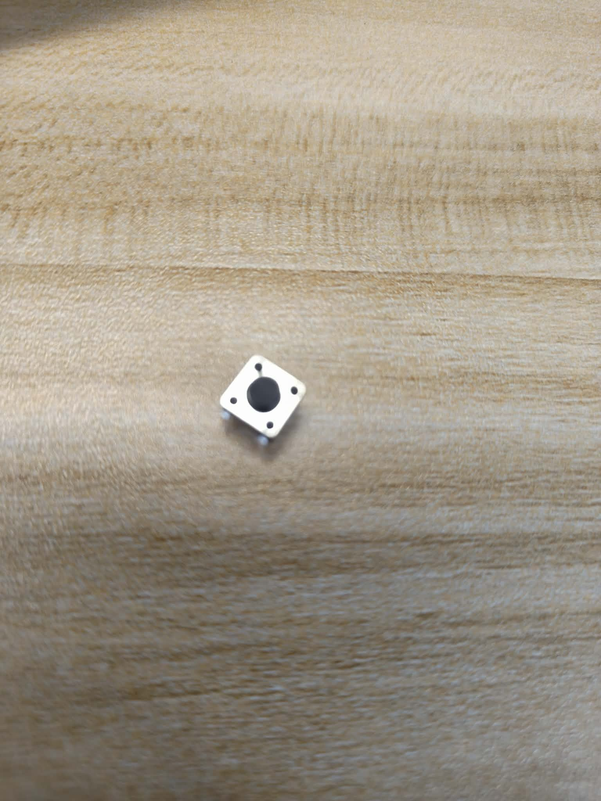
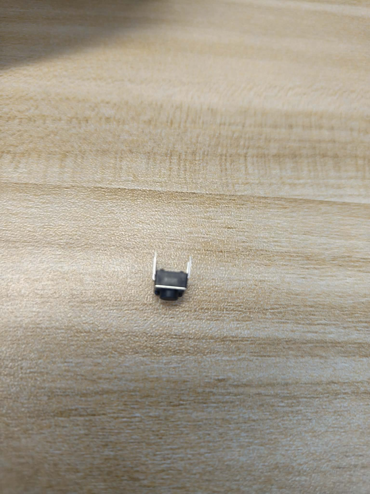
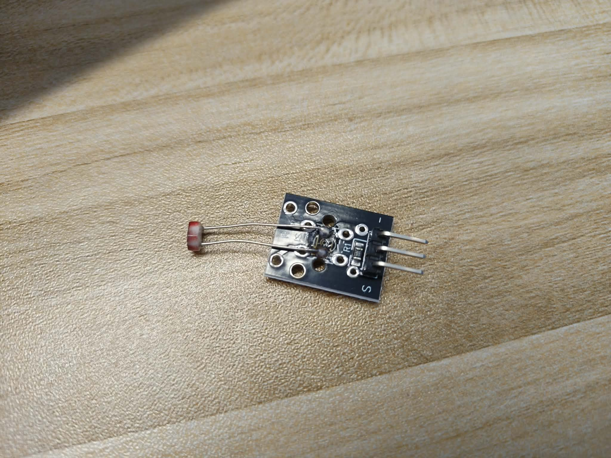
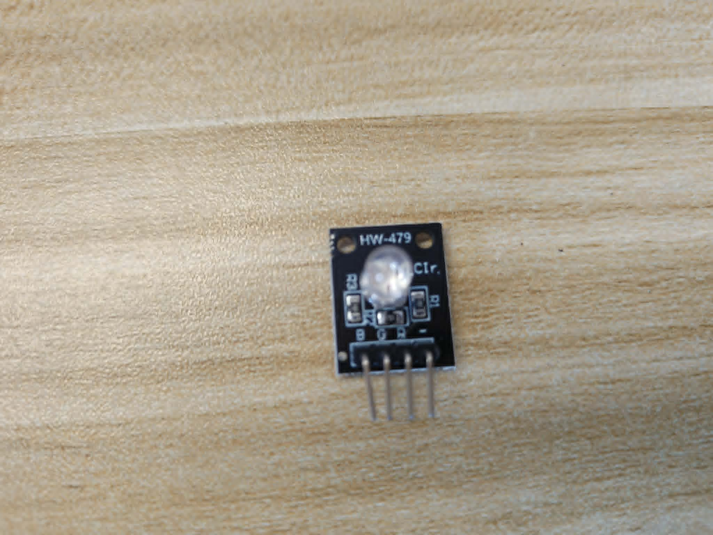
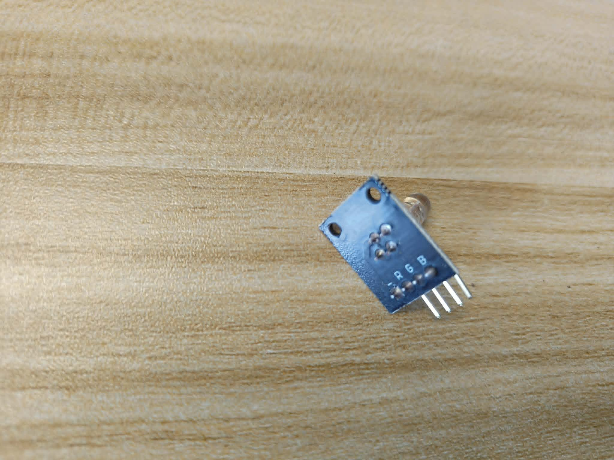
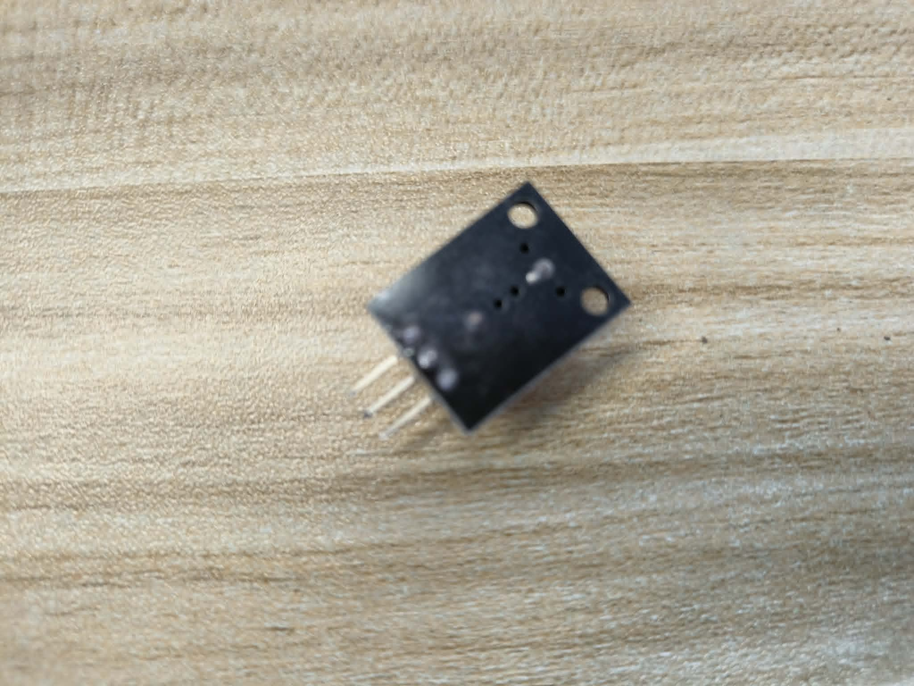
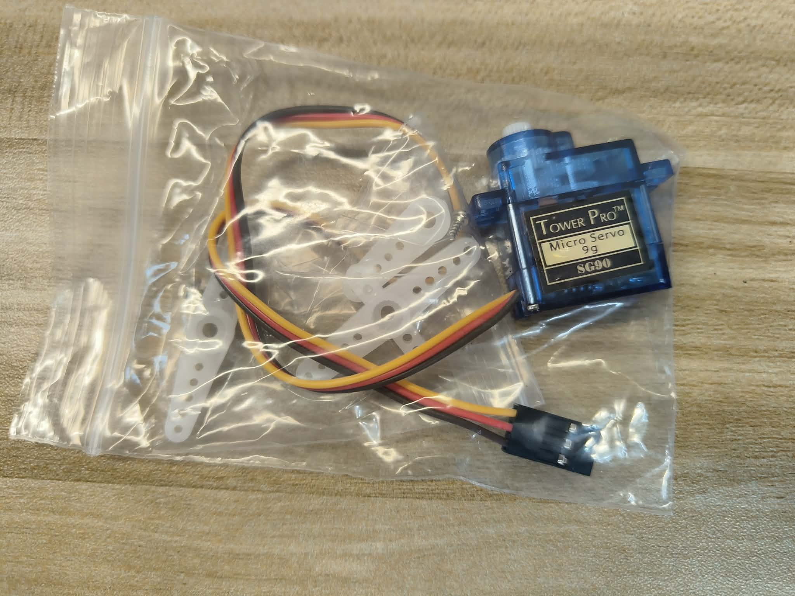
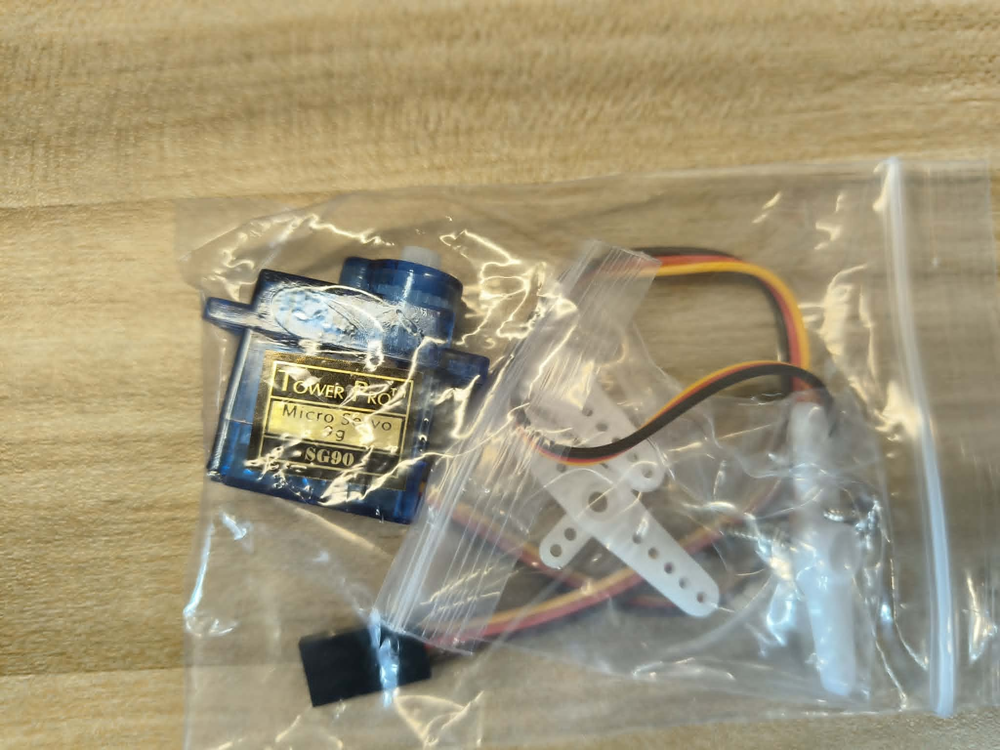
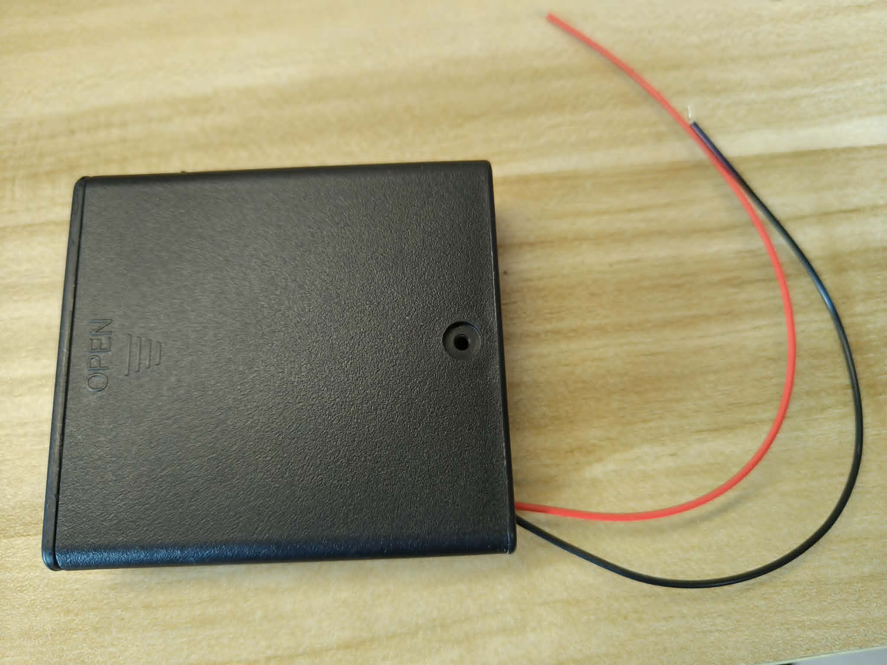

# 學生用單品辨識卡

本頁把原始蝦皮訂單與收到的實物分開整理，方便學生領料與核對購買規格。白底
商品卡只用於辨識外觀；實物照片保留拍攝背景與原始細節。兩者都不能取代板身
絲印、pinout、datasheet或實機測試。

完整原始截圖見[學生用訂單設備圖鑑](order_gallery.md)。
26項已購設備與後來找到的散裝按鈕之圖片進度及下一張需要補拍的內容見
[蝦皮商品圖與實物照片補拍清單](reshoot_checklist.md)。

## 400孔麵包板

## 四腳輕觸按鈕實物

目前已找到10顆散裝按鈕。照片中的金屬上蓋、中央黑色按鍵與成對接腳，
外形符合常見6×6 mm四腳瞬時按鈕；但照片不能證明5 mm高度、購買來源或
內部導通關係。Week 2接線前要先拍底面，並在斷電狀態以萬用電表確認哪兩腳原本
相通，以及按下後哪兩側接通。

## 20cm公對母杜邦線

一端是露出的金屬公針，另一端是有插孔的黑色母頭。

## 20cm母對母杜邦線

兩端都是有插孔的黑色母頭，沒有露出的金屬公針。

## 20cm公對公杜邦線

兩端都是露出的金屬公針。

## KY-018光敏電阻模組實物

第一張為元件面，可見光敏電阻、三針排針、`S`與`-`絲印；第二張為焊接面。
中間電源腳的絲印在目前照片中不夠清楚，因此尚不能只靠照片固定三針順序，
接線前仍須補拍排針旁絲印的垂直近照。

## DHT11三線溫濕度模組實物

購買頁稱YS-31；實物可看出DHT11感測器、三針排針與三條連接線，但目前看不清
PCB型號及排針絲印。線的顏色不等於已確認的VCC、DATA與GND順序。

## HW-479 RGB LED模組實物

購買頁稱KY-016，收到的PCB實際標示為`HW-479`。照片可辨識`B`、`G`、`R`及
`-`絲印，但尚未通電確認共用腳與每一色的控制邏輯。

下圖同樣是實物照片，但焦點不足，只保留為補充紀錄，不用來判斷腳位或焊點。

## HW-508蜂鳴器模組實物

購買頁稱KY-012有源蜂鳴器，收到的PCB實際標示為`HW-508`。目前照片失焦，
不能用來固定腳位、工作電壓，或判定它確實是有源型。

## Tower Pro SG90舵機實物

照片可辨識Tower Pro、Micro Servo、9g與SG90標籤，也可看見三線插頭及舵盤。
購買選項寫180度，但實際行程與安全角度仍須在合格外部供電下測試。

## 4AA電池盒實物

照片可辨識有蓋電池盒及紅黑裸線端，但沒有拍到開關與盒內四個電池槽。
在確認開關、極性及安全轉接方式前不要裝入電池。

## 使用限制

- 卡片中的價格只記錄當次訂單，不代表目前售價。
- 後製圖不能用來判斷接腳電壓、線序、導通品質或尺寸公差。
- 實作前仍須看實物兩端，確認公頭／母頭種類及是否有彎針、鬆脫或破皮。
- 後續品項依相同格式加入本頁，但不得因商品圖相似就宣稱實物規格已驗證。
